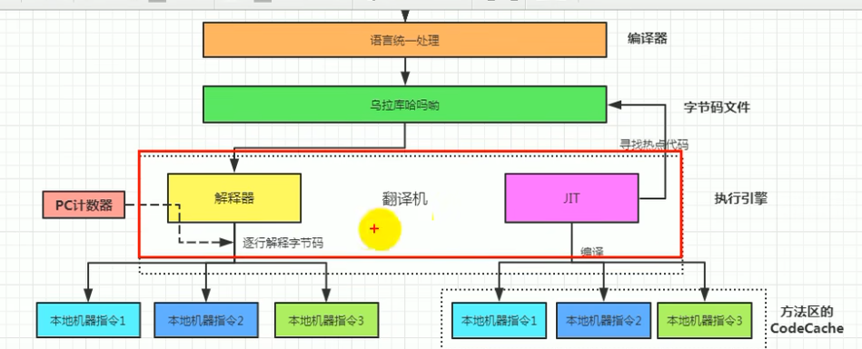

### 作用
java虚拟机就是二进制字节码的运行环境, 负责装载字节码到其内部, 解释/编译为对应平台上的机器指令执行.  每一条java指令, java虚拟机规范中都有详细定义, 如怎么取操作数, 怎么处理操作数, 处理结果放在哪里.
* 特点
	* 一次编译, 到处运行
	* 自动内存管理
	* 自动垃圾回收功能
### 位置

### 整体结构

### JVM架构模型

>java编译器输入的指令流基本上是一种基于**栈的指令集架构**, 另外一种指令集架构则是基于**寄存器的指令集架构**
>
* **基于栈式架构特点**
	1. 设计和实现更简单, 适用于资源受限的系统
	2. 避开了寄存器的分配难题, 使用零地址指令方式分配
	3. 指令流中的指令大部分式零地址指令, 其执行过程依赖于操作栈. 指令集更小, 编译器容易实现
	4. 不需要硬件支持, 可移植性更好, 更好实现跨平台
* **基于寄存器架构的特点**
	1. 典型的应用是x86的二进制指令集
	2. 指令集的架构则是完全依赖硬件, 可移植性差
	3. 性能优秀和执行更高效
	4. 花费更少的指令去完成一项操作
	5. 大部分情况下, 基于寄存器架构的指令集往往都以一地址指令,二地址指令和三地址指令为主,而基于栈式架构的指令却是以零地址指令为主.
### JVM的生命周期

* **虚拟机的启动** 
	* java虚拟机的启动是通过引导类加载器创建的一个初始类来完成的, 这个类是由虚拟机的具体实现指定的
* **虚拟机的执行**
	* 一个运行中的java虚拟机有着一个清晰的任务: 执行java程序
	* 程序开始执行时他才运行, 程序结束时他就停止
	* 执行一个所谓的java程序的时候, 真真正正在执行的是一个叫做java虚拟机的进程
* **虚拟机的退出**
	有如下的几种情况:
	* 程序正常执行结束
	* 程序在执行过程中遇到了异常或错误而异常终止
	* 由于操作系统出现错误而导致java虚拟机进程终止
	* 某线程调用Runtime类或System类的exit方法, 或Runtime类的halt方法, 并且Java安全管理器也允许这次exit或halt操作
	* 除此之外, JNI规范描述了用JNI Invocation API来加载或写在Java虚拟机时, Java虚拟机的退出情况
* **解释器和JIT**
	* 
	* **如果只用解释器**：即使是一段只执行一次的简单代码（如启动时的初始化逻辑），也要解释执行，性能尚可，但有大量重复解释成本。
	
	* **如果只用JIT编译器**：
    
	    - **启动时间极慢**：JIT编译整个程序（哪怕很多代码只运行一次）需要花费大量时间和内存。
	        
	    - **“预热”问题**：为了编译，JVM需要等待代码先执行一遍以收集信息，导致启动延迟巨大。
	        
	    - **内存占用高**：编译所有代码会占用大量代码缓存（Code Cache）空间。 
	- **混合模式完美平衡了两者**：

		- **启动时**：解释器快速启动，不浪费时间编译只用一次的代码。
		    
		- **运行时**：JIT只编译最频繁执行的“热点”，用20%的编译开销获得了80%的性能提升。
		    
		- **降级（逆优化，Deoptimization）**：极少数情况下（比如JIT编译时基于的假设被打破，如类继承关系改变），JVM可以放弃已优化代码，退回到解释器执行，保证正确性。

- ### HotSpot指的就是他的热点代码探测技术
	- 通过计数器找到最具编译价值的代码, 触发即时编译或栈上替换
	- 通过编译器与解耦器协同工作, 在最优化的程序响应时间与最佳执行性能中取得平衡

* ### TaoBaoJVM
	* 基于openJDK开发了自己定制版的AlibabaJDK
	* 基于OpenJDK HotSpot VM发布的国内第一个优化, 深度定制且开源的高性能服务器版Java虚拟机
		1. 创新的GCIH技术实现了off-heap，即将生命周期较长的Java对象从heap中移到heap之外, 并且GC不能管理GCIH内部的java对象, 以此达到降低GC的回收频率和提升GC的回收率的目的
		2. GCIH中的对象还能够在多个Java虚拟机进程中实现共享
		3. 使用crc32 指令实现JVMintrinsic降低JNI的调用开销
		4. PMU hardware的Java profiling tool和诊断协助功能
		5. 针对大数据场景的ZenGC
	*  taobao vm 硬件严重依赖intel cpu 损失了兼容性 但提高了性能