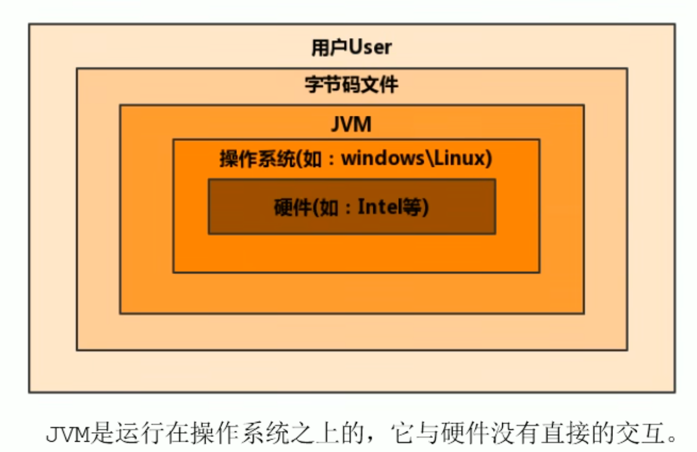
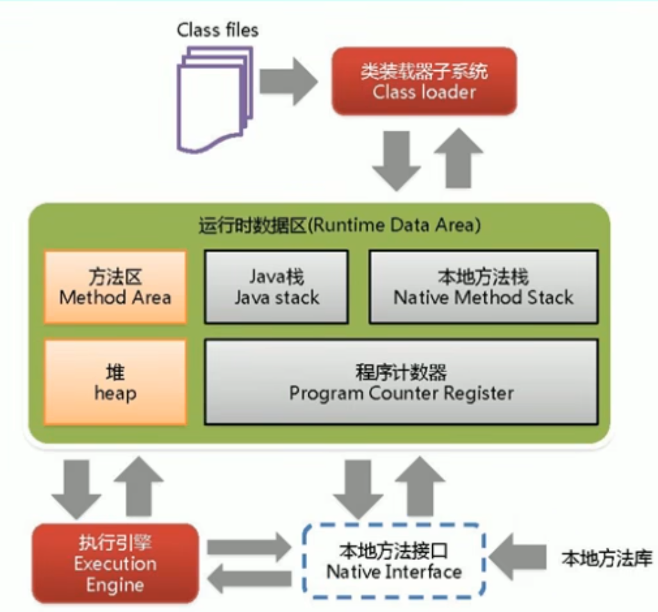
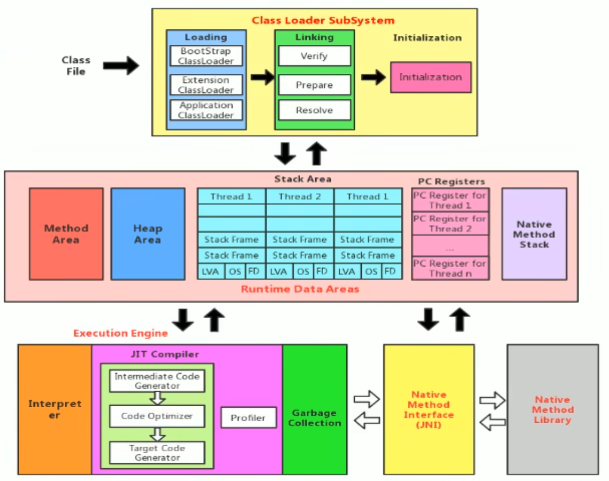

### 作用
java虚拟机就是二进制字节码的运行环境, 负责装载字节码到其内部, 解释/编译为对应平台上的机器指令执行.  每一条java指令, java虚拟机规范中都有详细定义, 如怎么取操作数, 怎么处理操作数, 处理结果放在哪里.
* 特点
	* 一次编译, 到处运行
	* 自动内存管理
	* 自动垃圾回收功能
### 位置

### 整体结构

### JVM架构模型
>java编译器输入的指令流基本上是一种基于**栈的指令集架构**, 另外一种指令集架构则是基于**寄存器的指令集架构**
* **基于栈式架构特点**
	1. 设计和实现更简单, 适用于资源受限的系统
	2. 避开了ji'cu