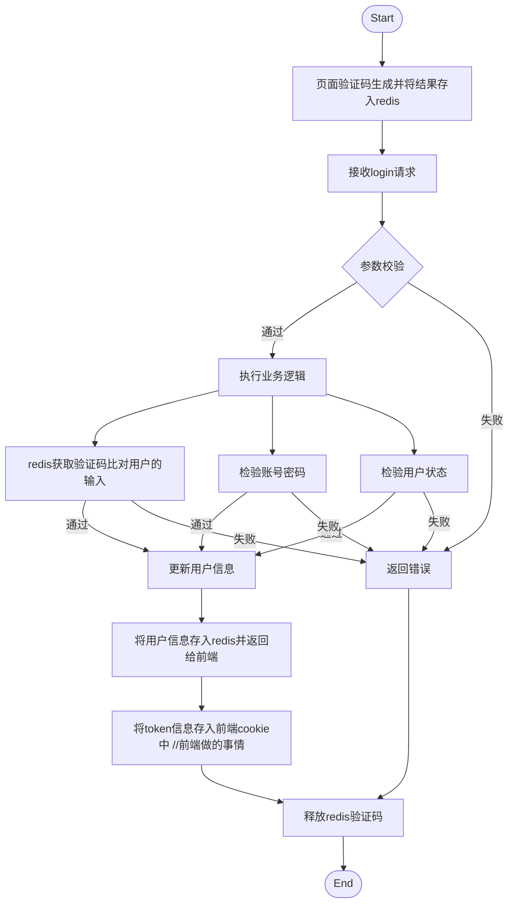

## Login

* **使用token + redis 进行用户登录**
* **附带验证码验证**




* #### autoLogin

  * ```mermaid
    graph TD
        Start([Start])
    	GetTokenUserInfo[通过请求头中的tokenId从redis中取出userInfo]
        Check{判断是否存在}
        GetTokenInfo[将用户信息返回给前端]
        Ok{判断token是否过期}
        FlashTokenInfo[过期重新获取新token刷新时间并存入redis]
        Fail[返回NULL]
        SaveToken2Session[将tokenId存入前端cookie设置expireTime //前端做的事情]
        End([End])
    Start --> GetTokenUserInfo --> Check
    Check -->|通过| Ok
    Ok --> |过期| FlashTokenInfo --> GetTokenInfo -->End
    Ok --> |未过期| SaveToken2Session --> GetTokenInfo --> End
    Check -->|失败| Fail --> End
    ```

### Register

* ```mermaid
  graph TD
  	Start([Start])
  	End([End])
  	Load[页面验证码生成并将结果存入redis]
  	ExsistEmailOrNickName{邮箱或者昵称是否存在}
  	Ok[初始化userInfo存入database]
  	Fail[业务逻辑错误]
  	ReleaveCheckCode[释放redis验证码]
  Start--> Load --> ExsistEmailOrNickName
  ReleaveCheckCode --> End
  ExsistEmailOrNickName --> |通过| Ok --> ReleaveCheckCode
  ExsistEmailOrNickName --> |失败| Fail --> ReleaveCheckCode
  ```
  
  ## 用redis + token or session 存放用户登录状态信息区别
  
  * ### Session共享问题
  
    * 在分布式集群环境中，会话（Session）共享是一个常见的挑战。默认情况下，Web 应用程序的会话是保存在单个服务器上的，当请求不经过该服务器时，会话信息无法被访问。在nginx中我们我们配置了负载均衡，用户的多次请求可能被分发到不同的后端应用上，这时候我们仍然使用Session这个对象来存储用户状态，那么只有处理了用户登录请求的后端程序记住了用户的登录状态，其他后端程序无法获取到这个Session数据，导致他们并不能判断用户是否登录，当用户的其他请求被nginx分发到其他后端程序的时候，用户的正常请求就会被拦截器拦截。下面我们有两种解决方案。
  
      1. `Session拷贝（不推荐）`
         Tomcat提供了Session拷贝功能，通过配置Tomcat可以实现Session的拷贝，但是这会增加服务器的额外内存开销，同时会带来数据一致性问题
         
      1. `Session Sticky（会话粘滞）`
         
         负载均衡层做手脚：同一个 JSESSIONID → 永远打到 A
         
         例如：
         
         - Nginx ip_hash
         - Cookie 粘滞
  	     
         **明显缺点：**
         
         - A 挂了 → 用户全掉线
         - 扩容、缩容很麻烦
         - 本质是 **假集群**
         
      2. `Redis缓存（推荐）`
         Redis缓存具有Session存储一样的特点，基于内存、存储结构可以是key-value结构、数据共享
         
         
    
    * **Redis缓存相较于传统Session存储的优点**：
    
      * `可靠性和持久性`：Redis 提供了持久化机制，可以将内存中的数据定期或异步地写入磁盘，以保证数据的持久性。这样即使发生服务器崩溃或重启，会话数据也可以被恢复。
        `丰富的数据结构`：Redis 不仅仅是一个键值存储数据库，它还支持多种数据结构，如字符串、列表、哈希、集合和有序集合等。这些数据结构的灵活性使得可以更方便地存储和操作复杂的会话数据。
        `分布式缓存功能`：Redis 作为一个高效的缓存解决方案，可以用于缓存会话数据，减轻后端服务器的负载。与传统的 Session 存储方式相比，使用 Redis 缓存会话数据可以大幅提高系统的性能和可扩展性。
        `可用性和可部署性`：Redis 是一个强大而成熟的开源工具，有丰富的社区支持和活跃的开发者社区。它可以轻松地与各种编程语言和框架集成，并且可以在多个操作系统上运行。
        `高性能和可伸缩性`：Redis 是一个内存数据库，具有快速的读写能力。相比于传统的 Session 存储方式，将会话数据存储在 Redis 中可以大大提高读写速度和处理能力。此外，Redis 还支持集群和分片技术，可以实现水平扩展，处理大规模的并发请求。
        `可靠性和持久性`：Redis 提供了持久化机制，可以将内存中的数据定期或异步地写入磁盘，以保证数据的持久性。这样即使发生服务器崩溃或重启，会话数据也可以被恢复。
        `丰富的数据结构`：Redis 不仅仅是一个键值存储数据库，它还支持多种数据结构，如字符串、列表、哈希、集合和有序集合等。这些数据结构的灵活性使得可以更方便地存储和操作复杂的会话数据。
        `分布式缓存功能`：Redis 作为一个高效的缓存解决方案，可以用于缓存会话数据，减轻后端服务器的负载。与传统的 Session 存储方式相比，使用 Redis 缓存会话数据可以大幅提高系统的性能和可扩展性。
        `可用性和可部署性`：Redis 是一个强大而成熟的开源工具，有丰富的社区支持和活跃的开发者社区。它可以轻松地与各种编程语言和框架集成，并且可以在多个操作系统上运行。
    

    
    
