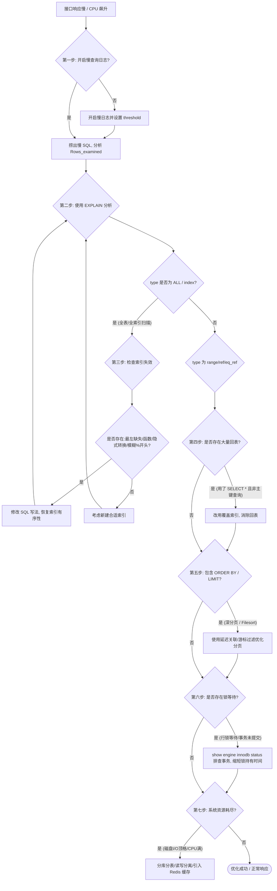

# 数据库突破：7 步带你排查 SQL 性能瓶颈（大厂面试实战版）

在 Java 后端面试中，**“SQL 跑得慢怎么排查与优化”** 是几乎 100% 会被问到的高频经典题。许多候选人往往只能零散地回答“加索引”、“看 EXPLAIN”，缺乏系统性的工程思维。本文为你提炼出一套大厂通用的 **7 步全链路排查法**，配合底层原理与核心考点，助你给出让面试官惊艳的系统化回答。

---

## 🎨 SQL 排查全链路视觉概念

为了更形象地展现从“慢查询”到“系统资源监控”的完整优化路径，下图为您绘制了 7 步排查全链路科技风路线图：


---

## 🎯 面试官高频必杀问（核心考点）

### Q1：如果线上某个接口跑得特别慢，或者数据库 CPU 飙升，你该怎么排查？
*   **黄金回答**：我不会盲目去猜，而是会遵循一条**“定位 -> 分析 -> 优化 -> 全局监控”**的 7 步标准链路进行系统排查：
    1.  **定位慢 SQL**：通过开启**慢查询日志（Slow Query Log）**，设定合理阈值（如 1s），找出 `Query_time` 长、扫描行数 `Rows_examined` 多但返回行数 `Rows_sent` 少的异常 SQL。
    2.  **看执行计划**：使用 `EXPLAIN` 分析该 SQL 的执行计划，重点关注 `type`（访问类型）、`key`（实际使用索引）、`rows`（估算扫描行数）以及 `Extra`（额外开销）。
    3.  **排查索引失效**：检查 SQL 写法，看是否存在函数操作、模糊查询 `%` 开头、隐式类型转换等导致索引失效的场景。
    4.  **评估回表开销**：分析是否由于 `SELECT *` 导致了大量的**回表**操作，评估能否通过**覆盖索引**进行优化。
    5.  **分析排序与分页**：对于包含 `ORDER BY` 和 `LIMIT` 的 SQL，排查是否产生了文件排序（Filesort），以及是否存在**深分页**性能雪崩问题。
    6.  **排查锁等待**：通过 `show engine innodb status` 检查是否存在长事务锁定了数据，导致当前 SQL 处于**锁等待**状态。
    7.  **看系统资源**：如果单条 SQL 没问题，但整体慢，需结合监控系统（如 Prometheus + Grafana）查看数据库主机的 CPU、磁盘 I/O、内存及连接数是否触顶。

### Q2：什么是“回表”？它是如何产生的？如何避免？
*   **底层物理原理**：
    在 InnoDB 引擎中，索引分为**聚簇索引（Clustered Index）**和**二级索引/辅助索引（Secondary Index）**。
    *   **聚簇索引**（通常是主键）：其叶子节点存储的是**完整的整行数据**。
    *   **二级索引**（如我们自己建的单列索引或联合索引）：其叶子节点存储的是**索引列的值 + 主键 ID**。
    *   **回表现象**：当我们通过二级索引（如 `name` 字段的索引）查询数据，且查询的列中包含了非索引字段（如 `select name, age, address from user where name = '张三'`），MySQL 首先在二级索引树中找到“张三”对应的节点，获取到其主键 ID，然后**拿着这个主键 ID 回到聚簇索引树**中重新查询一次，以获取 `age` 和 `address`。这个回到聚簇索引树查询的过程就叫**“回表”**。
*   **如何避免**：
    *   **避免使用 `SELECT *`**：只查询业务需要的字段。
    *   **覆盖索引（Covering Index）**：将需要查询的字段共同建立一个**联合索引**。这样，查询的数据可以直接在二级索引的叶子节点中全部获取，无需再回到聚簇索引，回表次数降为 0，性能提升数倍。

### Q3：索引失效有哪些经典场景？其底层的本质原因是什么？
*   **经典场景**：
    1.  **最左前缀法则**：在联合索引中，查询没有从最左侧的列开始，或者中间断开。
    2.  **在索引列上做计算或函数操作**：如 `WHERE YEAR(birthday) = 2026`。
    3.  **隐式类型转换**：如字符串类型字段 `varchar_col`，在查询时写成数字 `WHERE varchar_col = 123`（MySQL 会自动隐式调用 `CAST` 函数，导致索引失效）。
    4.  **模糊查询以 `%` 开头**：如 `LIKE '%keyword'`。
    5.  **OR 连接非索引列**：`WHERE age = 10 OR salary = 5000`，如果 `salary` 没有索引，则整体索引失效。
*   **底层本质原因**：
    B+ 树的索引是有序排列的。但是，一旦对索引列进行了**计算、函数操作、类型转换或模糊匹配**，这部分数据在 B+ 树中的**有序性就会遭到彻底破坏**。MySQL 无法再通过 B+ 树的二分查找快速定位数据，只能被迫退化为**全表扫描（ALL）**。

---

## 📊 7 步性能排查全链路决策树



---

## 🔍 EXPLAIN 执行计划黄金解密（核心考点）

在面试中，能准确说出 `EXPLAIN` 的核心字段是基本功。以下是必须牢记的黄金考点：

| 核心字段 | 字段含义 | 黄金考点 / 核心取值说明 |
| :--- | :--- | :--- |
| **`type`** | **访问类型** | 衡量 SQL 性能的最关键指标。从好到坏排列为：<br>`system` > `const` (主键/唯一索引等值查询) > `eq_ref` > `ref` (非唯一索引等值) > `range` (范围查询) > `index` (全索引扫描) > `ALL` (全表扫描)。<br>**大厂要求**：线上 SQL 的 `type` 必须达到 **`range` 级别及以上**，尽量达到 `ref`。 |
| **`key`** | **实际使用索引** | 如果为 `NULL`，说明没有用上索引，需要紧急优化。 |
| **`rows`** | **估算扫描行数** | 值越小说明越精准，越小越好。 |
| **`Extra`** | **额外信息说明** | 核心考点：<br>1. **`Using index`**：使用了**覆盖索引**，直接在二级索引获取数据，性能极佳！<br>2. **`Using index condition`**：使用了**索引下推（ICP）**技术，在存储引擎层先过滤，减少回表次数。<br>3. **`Using filesort`**：产生了**文件排序**，说明无法利用索引本身顺序，需创建对应排序索引。<br>4. **`Using temporary`**：使用了**临时表**（常见于 `GROUP BY` 或 `DISTINCT` 未用索引），性能极差，必须优化！ |

---

## 💡 终极硬核追问：深分页（`LIMIT 1000000, 10`）性能雪崩如何优化？

这是高频的中高级面试必考点。
*   **为什么慢**：
    `LIMIT 1000000, 10` 意味着 MySQL 需要扫描 **1,000,010** 条记录，然后**丢弃前 1,000,000 条**，只留下最后 10 条。在此期间，如果查询非主键字段，MySQL 伴随了整整 **100 万次无意义的回表**，造成极其严重的磁盘 I/O 阻塞，导致接口超时。
*   **终极优化方案**：
    1.  **方案一：延迟关联（Deferred Join）**——通过覆盖索引先查主键，避免前 100 万次的回表：
        ```sql
        -- 优化前 (超慢，回表 100 万次)
        SELECT * FROM orders WHERE user_id = 100 ORDER BY create_time LIMIT 1000000, 10;
        
        -- 优化后 (只回表 10 次)
        SELECT o.* FROM orders o 
        JOIN (
            SELECT id FROM orders WHERE user_id = 100 ORDER BY create_time LIMIT 1000000, 10
        ) t ON o.id = t.id;
        ```
        *原理*：子查询中仅查询 `id` 且走了索引，利用了**覆盖索引**技术快速跳过了前 100 万条数据（回表次数为 0），最后在外层仅对选中的 10 条主键 ID 进行回表，效率暴增数倍。
        
    2.  **方案二：游标滚动 / 增量滚动分页**——彻底干掉 `offset`：
        如果业务允许（如手机 APP 的下滑刷新），前端每次请求时都传入**上一页的最后一条记录的 ID（或排序字段的值）**：
        ```sql
        SELECT * FROM orders WHERE user_id = 100 AND id < 985746 ORDER BY id DESC LIMIT 10;
        ```
        *原理*：通过 `id < 985746` 直接过滤掉已经看过的 100 万条数据，使扫描行数永远保持为 10 行，不管页数多深，性能始终恒定！

---

## ⚡ 大厂高并发实战与锁等待排查

在大并发场景下，SQL 变慢有时并非由于索引，而是由于**锁等待（Lock Wait）**。
*   **排查三板斧**：
    1.  执行 `SHOW ENGINE INNODB STATUS\G`，查找 `TRANSACTIONS` 模块，查看是否有锁等待相关的描述。
    2.  查询 `information_schema` 视图定位元凶：
        ```sql
        -- 查看当前正在阻塞的锁等待关系
        SELECT * FROM information_schema.innodb_lock_waits;
        -- 查看是谁占着锁不放（trx_query 字段即为元凶事务的 SQL）
        SELECT * FROM information_schema.innodb_trx;
        ```
*   **避坑指南**：
    *   **严禁在长事务中夹杂外部 RPC 接口调用或 MQ 发送**。一旦外部接口变慢，事务将长期无法提交，导致行锁被长期持有，其他抢占同一行数据的业务 SQL 只能在 `innodb_lock_wait_timeout`（默认 50s）内苦苦挣扎，引发雪崩。