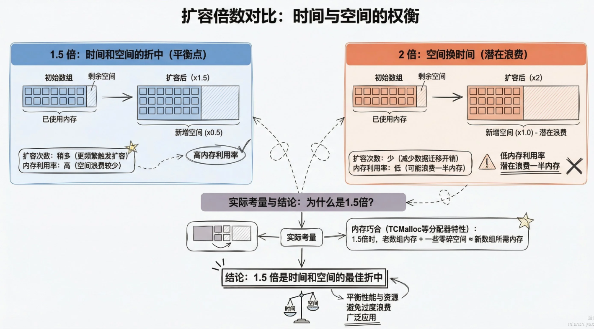
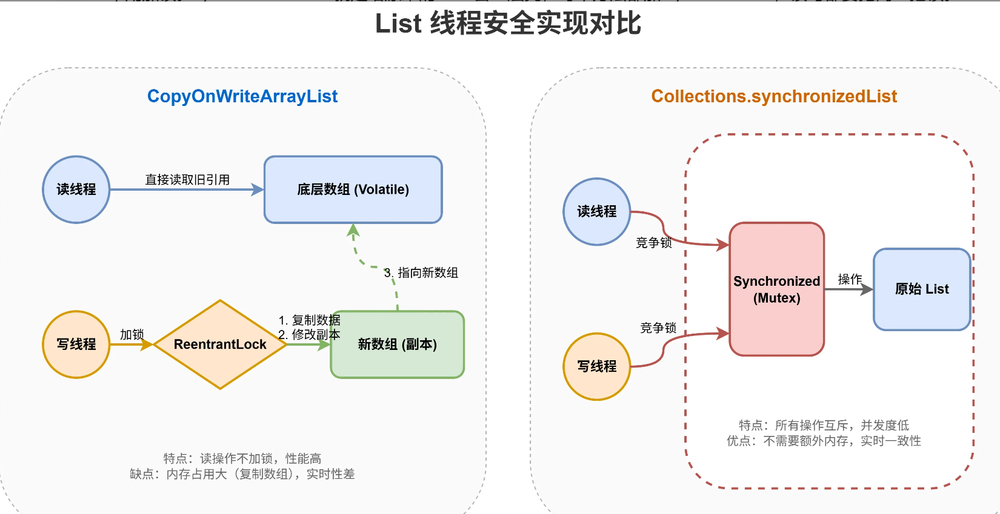
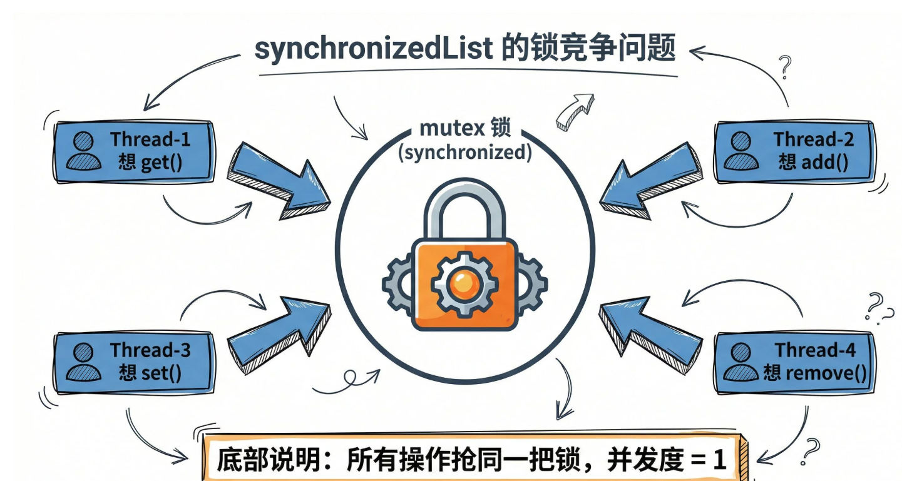

# Java 后端面试笔记归纳拓展版

> 适用场景：Java 后端实习 / 初级开发面试复习。  
> 整理方式：按模块分类，保留“面试回答话术”，补充“追问点、易错点、项目结合点”。  
> 复习建议：先背每节的【标准回答】，再看【追问拓展】，最后用【项目结合】把八股和项目串起来。

---

## 目录

- [一、Java 基础](#一java-基础)
- [二、集合框架](#二集合框架)
- [三、并发编程](#三并发编程)
- [四、计算机网络](#四计算机网络)
- [五、Spring / Spring Boot](#五spring--spring-boot)
- [六、JVM](#六jvm)
- [七、MySQL 与数据库](#七mysql-与数据库)
- [八、Redis 与缓存](#八redis-与缓存)
- [九、消息队列 MQ](#九消息队列-mq)
- [十、Spring Cloud / 微服务](#十spring-cloud--微服务)
- [十一、项目高频追问：智能视频内容社区平台](#十一项目高频追问智能视频内容社区平台)
- [十二、场景题整理](#十二场景题整理)
- [十三、HR 面试话术](#十三hr-面试话术)
- [十四、面试快速背诵卡片](#十四面试快速背诵卡片)
- [十五、需要重点修正的原笔记表达](#十五需要重点修正的原笔记表达)
- [十六、复习路线建议](#十六复习路线建议)
- [十七、最后冲刺：万能回答结构](#十七最后冲刺万能回答结构)
- [十八、结合简历的面试官追问与回答模板](#十八结合简历的面试官追问与回答模板)
- [十九、简历补充高频追问](#十九简历补充高频追问)

---

# 一、Java 基础

## 1. 面向对象三大特性

### 标准回答

Java 面向对象三大特性是：**封装、继承、多态**。

- **封装**：把对象的属性和行为封装起来，通常使用 `private` 修饰属性，通过 `getter/setter` 控制访问，提高安全性和可维护性。
- **继承**：子类可以复用父类的属性和方法，提高代码复用性。
- **多态**：父类引用指向子类对象，程序在运行时根据对象的真实类型调用对应方法，提高扩展性。

### 面试话术

> 我理解面向对象的核心是把现实业务抽象成对象。封装保证对象内部状态不被随意修改，继承解决代码复用问题，多态则解决程序扩展问题，比如同一个接口有不同实现，运行时根据实际对象执行不同逻辑。

### 追问拓展

#### 多态成立的条件

1. 有继承或接口实现关系。
2. 子类重写父类方法。
3. 父类引用指向子类对象。

```java
Animal animal = new Dog();
animal.eat(); // 调用 Dog 的 eat 方法
```

#### 多态的好处

业务扩展时不用大量修改原代码，只需要新增实现类即可，符合开闭原则。

---

## 2. 抽象类和接口区别

| 对比点 | 抽象类 | 接口 |
|---|---|---|
| 关键字 | `abstract class` | `interface` |
| 继承/实现 | Java 单继承 | 可以多实现 |
| 方法 | 可以有普通方法、抽象方法 | Java 8 后可以有 default/static 方法 |
| 成员变量 | 可以是普通成员变量 | 默认是 `public static final` 常量 |
| 构造方法 | 有构造方法 | 没有构造方法 |
| 设计思想 | 表示“是什么” | 表示“能做什么” |

### 面试话术

> 抽象类更强调父子之间的共性，比如模板方法；接口更强调能力扩展，比如某个类具备登录、支付、消息发送能力。实际开发中，如果多个类属于同一类事物并且有公共代码，可以用抽象类；如果只是定义行为规范，优先用接口。

### 易错点

- 接口不是完全不能有方法实现。Java 8 之后接口可以有 `default` 和 `static` 方法。
- 接口里的变量默认是 `public static final`，所以一般不能作为对象状态存储。

---

## 3. 重载和重写

### 重载 Overload

发生在**同一个类中**。

条件：

- 方法名相同。
- 参数列表不同，包括参数个数、类型、顺序不同。
- 返回值可以不同，但不能只靠返回值区分重载。

```java
public void test(String name) {}
public void test(String name, int age) {}
```

### 重写 Override

发生在**子类和父类之间**。

规则：

- 方法名相同。
- 参数列表相同。
- 返回类型兼容。
- 子类访问权限不能比父类更严格。
- 子类抛出的异常不能比父类更宽泛。

```java
@Override
public void run() {}
```

### 面试话术

> 重载是编译期确定的，主要看方法参数；重写是运行期确定的，主要体现多态。

---

## 4. final 关键字

| 修饰对象 | 含义 |
|---|---|
| `final` 类 | 不能被继承，例如 `String` |
| `final` 方法 | 不能被子类重写 |
| `final` 变量 | 只能赋值一次，基本类型值不可变，引用类型引用地址不可变 |

### 易错点

`final` 修饰引用类型时，表示引用地址不能变，但对象内部属性仍然可能被修改。

```java
final List<String> list = new ArrayList<>();
list.add("a"); // 可以
// list = new ArrayList<>(); // 不可以
```

---

## 5. equals 和 hashCode

### 标准回答

`equals()` 用来判断两个对象是否相等，`hashCode()` 用来计算对象的哈希值。  
在 HashMap、HashSet 这类哈希集合中，通常先根据 `hashCode()` 定位桶位置，再通过 `equals()` 判断是不是同一个 key。

### 重要规则

- 如果两个对象 `equals()` 相等，那么它们的 `hashCode()` 必须相等。
- 如果两个对象 `hashCode()` 相等，它们不一定 `equals()` 相等。
- 重写 `equals()` 时通常必须一起重写 `hashCode()`。

### 面试话术

> HashMap 中 hashCode 决定 key 大概放在哪个 bucket，equals 决定这个 key 到底是不是同一个对象。如果只重写 equals 不重写 hashCode，可能会导致逻辑上相等的对象被放到不同桶里，从而出现重复插入或查找不到的问题。

---

# 二、集合框架

## 1. HashMap 底层原理

### 标准回答

HashMap 底层是：**数组 + 链表 + 红黑树**。

存放 key-value 时，会先根据 key 计算 hash 值，然后通过：

```java
(length - 1) & hash
```

计算数组下标。

如果该位置没有元素，直接插入；如果发生哈希冲突，会挂到链表上。JDK 8 中，当同一个桶的链表长度超过 8，并且数组长度大于等于 64 时，链表会转换成红黑树，提高查询效率。

### 扩容机制

HashMap 默认负载因子是 `0.75`。当元素数量超过：

```java
capacity * loadFactor
```

就会触发扩容，数组长度变为原来的 2 倍，并重新分布元素。

### 易错点

#### 1. 链表超过 8 一定树化吗？

不一定。

- 链表长度 > 8；
- 数组长度 >= 64；

同时满足才会树化。

如果数组长度小于 64，HashMap 会优先扩容，而不是直接树化。

#### 2. 红黑树什么时候退化为链表？

当树节点数量小于等于 6 时，红黑树可能会退化成链表。

#### 3. 为什么数组长度是 2 的幂？

因为 `(length - 1) & hash` 可以等价于取模，但性能比 `%` 更高。  
同时长度为 2 的幂时，低位掩码更均匀，有利于减少哈希冲突。

### 面试话术

> HashMap 通过 hash 定位桶，通过 equals 判断 key 是否相同。JDK 8 之后为了避免链表过长导致查询退化成 O(n)，引入了红黑树。当链表长度超过 8 且数组容量达到 64 时才树化，否则会优先扩容。

---

## 2. HashMap 为什么线程不安全

### 标准回答

HashMap 线程不安全，主要是因为 `put`、`resize` 等操作没有加锁控制。在多线程并发场景下，可能出现：

- 数据覆盖；
- 数据丢失；
- 读取到不一致数据；
- JDK 7 扩容时头插法可能造成链表成环，导致 `get` 死循环。

### 补充说明

JDK 8 改成尾插法后，基本解决了 JDK 7 扩容成环问题，但 HashMap 仍然不是线程安全的，多线程 put 仍然可能出现数据覆盖、数据丢失等问题。

### 面试话术

> 所以在并发场景下不会使用 HashMap，一般会使用 ConcurrentHashMap，或者在小范围内用 Collections.synchronizedMap，但实际开发更推荐 ConcurrentHashMap。

---

## 3. ConcurrentHashMap 原理

### JDK 1.7

JDK 1.7 中 ConcurrentHashMap 采用：**Segment 分段锁**。

- 整体结构类似：Segment 数组 + HashEntry 数组 + 链表。
- 每个 Segment 类似一个小 HashMap，并继承 ReentrantLock。
- 不同线程访问不同 Segment 时可以并发执行。
- 默认并发度是 16。

### JDK 1.8

JDK 1.8 取消了 Segment，采用：**数组 + 链表 + 红黑树 + CAS + synchronized**。

插入流程大致是：

1. 根据 hash 定位桶位置。
2. 如果桶为空，通过 CAS 尝试插入。
3. 如果桶不为空，对桶头节点加 `synchronized` 锁。
4. 只锁当前桶，不影响其他桶操作。

### 面试话术

> JDK 8 的 ConcurrentHashMap 锁粒度更细，只锁数组某个桶的头节点，其他桶仍然可以并发操作，所以并发性能比 JDK 7 的分段锁更好。

### 易错点

- JDK 8 不是完全无锁，只是在空桶插入时使用 CAS，冲突时仍然会使用 synchronized。
- synchronized 在 JDK 6 之后经过偏向锁、轻量级锁、自旋等优化，性能已经比早期好很多。

---

## 4. ArrayList 和 LinkedList 区别

| 对比点  | ArrayList     | LinkedList       |
| ---- | ------------- | ---------------- |
| 底层结构 | 动态数组          | 双向链表             |
| 查询   | 快，支持随机访问，O(1) | 慢，需要遍历，O(n)      |
| 插入删除 | 中间插入删除需要移动元素  | 找到节点后插入删除较快      |
| 内存占用 | 相对较低          | 每个节点需要存前后指针，内存更高 |
| 使用场景 | 查询多           | 插入删除多            |
|      |               |                  |
### ArrayList扩容机制

* ArrayList底层是个Object数组, 当元素塞满了就得扩容, 默认初始容量是10, 扩容时新容量是原来的**1.5倍**.
* 扩容流程:
	1. add元素时候检查容量是否够用
	2. 如果不够, 计算新容量 = 老容量*1.5
	3. 创建新数组, 调用Arrays.copyof()把老数据拷过去
	4. elementData指向新数组
	
* 为什么是**1.5倍**
	

### 面试话术

> 实际开发中大多数场景 ArrayList 更常用，因为业务中随机查询和遍历更多，LinkedList 虽然插入删除节点本身快，但找到节点也需要 O(n)，而且内存开销更大。

## 5. 线程安全的List集合

* **CopyOnWriteArrayList
	* CopyOnWriteArrayList 每次写入都会复制整个底层数组, 生成一个新数组来承载修改, 读操作直接读旧数组, 完全不用加锁. 
* **SynchronizedList** 
	* synchronizedList就是给原来的List套一层壳, 每个方法都加synchronized, 读写都要抢同一把锁


---

### 面试话术
#### 提问: CopyOnWriteArrayList能保证实时一致性吗?

**回答:** 不能. 它只能保证最终一致性. 读操作读的是旧数据, 写操作在新数组上改, 改完才把引用切过去.在切换引用之前, 读线程看到的都是老数据. 如果业务上要求读到的必须是最新数据, 得加锁

#### 提问: 如何让ArrayList实现线程安全:

**回答:** 
* ### `Collections.synchronizedList()` — 同步包装器
	* 最简单的方法，把 `ArrayList` 包一层：
		```java
		List<String> list = Collections.synchronizedList(new ArrayList<>());
		```
	- **原理**：返回的 `SynchronizedRandomAccessList` 或 `SynchronizedList`，内部几乎所有方法都用 `synchronized` 块包住了同一个互斥锁（mutex）。
	    
	- **优点**：改造快，所有单个操作（add、remove、get 等）都变成线程安全的。
	    
	- **注意陷阱——迭代必须手动加锁**：  
	    `iterator()` 返回的迭代器本身**不是**线程安全的，遍历时必须手动对返回的包装列表加锁，否则依然可能抛出 `ConcurrentModificationException`
	    ```java
	    List<String> syncList = Collections.synchronizedList(new ArrayList<>());
		synchronized (syncList) {
		    for (String s : syncList) {
		        System.out.println(s);
		    }
		}
	    ```

* ### `CopyOnWriteArrayList` — 写时复制列表
	线程安全的 `List` 实现，位于 `java.util.concurrent` 包
	```java
	List<String> list = new CopyOnWriteArrayList<>();
	```
	- **原理**：任何修改操作（add、set、remove 等）都会先复制一份底层数组，在新数组上修改，最后把引用指向新数组，整个过程中持有 `ReentrantLock`。读操作（get、遍历）完全无锁，直接读取当前的数组快照。
	    
	- **优点**：读远多于写的场景性能极好；迭代器是“弱一致性”快照，遍历时即使有别的线程在修改，也不会抛 `ConcurrentModificationException`，更无需额外加锁。
	    
	- **缺点**：写操作开销大（复制数组 + 锁），内存占用高，不适合频繁修改的场景。
	    
	- **适合场景**：监听器列表、配置信息这种读多写少的集合。

* ### 手动加锁 / 同步控制
	如果你仍希望基于普通 `ArrayList`，可以在所有访问的地方自行加锁：
	```java
	private final List<String> list = new ArrayList<>();
	private final Object lock = new Object();
	
	public void add(String s) {
	    synchronized (lock) {
	        list.add(s);
	    }
	}
	```


# 三、并发编程

## 1. 创建线程的方式

### 标准回答

Java 创建线程常见方式有：

1. 继承 `Thread` 类。
2. 实现 `Runnable` 接口。
3. 实现 `Callable` 接口，结合 `Future` 获取返回值。
4. 实际开发中通常使用线程池。

> Runnable和Callable的选择
> 这两个接口的核心区别在于返回值和异常处理, Runnable的run()返回void, 也不能抛checked异常;Callable的call() 能返回任意类型, 也能抛异常.
> 选择: 任务需要返回结果或者可能抛出异常用callable, 不需要就用Runnable, 但要注意Callable配合FutureTask使用时, get() 是阻塞的, 如果任务卡住了, 调用方也会一直等, 生产环境最好用带超时的get(timeout, unit)
### 面试话术

> 开发中不建议频繁 new Thread，因为线程创建和销毁成本较高，而且不好统一管理。一般通过线程池复用线程，并控制并发数量。

---

## 2. sleep 和 wait 区别

| 对比点 | sleep | wait |
|---|---|---|
| 所属类 | Thread | Object |
| 是否释放锁 | 不释放锁 | 释放锁 |
| 使用位置 | 任意地方 | 必须在 synchronized 中 |
| 唤醒方式 | 时间到自动恢复 | notify / notifyAll / 超时 |
| 用途 | 线程休眠 | 线程间通信 |

### 面试话术

> sleep 只是让线程暂停执行，不释放锁；wait 是线程间通信机制，会释放锁并进入等待队列，必须配合 synchronized 使用。

---

## 3. synchronized 原理

### 标准回答

`synchronized` 是 Java 内置锁，可以修饰方法或代码块，保证同一时刻只有一个线程进入临界区。它可以保证：

- 原子性；
- 可见性；
- 有序性。

底层依赖对象头中的 Mark Word 和 Monitor 实现。

### 锁对象

```java
public synchronized void method() {}
```

等价于锁当前对象 `this`。

```java
public static synchronized void method() {}
```

锁的是当前类的 Class 对象。

```java
synchronized (lock) {}
```

锁的是括号里的对象。

### 面试话术

> synchronized 能解决共享资源并发访问问题，但会带来线程阻塞和上下文切换成本。不过 JDK 6 之后对 synchronized 做了很多优化，比如偏向锁、轻量级锁、自旋锁、锁粗化、锁消除等，所以现在并不是一提 synchronized 就性能很差。

---

## 4. volatile 关键字

### 标准回答

`volatile` 主要有两个作用：

1. **保证可见性**：一个线程修改 volatile 变量后，其他线程能及时看到最新值。
2. **禁止指令重排**：通过内存屏障避免特定指令重排序。

### 易错点

`volatile` **不能保证复合操作的原子性**。

```java
volatile int count = 0;
count++; // 不是原子操作
```

`count++` 包含读取、加一、写回三个步骤，多线程下仍然可能出现数据丢失。

### 面试话术

> 如果只是一个状态标记，比如线程是否停止，可以用 volatile；但如果是计数累加，不能只靠 volatile，需要用 synchronized、AtomicInteger 或 LongAdder。

---

## 5. CAS 原理

### 标准回答

CAS 是 Compare And Swap，比较并交换。它是一种无锁原子操作，底层通常依赖 CPU 原子指令。

CAS 操作包含三个值：

- 内存中的当前值 V；
- 预期值 A；
- 要更新的新值 B。

如果 V 等于 A，就把 V 改成 B；否则不修改并重试。

### 优点

- 不需要加锁，减少线程阻塞。
- 适合冲突不严重的场景。

### 缺点

1. ABA 问题。
2. 自旋时间过长会浪费 CPU。
3. 一次只能保证一个变量的原子更新。

### ABA 问题

一个值从 A 变成 B，又变回 A，CAS 判断时发现还是 A，就误以为没有变化。

解决方案：加版本号，例如 `AtomicStampedReference`。

### 面试话术

> CAS 适合低冲突场景，如果冲突非常激烈，大量线程一直自旋，反而会浪费 CPU，这时加锁可能更合适。

---

## 6. AQS 原理

### 标准回答

AQS 是 Java 并发包中的一个抽象同步框架，全称是 `AbstractQueuedSynchronizer`。它主要用于统一封装线程的抢锁、排队、阻塞、唤醒机制。

AQS 核心由两部分组成：

1. `volatile int state`：表示同步状态。
2. FIFO 双向队列：用来保存抢锁失败的线程。

很多并发工具底层都基于 AQS，例如：

- ReentrantLock；
- Semaphore；
- CountDownLatch；
- ReentrantReadWriteLock。

### 面试话术

> AQS 本身不直接规定怎么加锁，它只是提供排队和唤醒机制。具体 state 表示什么，由子类自己定义。例如 ReentrantLock 中 state 为 0 表示锁空闲，大于 0 表示被占用，并且支持可重入。

---

## 7. ReentrantLock 和 synchronized 区别

| 对比点 | synchronized | ReentrantLock |
|---|---|---|
| 类型 | Java 关键字 | JUC 工具类 |
| 是否自动释放锁 | 自动释放 | 需要手动 unlock |
| 是否可中断 | 不方便 | 支持 lockInterruptibly |
| 公平锁 | 不支持直接配置 | 支持公平/非公平 |
| 条件队列 | 一个 wait/notify 队列 | 多个 Condition |
| 使用难度 | 简单 | 更灵活但容易忘记释放 |

### 面试话术

> 简单同步场景用 synchronized 更简洁；如果需要可中断锁、公平锁、多个条件队列等高级能力，可以使用 ReentrantLock。

---

## 8. 线程池核心参数和执行流程

### 核心参数

1. `corePoolSize`：核心线程数。
2. `maximumPoolSize`：最大线程数。
3. `keepAliveTime`：非核心线程空闲存活时间。
4. `workQueue`：任务队列。
5. `threadFactory`：线程工厂。
6. `handler`：拒绝策略。

### 执行流程

1. 任务提交后，如果核心线程数未满，创建核心线程执行。
2. 核心线程满了，任务进入工作队列。
3. 工作队列满了，继续创建非核心线程。
4. 线程数达到最大线程数后，再提交任务触发拒绝策略。
5. 非核心线程空闲时间超过 `keepAliveTime` 后被回收。

### 拒绝策略

| 策略 | 含义 | 适用场景 |
|---|---|---|
| AbortPolicy | 直接抛异常 | 重要业务，不能静默丢失 |
| CallerRunsPolicy | 谁提交谁执行 | 可接受调用线程短暂阻塞 |
| DiscardOldestPolicy | 丢弃队列最老任务 | 新任务比旧任务重要 |
| DiscardPolicy | 直接丢弃，不抛异常 | 不重要任务，如部分日志 |

### 面试话术

> 线程池的核心是复用线程，避免频繁创建销毁线程，同时通过队列和最大线程数控制并发压力。实际开发中我会根据业务类型设置参数，比如 CPU 密集型关注核心数，IO 密集型可以适当增加线程数。

### 易错点

- 核心线程满了之后，不是马上创建最大线程，而是先进入队列。
- 队列满了之后，才会创建非核心线程。
- 不建议直接使用 `Executors.newFixedThreadPool()`，因为它默认使用无界队列，可能导致 OOM。

---

## 9. ThreadLocal

### 标准回答

ThreadLocal 用来保存线程本地变量，每个线程都有自己独立的一份数据，线程之间互不影响。

常见使用场景：

- 保存用户登录信息；
- 保存数据库连接；
- 保存链路追踪 traceId；
- 保存日期格式化对象。

### 内存泄漏问题

ThreadLocalMap 的 key 是弱引用，value 是强引用。如果线程长期不销毁，并且没有调用 `remove()`，value 可能无法释放，导致内存泄漏。

### 面试话术

> 在线程池场景下尤其要注意 ThreadLocal 使用完后调用 remove，因为线程会被复用，如果不清理，不仅可能造成内存泄漏，还可能出现用户信息串号的问题。

---

# 四、计算机网络

## 面试话术 
### HTTP中GET和POST的区别是什么:

从 HTTP 规范的语义来看，GET 用于获取资源，不应该改变服务器状态；POST 用于提交数据，通常会产生副作用，比如创建或更新资源。

不过在实际应用中，因为浏览器和服务器的实现，两者有一些明显的差异：

1）参数传递方式不同：GET 把参数拼在 URL 上，长度受浏览器和服务器限制，一般在 2KB 左右。POST 把参数放在请求体里，理论上没有大小限制，更适合传大块数据。当然 POST 也能在 URL 上带参数，只是不常见。

2）安全性有区别：GET 的参数直接暴露在 URL 里，会被浏览器历史记录、服务器日志、代理缓存记录下来，不适合传密码这类敏感信息。POST 把数据藏在请求体里，看起来安全一点，但本质上还是明文，真要安全得靠 HTTPS。

3）幂等性不同：按规范 GET 是幂等的，同一个请求发 10 遍结果都一样；POST 不是幂等的，发 10 遍可能创建 10 条数据。但实际上并不一样，有人拿 GET 搞提交、拿 POST 搞查询，那就得具体看代码逻辑了。

4）缓存机制不同：GET 请求能被浏览器和 CDN 缓存，适合图片、静态页面这类不常变的资源。POST 请求默认不缓存，每次都会打到服务器。

---
# 五、Spring / Spring Boot

## 1. IOC 原理

### 标准回答

IOC 是控制反转，意思是对象的创建、依赖管理不再由程序员手动 `new`，而是交给 Spring 容器管理。Spring 通过 BeanFactory 或 ApplicationContext 创建和管理 Bean，并通过依赖注入把对象之间的依赖关系装配起来。

### 面试话术

> IOC 的好处是降低对象之间的耦合度。比如 Service 依赖 Mapper，不需要自己 new Mapper，而是交给 Spring 容器注入，这样更方便扩展、测试和统一管理生命周期。

### BeanFactory 和 ApplicationContext 区别

| 对比点 | BeanFactory | ApplicationContext |
|---|---|---|
| 定位 | 基础 IOC 容器 | BeanFactory 的增强版 |
| Bean 创建 | 默认懒加载 | 默认启动时创建单例 Bean |
| 功能 | 基础 Bean 管理 | 国际化、事件、AOP、资源加载等 |

---

## 2. AOP 原理

### 标准回答

AOP 是面向切面编程，主要用于把日志、权限、事务、异常处理等公共逻辑从业务代码中抽离出来，降低重复代码和耦合度。

Spring AOP 底层主要通过动态代理实现：

- 如果目标类实现了接口，默认使用 JDK 动态代理。
- 如果目标类没有实现接口，使用 CGLIB 动态代理生成子类。

### 关键概念

| 概念 | 含义 |
|---|---|
| JoinPoint | 连接点，可被增强的位置 |
| Pointcut | 切点，真正匹配哪些方法 |
| Advice | 通知，增强逻辑 |
| Aspect | 切面，切点 + 通知 |
| Weaving | 织入，把增强逻辑加入目标对象 |

### 面试话术

> 在我的项目中，消息通知模块可以用 AOP 实现，比如点赞、收藏、评论、投币等行为触发通知。我可以在相关方法上加自定义注解，通过切面拦截后异步把通知消息放入队列，再定时批量落库，避免通知逻辑侵入核心业务代码。

---

## 3. Spring Bean 生命周期

### 标准流程

1. **实例化**：通过反射创建 Bean 对象。
2. **属性注入**：填充依赖属性。
3. **Aware 回调**：如果实现了 Aware 接口，注入容器相关对象。
4. **BeanPostProcessor 前置处理**。
5. **初始化方法**：执行 `@PostConstruct`、`InitializingBean`、`initMethod`。
6. **BeanPostProcessor 后置处理**：AOP 代理通常在这一步生成。
7. **Bean 就绪**：可以被业务使用。
8. **销毁**：执行 `@PreDestroy`、`DisposableBean`、`destroyMethod`。

### 面试话术

> Bean 生命周期可以简单记为：实例化、属性注入、初始化、使用、销毁。扩展点主要在 Aware、BeanPostProcessor、初始化和销毁方法，其中 AOP 代理一般在 BeanPostProcessor 后置处理中完成。

### 易错点

- 注解是 `@PreDestroy`，不是 `@predestory`。
- `BeanPostProcessor` 是 Spring 非常重要的扩展点，AOP、自动代理等都和它有关。

---

## 4. Spring 注解本质

### 标准回答

注解本质是一种元数据，本身不会直接改变代码逻辑，而是给编译器、类加载器或运行时框架提供信息。框架可以通过反射读取注解，然后执行相应逻辑。

### Retention 保留策略

| 策略 | 含义 |
|---|---|
| SOURCE | 只在源码阶段保留，编译后丢弃 |
| CLASS | 保留到字节码，运行时不可反射获取 |
| RUNTIME | 运行时仍然保留，可以通过反射读取 |

### 面试话术

> Spring 中大量注解都是运行时注解，比如 @Component、@Autowired、@Transactional，Spring 启动时会扫描类和方法上的注解，然后根据注解完成 Bean 注册、依赖注入、代理增强等操作。

---

## 5. Spring Boot 自动装配原理

### 标准回答

Spring Boot 自动装配的核心是 `@SpringBootApplication`，其中包含 `@EnableAutoConfiguration`。它会根据类路径下的依赖和配置条件，自动加载对应的配置类。

Spring Boot 2.x 主要通过：

```text
META-INF/spring.factories
```

加载自动配置类。

Spring Boot 3.x 中自动配置类主要通过：

```text
META-INF/spring/org.springframework.boot.autoconfigure.AutoConfiguration.imports
```

进行加载。

这些自动配置类还会配合条件注解判断是否生效，例如：

- `@ConditionalOnClass`
- `@ConditionalOnMissingBean`
- `@ConditionalOnProperty`

### 面试话术

> 简单理解，Spring Boot 会先扫描当前项目引入了哪些 starter 和依赖，再通过自动配置类和条件注解判断要不要帮我们创建默认 Bean。比如引入 web starter，它会自动配置 Tomcat、Spring MVC 等组件；如果我们自己定义了同类型 Bean，很多自动配置会因为 ConditionalOnMissingBean 而让位给用户配置。

### 易错点

- Spring Boot 3 不再主要依赖 `spring.factories` 加载自动配置，而是使用 `AutoConfiguration.imports`。
- 自动装配不是无脑全部加载，而是要经过条件注解过滤。

---

## 6. Spring 事务失效场景

### 常见失效原因

1. 方法不是 `public`。
2. 同类内部方法调用，绕过代理。
3. 异常被 catch 掉没有抛出。
4. 默认只回滚运行时异常，受检异常需要指定 `rollbackFor = Exception.class`。
5. 数据库引擎不支持事务，例如 MyISAM。
6. 方法没有被 Spring 容器管理。

### 面试话术

> Spring 事务本质是 AOP 代理，如果调用没有经过代理对象，事务就不会生效。比如同一个类里面 A 方法直接调用 B 方法，B 上的 @Transactional 可能失效，因为没有经过 Spring 代理。

---

# 六、JVM

## 1. JVM 内存区域

### 标准回答

JVM 运行时内存主要包括：

1. **堆**：存放对象实例和数组，是 GC 主要管理区域。
2. **方法区 / 元空间**：存放类信息、常量、静态变量、即时编译后的代码等。
3. **虚拟机栈**：每个线程私有，存放栈帧、局部变量表、操作数栈、方法出口等。
4. **本地方法栈**：服务 native 方法。
5. **程序计数器**：记录当前线程执行到哪一行字节码。

### 面试话术

> 堆和方法区是线程共享的，虚拟机栈、本地方法栈、程序计数器是线程私有的。对象实例主要在堆中分配，所以堆也是垃圾回收最关注的区域。

---

## 2. 类加载过程

### 标准流程

类加载过程包括：

1. **加载**：把 class 字节码读入内存，在方法区生成类元信息，并在堆中创建 Class 对象作为访问入口。
2. **验证**：验证字节码是否合法，防止恶意代码破坏 JVM。
3. **准备**：给静态变量分配内存并赋默认值。
4. **解析**：把常量池中的符号引用替换为直接引用。
5. **初始化**：执行类构造器 `<clinit>()`，真正执行静态变量赋值和静态代码块。

### 易错点

准备阶段是赋默认值，不是代码中写的值。

```java
static int a = 10;
```

准备阶段：`a = 0`。  
初始化阶段：`a = 10`。

---

## 3. 双亲委派机制

### 标准回答

双亲委派机制是指类加载器加载类时，会先把加载请求交给父类加载器处理，父类加载器无法加载时，子类加载器才会尝试加载。

### 好处

1. 避免类重复加载。
2. 保护 Java 核心类库安全。

### 面试话术

> 比如我们自己写一个 java.lang.String 类，正常情况下也不会替代 JDK 自带的 String，因为类加载请求会向上委派给 Bootstrap ClassLoader，优先加载核心类库中的 String。

---

## 4. GC 基础

### 如何判断对象可回收

常见方法有：

1. 引用计数法。
2. 可达性分析算法。

Java 主流使用可达性分析，从 GC Roots 出发，如果一个对象不可达，就可能被回收。

### 常见 GC Roots

- 虚拟机栈中的引用对象；
- 方法区中静态变量引用的对象；
- 方法区中常量引用的对象；
- 本地方法栈 JNI 引用的对象；
- 被 synchronized 持有的对象。

### 常见垃圾回收算法

| 算法 | 特点 |
|---|---|
| 标记-清除 | 简单，但会产生内存碎片 |
| 复制算法 | 适合新生代，效率高但浪费空间 |
| 标记-整理 | 避免碎片，适合老年代 |
| 分代收集 | 新生代和老年代使用不同算法 |

---

## 5. OOM / CPU 飙高排查

### OOM 排查思路

1. 查看报错类型：Java heap space、Metaspace、GC overhead 等。
2. 查看 JVM 参数和内存限制。
3. 使用 `jmap` 导出 dump 文件。
4. 使用 MAT / JProfiler 分析大对象和引用链。
5. 判断是否是集合无限增长、缓存未清理、ThreadLocal 未 remove、文件流未关闭等。

### CPU 飙高排查思路

1. 使用 `top` 找到高 CPU 进程。
2. 使用 `top -Hp pid` 找到高 CPU 线程。
3. 将线程 id 转为 16 进制。
4. 使用 `jstack pid` 查看线程栈。
5. 定位是否存在死循环、频繁 GC、锁竞争、线程池任务堆积等。

# 七、MySQL 与数据库

## 1. 聚簇索引和非聚簇索引

### 标准回答

InnoDB 中主键索引是聚簇索引，叶子节点存放的是整行数据。普通索引是非聚簇索引，叶子节点存放的是索引字段值和主键值。

### 查询过程

假设有表：

```sql
CREATE TABLE user_info (
  id BIGINT PRIMARY KEY,
  username VARCHAR(50),
  age INT,
  INDEX idx_username(username)
);
```

### 面试话术

> 如果线上出现 CPU 飙高，我会先定位进程和线程，再通过 jstack 查看具体线程栈。如果是内存问题，会结合 GC 日志和 dump 文件分析对象占用，判断是瞬时流量过高还是代码存在内存泄漏。

---

#### 根据主键查

```sql
select * from user_info where id = 1;
```

直接走主键 B+ 树，叶子节点拿到整行数据。

#### 根据普通索引查

```sql
select * from user_info where username = 'zhangsan';
```

先走 `idx_username` 普通索引，叶子节点拿到主键 id，再回到主键索引查询整行数据，这个过程叫**回表**。

### 面试话术

> 所以普通索引查询如果查询字段都在索引里，可以走覆盖索引，避免回表，提高性能。

---

## 2. 为什么 MySQL 索引用 B+ 树

### 标准回答

MySQL 索引使用 B+ 树，主要是因为 B+ 树适合磁盘 IO 场景。

优点：

1. 非叶子节点只存 key，不存整行数据，单个节点能存更多 key，树更矮，IO 次数更少。
2. 叶子节点有序并通过链表连接，适合范围查询。
3. 查询性能稳定，基本都需要从根节点走到叶子节点。

### 面试话术

> 相比二叉树，B+ 树高度更低，减少磁盘 IO；相比 Hash 索引，B+ 树支持范围查询和排序，所以更适合作为 MySQL 的通用索引结构。

---

## 3. 事务 ACID

| 特性 | 含义 |
|---|---|
| 原子性 Atomicity | 要么都成功，要么都失败 |
| 一致性 Consistency | 事务前后数据满足约束 |
| 隔离性 Isolation | 并发事务之间互不干扰 |
| 持久性 Durability | 提交后的数据永久保存 |

---

## 4. 事务隔离级别

| 隔离级别 | 脏读 | 不可重复读 | 幻读 |
|---|---|---|---|
| 读未提交 | 可能 | 可能 | 可能 |
| 读已提交 | 避免 | 可能 | 可能 |
| 可重复读 | 避免 | 避免 | 一定程度避免 |
| 串行化 | 避免 | 避免 | 避免 |

### MySQL 默认隔离级别

InnoDB 默认是 **可重复读 RR**。

### 面试话术

> MySQL InnoDB 在可重复读隔离级别下，通过 MVCC 解决一致性读问题，通过 next-key lock 在当前读场景下解决幻读问题。

---

## 5. MVCC 原理

### 标准回答

MVCC 是多版本并发控制，用来在不加锁的情况下提高数据库并发读写能力。

InnoDB MVCC 主要依赖：

1. 隐藏字段：事务 id、回滚指针等。
2. undo log：保存历史版本数据。
3. ReadView：判断当前事务能看到哪个版本。

### 面试话术

> 普通 select 是快照读，会基于 ReadView 读取可见版本；update、delete、select for update 属于当前读，会读取最新版本并加锁。

---

## 6. SQL 优化思路

### 常见思路

1. 使用 `EXPLAIN` 查看执行计划。
2. 避免 `select *`，只查需要字段。
3. 给 where、order by、group by 常用字段建立合适索引。
4. 避免索引失效，例如函数、隐式类型转换、左模糊 `%xxx`。
5. 大分页使用延迟关联或基于游标分页。
6. 合理拆分冷热数据。

### 面试话术

> SQL 优化我一般先看执行计划，判断是否走索引、扫描行数是否过大、是否出现 filesort 或 temporary，然后再决定是加索引、改 SQL，还是从业务层面调整查询方式。

---

# 八、Redis 与缓存

## 1. Redis 为什么快

### 标准回答

Redis 快主要有几个原因：

1. 基于内存操作，避免磁盘 IO。
2. 单线程执行命令，避免线程切换和锁竞争。
3. 使用 IO 多路复用，可以同时处理大量连接。
4. 数据结构高效，例如 Hash、ZSet、Bitmap、HyperLogLog 等。
5. 底层实现优化较多，例如 SDS、跳表、渐进式 rehash 等。

### 面试话术

> Redis 的单线程主要指命令执行线程是单线程，不代表 Redis 整个系统只有一个线程。Redis 6 之后网络 IO 也支持多线程，但命令执行仍然保持单线程模型，避免并发修改数据结构带来的复杂度。

---

## 2. Redis 常用数据结构和项目场景

| 数据结构 | 常见用途 | 项目结合 |
|---|---|---|
| String | 缓存、计数、分布式锁 | token、验证码、播放去重标记 |
| Hash | 对象缓存、计数聚合 | 用户点赞/收藏/投币计数 |
| List | 简单队列 | 异步任务队列 |
| Set | 去重 | 用户是否点赞、去重播放 |
| ZSet | 排行榜、时间排序 | 播放历史记录，score 存时间戳 |
| Bitmap | 签到、在线状态 | 用户活跃统计 |
| HyperLogLog | UV 统计 | 视频播放 UV 统计 |

---

## 3. 缓存三大问题

### 缓存穿透

查询缓存和数据库都不存在的数据，导致请求一直打到数据库。

解决方案：

1. 缓存空对象。
2. 使用布隆过滤器。
3. 做参数校验。

### 缓存击穿

热点 key 失效，大量请求瞬间打到数据库。

解决方案：

1. 互斥锁重建缓存。
2. 热点 key 不设置过期，逻辑过期。
3. 提前异步刷新。

### 缓存雪崩

大量 key 同时过期，导致数据库压力瞬间增大。

解决方案：

1. 过期时间加随机值。
2. 多级缓存。
3. 限流降级。
4. 热点数据预热。

---

## 4. Redis 分布式锁

### 基础实现

```redis
SET lock:key value NX EX 30
```

含义：

- `NX`：不存在才设置。
- `EX`：设置过期时间，防止死锁。
- `value`：唯一标识，防止误删别人的锁。

释放锁时要用 Lua 脚本保证判断和删除原子性。

### 面试话术

> synchronized 只能保证单机 JVM 内的线程互斥，分布式环境下多个服务实例之间不共享同一把锁，所以需要 Redis 分布式锁。Redis 锁要注意设置过期时间、唯一 value、Lua 原子释放，复杂场景可以使用 Redisson。

---

## 5. Redis 宕机如何保证数据可靠性

### 回答结构

可以从三层回答：**事前预防、事中兜底、事后恢复**。

### 1）事前预防：持久化

开启 AOF：

```conf
appendonly yes
appendfsync everysec
```

`everysec` 表示每秒同步一次，性能和安全性比较均衡。即使 Redis 宕机，最多可能丢失 1 秒内的数据。

Redis 4.0 后可以开启 RDB + AOF 混合持久化：

- RDB 用于快速恢复。
- AOF 保证更高数据完整性。

### 2）事中兜底：消息队列 / 数据库最终一致性

对于重要业务，不只依赖 Redis 内存数据，可以把用户操作同时写入队列或操作日志表。

例如点赞、投币、收藏：

1. Redis 中做实时计数。
2. 操作事件写入 MQ 或 Redis Stream。
3. 定时任务批量消费并落库。
4. 落库使用唯一索引 / 幂等 key 防止重复写。

### 3）事后恢复：补偿任务

服务恢复后：

1. 读取 AOF 恢复 Redis 数据。
2. 扫描未消费消息重新处理。
3. 对账任务比对 Redis 统计值和 MySQL 落库值。
4. 对失败数据进行补偿更新。

### 面试话术

> 我不会把 Redis 当成绝对可靠的数据源。对于点赞、投币、收藏这类用户行为，我会让 Redis 承担高并发实时统计，最终结果仍然通过异步任务落 MySQL。Redis 宕机时依靠 AOF 恢复大部分数据，同时通过消息队列和补偿任务保证最终一致性。
---
## 6. Redis 主从复制原理

# 九、消息队列 MQ

## 1. MQ 作用

### 标准回答

消息队列主要用于：

1. 异步处理。
2. 削峰填谷。
3. 系统解耦。
4. 流量缓冲。

### 项目结合

在视频项目中，点赞、收藏、投币、通知、播放记录落库等操作都可以先进入队列，再由后台任务批量处理，降低接口响应时间和数据库压力。

---

## 2. 如何保证消息可靠性

### 生产端

- 开启 publisher confirm，确认消息到达交换机。
- 开启 return callback，处理无法路由到队列的消息。
- 发送失败记录日志或落库重试。

### MQ 服务端

- 交换机持久化。
- 队列持久化。
- 消息持久化。

### 消费端

- 手动 ack。
- 消费失败不 ack，进入重试或死信队列。
- 幂等处理，防止重复消费。

### 面试话术

> MQ 可靠性不能只靠一个点，要从生产者、Broker、消费者三端保证。生产者确认消息发出去，Broker 保证消息持久化，消费者手动 ack 并做好失败重试和幂等。

---

## 3. 如何防止重复消费

### 常见方案

1. 数据库唯一索引。
2. Redis `SETNX` 去重。
3. 业务状态机判断。
4. 消息表记录消费状态。

### 项目话术

> 比如用户对同一个视频只能投币一次，我会在数据库设计唯一索引，例如 `user_id + video_id + action_type`。即使 MQ 重复投递，落库时也不会重复插入，保证幂等性。

---

# 十、Spring Cloud / 微服务

## 1. Spring Cloud 常见组件

| 能力 | 常见组件 |
|---|---|
| 服务注册与发现 | Nacos / Eureka |
| 配置中心 | Nacos Config |
| 服务调用 | OpenFeign |
| 负载均衡 | Spring Cloud LoadBalancer |
| 网关 | Spring Cloud Gateway |
| 熔断限流 | Sentinel / Resilience4j |
| 消息驱动 | RabbitMQ / Kafka |
| 链路追踪 | SkyWalking / Zipkin / Sleuth |

### 面试话术

> Spring Cloud 主要解决微服务拆分后的治理问题，包括服务注册发现、远程调用、网关统一入口、配置中心、限流熔断、链路追踪等。

---

## 2. Nacos 作用

### 标准回答

Nacos 可以做服务注册发现和配置中心。

- 服务注册发现：服务启动后注册到 Nacos，消费者通过服务名发现提供者。
- 配置中心：把配置统一放到 Nacos，支持动态刷新和多环境管理。

---

## 3. OpenFeign 原理

### 标准回答

OpenFeign 是声明式 HTTP 客户端。开发者只需要定义接口和注解，Feign 会在运行时生成代理对象，把方法调用转换成 HTTP 请求。

### 面试话术

> Feign 的优点是让远程调用像调用本地方法一样简单。它通常结合注册中心和负载均衡使用，通过服务名找到目标服务实例。

---

## 4. Gateway 作用

### 标准回答

网关是微服务统一入口，主要作用有：

1. 路由转发。
2. 统一鉴权。
3. 限流。
4. 跨域处理。
5. 日志记录。
6. 灰度发布。

### 项目结合

> 在我的视频平台中，Gateway 可以作为统一入口，对用户请求进行 token 校验，然后再转发到 user、video、comment、search 等服务，避免每个服务都重复写鉴权逻辑。

---

# 十一、项目高频追问：智能视频内容社区平台

## 1. 项目整体介绍

### 面试回答版

> 我做的是一个智能视频内容社区平台，整体类似 B 站的视频内容系统，分为客户端和管理端。客户端支持视频上传、播放、评论、弹幕、点赞、收藏、投币、播放历史、消息通知、视频搜索等功能；管理端负责稿件审核、分类管理、评论弹幕管理和系统配置。技术上使用 Spring Boot / Spring Cloud、MySQL、Redis、RabbitMQ、Elasticsearch、FFmpeg，并扩展了 AI 视频语义搜索能力。

### 架构关键词

- 前端：Vue。
- 后端：Spring Boot / Spring Cloud。
- 注册发现：Nacos。
- 网关：Gateway。
- 数据库：MySQL。
- 缓存和计数：Redis。
- 异步削峰：RabbitMQ 或 Redis Queue。
- 搜索：Elasticsearch。
- 视频处理：FFmpeg。
- AI 搜索：Fast-Whisper + BGE-M3 + ES 向量索引。

---

## 2. 为什么设计 video_info_post 和 video_info 两张表

### 回答

> 我把视频稿件表和公开视频表拆开，主要是为了区分“待审核/编辑中的稿件”和“已经审核通过、对用户可见的视频”。用户修改稿件信息时先写入 `video_info_post`，管理员审核通过后再同步到 `video_info`。这样可以避免用户修改未审核内容直接影响线上展示，也方便管理端进行审核和回滚。

### 好处

1. 审核流程更清晰。
2. 用户修改不会直接影响线上数据。
3. 前台查询只查公开视频表，查询逻辑更简单。
4. 便于做草稿、审核、驳回、发布状态管理。

---

## 3. 点赞 / 收藏 / 投币如何设计

### 回答结构

可以按：**实时性、原子性、异步落库、幂等性** 回答。

### 面试回答版

> 点赞、收藏、投币这类操作并发较高，如果每次都直接更新 MySQL，会给数据库带来较大压力。所以我设计为 Redis 实时统计 + Lua 保证原子性 + 队列异步落库。用户操作时先在 Redis Hash 中更新计数，同时通过 Lua 脚本保证扣减和状态变更的原子性，然后把操作事件写入队列。后台每 10 秒批量取出事件并落库到 MySQL。

### 关键点

- Redis Hash 记录视频维度或用户维度的计数。
- Lua 脚本保证多步操作原子性。
- 队列削峰，避免瞬时写库压力。
- 定时任务批量落库，提高数据库写入效率。
- 数据库唯一索引保证幂等，避免重复点赞/投币。

### 可能追问：Redis 已经加了计数，为什么还要落库？

> Redis 主要负责高并发和实时统计，但它不是最终数据源。MySQL 负责持久化和最终一致性，后续做数据分析、用户记录查询、审核追踪都需要依赖数据库。

---

## 4. 用户统计 user_stats 如何设计

### 面试回答版

> 我设计了 `user_stats` 统计表，用来记录每个用户每天的视频播放量、点赞数、收藏数、投币数、粉丝增长等指标。Redis 中实时维护当天的增量数据，控制台查询时可以快速展示实时数据和较昨日变化。每天凌晨定时将当天快照刷入 MySQL，形成历史统计数据。

### 边界问题处理

如果在 00:00 正好有请求进来，可能造成统计边界不准确。

可以这样回答：

> 为了避免凌晨边界误差，我会在接近 00:00 时做快照锁定，例如先冻结当天统计快照，再延迟几分钟落库。新产生的数据写入第二天的 key，避免当天数据和次日数据混在一起。

### 更规范的说法

原笔记里写的是 “12:00 / 12:05”，如果想表达凌晨，建议面试时说成：

- `00:00` 生成当天快照。
- `00:05` 执行落库补偿。

---

## 5. 在线人数如何设计

### 面试回答版

> 在线人数我会通过心跳机制实现。前端每隔 5 秒上报一次用户 id 和设备 id，后端用 `userId + deviceId` 作为唯一标识写入 Redis，并设置较短过期时间，比如 15 秒。如果用户持续在线，会不断续期；如果用户关闭页面或断网，key 自动过期。在线人数可以通过 Redis 中在线 key 的数量统计，或者维护一个在线计数。

### 易错点

不要只依赖 Redis 过期事件做 `count--`，因为 Redis 过期事件通知不是强可靠机制，极端情况下可能丢失。

### 更稳方案

- 在线 key 设置 TTL。
- 定时扫描在线集合，清理超时设备。
- 在线人数以实时集合数量为准。
- 过期监听只作为辅助优化。

---

## 6. 播放量如何设计

### 面试回答版

> 播放量统计我分成两个维度：一个是有效播放次数，一个是 UV 去重统计。为了防止刷播放量，我会用 Redis `setIfAbsent` 给 `userId + videoId` 设置 30 分钟去重 key，同一用户 30 分钟内重复播放不重复计数。对于 UV 统计，可以使用 HyperLogLog 存储用户 id 或 IP，节省内存。最终播放增量会先存在 Redis 中，再通过定时任务批量更新到 MySQL。

### Redis key 示例

```text
video:play:dedup:{videoId}:{userId}      30分钟过期
video:play:delta:{date}                 Hash，记录视频播放增量
video:uv:{videoId}:{date}               HyperLogLog，记录独立访客
video:play:changed:{date}               Set，记录当天发生变化的视频id
```

### 易错点

- HyperLogLog 只能估算基数，不能反查具体用户列表。
- 如果题目要求“精确统计”，不能用 HyperLogLog。
- HLL 有误差，适合 UV 这类允许误差的统计场景。

---

## 7. 播放历史如何设计

### 面试回答版

> 播放历史我使用 Redis ZSet 实现，member 存视频 id，score 存播放时间戳。这样天然可以按照时间倒序查询最近观看记录。为了控制内存，我会限制每个用户最多保留 1000 条，并清理 30 天以前的数据。后台再异步把历史记录写入 MySQL，保证持久化。

### Redis 操作思路

```text
ZADD user:history:{userId} timestamp videoId
ZREVRANGE user:history:{userId} start end
ZREMRANGEBYRANK user:history:{userId} 0 -1001
ZREMRANGEBYSCORE user:history:{userId} 0 过期时间戳
```

### 追问：为什么用 ZSet？

> 因为播放历史天然需要按时间排序，ZSet 的 score 正好可以存时间戳，查询最近记录效率比较高。

---

## 8. 消息通知模块如何设计

### 面试回答版

> 消息通知模块主要包括点赞、收藏、评论、投币通知和系统通知。我会用 AOP + 队列实现解耦。在需要发送通知的方法或类上加自定义注解，切面拦截后构造通知事件并异步放入队列，后台任务批量消费并落库，前端收件箱分页查询通知。

### 好处

1. 通知逻辑和业务逻辑解耦。
2. 异步处理，不影响主接口响应速度。
3. 批量落库，降低数据库压力。
4. 后续扩展短信、邮件、站内信更方便。

---

## 9. AI 视频语义搜索如何设计

### 面试回答版

> AI 视频语义搜索主要是在视频上传或审核通过后异步触发处理任务。首先用 FFmpeg 或视频处理流程提取音频，再用 Fast-Whisper 做语音识别生成字幕文本，然后用 BGE-M3 这类 embedding 模型把文本转成向量，存入 Elasticsearch 向量索引。用户搜索时，先把用户输入也转成向量，再在 ES 中进行向量相似度检索，并结合标题、标签、分区、热度等信息进行排序，最后返回相关视频。

### 流程

```text
视频上传
  ↓
异步转码 / 提取音频
  ↓
Fast-Whisper 生成字幕文本
  ↓
BGE-M3 生成向量
  ↓
写入 ES 向量索引
  ↓
用户搜索
  ↓
向量召回 + 关键词检索 + 业务排序
  ↓
返回视频列表
```

### 追问：为什么不用 MySQL 做搜索？

> MySQL 适合事务型数据存储，不适合复杂全文检索和向量相似度搜索。ES 在倒排索引、相关度排序、分词搜索、向量检索方面更合适，所以我用 MySQL 存主数据，用 ES 做搜索索引。

---

## 10. 如果 Redis 和 MQ 宕机，如何保证可靠性

### 面试回答版

> 我会把这类问题分成实时性和最终一致性来看。Redis 和 MQ 宕机会影响实时统计和异步削峰，但核心数据不能只依赖它们。对于重要操作，我会在数据库设计唯一索引和操作日志，保证最终可以恢复。Redis 开启 AOF + RDB 混合持久化，MQ 开启消息持久化、生产者确认和消费者手动 ack。服务恢复后，通过未消费消息、操作日志表和定时对账任务进行补偿。

### 分层方案

1. **Redis 层**：AOF everysec + RDB 混合持久化。
2. **MQ 层**：交换机、队列、消息持久化；confirm；manual ack；死信队列。
3. **数据库层**：唯一索引、操作日志表、状态字段。
4. **任务层**：定时补偿、失败重试、对账修复。
5. **接口层**：异常时降级，例如提示“操作处理中”，避免直接失败。

### 项目化话术

> 比如点赞操作，如果 Redis 临时不可用，可以短时间降级为直接写操作日志表或提示稍后重试；如果 MQ 不可用，生产端可以把待发送事件落入本地消息表，由定时任务重新投递。最终通过唯一索引保证不会重复落库。

---

# 十二、场景题整理

## 1. 秒杀系统如何防止超卖

### 标准回答

秒杀场景中可以用 Redis 预扣库存 + Lua 脚本保证原子性。

流程：

1. 活动开始前把库存加载到 Redis。
2. 用户请求到来时，Lua 脚本判断库存是否充足。
3. 库存充足则扣减库存，并记录用户已购买标记。
4. 请求进入 MQ 异步创建订单。
5. 消费端落库时再次做幂等校验。
6. 数据库用乐观锁或唯一索引兜底。

### 面试话术

> Redis 预扣库存是第一层防线，Lua 保证库存判断和扣减的原子性；MQ 用来削峰；数据库唯一索引和库存条件更新作为最终兜底，防止重复下单和超卖。

---

## 2. 如何设计电力数据实时监控系统

### 架构图

```text
电力设备
  ↓
数据采集层：IoT 网关 / 采集终端
  ↓
消息队列：Kafka / RabbitMQ
  ↓
实时处理层：Flink / Stream 任务
  ↓
存储层：Redis + MySQL + Elasticsearch / 时序数据库
  ↓
业务服务层：告警服务、统计服务、查询服务
  ↓
监控平台：Web 大屏 / 报表 / 告警通知
```

### 面试回答版

> 我会把系统分为采集层、消息层、实时处理层、存储层和展示层。电力设备数据先通过 IoT 网关采集，然后写入 Kafka 或 RabbitMQ 做削峰和解耦。实时处理层对电压、电流、功率等指标进行清洗、聚合和异常判断。热点实时数据放 Redis，结构化业务数据落 MySQL，日志和复杂检索可以放 ES，如果是大规模时序数据也可以考虑时序数据库。最后 Web 平台展示实时监控大屏，并对异常数据触发告警通知。

### 可追问点

#### 如何保证数据不丢？

- 采集端本地缓存。
- MQ 持久化。
- 消费端手动 ack。
- 失败重试和死信队列。
- 定时对账补偿。

#### 如何处理高并发写入？

- MQ 削峰。
- 批量写库。
- 分库分表或时序数据库。
- 冷热数据分离。

#### 如何做告警？

- 规则配置：阈值、持续时间、设备等级。
- 实时计算：超过阈值触发告警。
- 告警去重：同设备同类型短时间内只发一次。
- 通知方式：站内信、短信、邮件、企业微信。

---

## 3. 海量日志统计最近 1 小时不重复 IP 和 Top10 IP

### 精确统计方案

如果要求精确统计，不能用 HyperLogLog。

#### 方案一：IP 转整数 + Bitmap 去重

IPv4 可以转成 32 位整数，理论上最大空间为：

```text
2^32 bit = 512 MB
```

用 Bitmap 标记 IP 是否出现，可以精确统计 UV。

优点：

- 精确去重。
- 内存可控。

缺点：

- 只适合 IPv4。
- 如果按多个维度统计，需要更多 Bitmap。

#### Top10 IP

可以使用 HashMap 统计 IP 出现次数，但 10 亿日志单机内存可能不够。更稳方案：

1. 按 IP hash 分片到多个文件或多台机器。
2. 每个分片内部统计 IP 次数。
3. 每个分片维护小根堆 Top10。
4. 最后合并所有分片 Top10。

### 允许误差的 UV 方案

如果允许误差小于 3%，可以使用 HyperLogLog。

优点：

- 内存极小。
- 适合海量 UV 统计。

缺点：

- 有误差。
- 不能获取具体 IP 列表。

---

# 十三、HR 面试话术

## 1. AI 技术迭代很快，你掌握了哪些 AI 技能？

### 回答

> 我目前主要是把 AI 能力和 Java 后端项目结合起来使用。比如在视频内容平台中，我设计过 AI 视频语义搜索流程：通过 Fast-Whisper 提取视频语音文本，再用 BGE-M3 生成向量，最后存入 Elasticsearch 向量索引，实现基于语义的视频检索。我也了解过本地大模型部署和 Ollama，对 RAG、向量检索、Embedding 有一定实践理解。对我来说，AI 不只是单独的模型能力，更重要的是怎么和传统业务系统结合，提升搜索、推荐、内容理解等功能。

---

## 2. AI 发展对你最大的挑战和机遇是什么？

### 回答

> 最大挑战是技术变化很快，后端开发不能只停留在 CRUD，需要持续学习 AI 工具、向量数据库、模型调用、智能检索等新能力。最大的机遇是 AI 可以和传统业务系统结合，帮助后端系统从“数据管理”升级到“智能服务”。我希望自己未来不仅能写稳定的业务代码，也能把 AI 能力接入实际项目，比如智能搜索、智能客服、内容审核、推荐系统等方向。

---

## 3. 你想找什么样的公司？

### 回答

> 我希望找一家技术氛围比较踏实、业务方向清晰、愿意培养新人的公司。我个人更看重能不能接触真实项目、能不能在团队里学习规范开发流程，比如代码评审、接口设计、数据库设计、线上问题排查等。薪资我会考虑，但更看重成长空间和团队氛围。

---

## 4. 工作方面有什么情怀和理想？

### 回答

> 我希望自己能成为一个靠谱的后端工程师，不只是完成需求，也能关注系统的稳定性、性能和可维护性。短期目标是把 Java 后端基础打牢，熟悉企业级开发流程；长期希望能在高并发、微服务、AI 应用落地这些方向深入发展，做出真正能支撑业务的系统。

---

## 5. 个人优点和缺点

### 优点

> 我的优点是学习能力和执行力比较强，遇到问题会主动查资料、做实验验证。比如在项目中涉及 Redis、MQ、ES、AI 语义搜索这些内容时，我不是只停留在使用层面，也会思考为什么这样设计，以及宕机、并发、数据一致性这些边界问题。

### 缺点

> 我的缺点是项目经验还不算特别丰富，有时候一开始会更关注功能实现，后面才进一步考虑代码结构和可维护性。不过我现在也在有意识地改进，比如把 Controller 逻辑下沉到 Service，抽取公共组件，补充异常处理和幂等设计。

---

## 6. 找工作最看重什么？

### 回答

> 我最看重成长空间、团队氛围和实际项目机会。我希望进入团队后能参与真实业务开发，在需求分析、接口设计、代码实现、测试上线这些流程中不断提升。同时也希望团队有一定技术规范和分享机制，这样我能更快成长为独立负责模块的后端开发。

---

## 7. 反问面试官

可以准备 3 个问题：

1. 团队目前主要技术栈是什么？
2. 实习生入职后主要参与哪些模块开发？
3. 公司是否有代码评审、技术分享或导师带教机制？

---

# 十四、面试快速背诵卡片

## 1. HashMap

> HashMap 底层是数组 + 链表 + 红黑树。通过 `(length - 1) & hash` 定位桶，下标冲突后挂链表。JDK 8 中链表长度超过 8 且数组长度大于等于 64 时转红黑树，小于 64 会优先扩容。负载因子默认 0.75，超过阈值后扩容为原来的 2 倍。

---

## 2. ConcurrentHashMap

> JDK 7 是 Segment 分段锁；JDK 8 取消 Segment，使用 CAS + synchronized，只锁桶头节点，降低锁粒度，提高并发性能。空桶插入用 CAS，冲突时对桶头加 synchronized。

---

## 3. volatile

> volatile 保证可见性和禁止指令重排，但不保证复合操作原子性。状态标记可以用 volatile，计数累加要用 AtomicInteger、LongAdder 或锁。

---

## 4. AQS

> AQS 是抽象同步队列，核心是 volatile state + FIFO 双向队列。抢锁成功修改 state，抢锁失败进入队列等待。ReentrantLock、Semaphore、CountDownLatch 都基于 AQS。

---

## 5. 线程池

> 线程池通过复用线程降低创建销毁成本。执行流程是：核心线程未满先创建核心线程；核心线程满了进队列；队列满了创建非核心线程；达到最大线程数后触发拒绝策略。

---

## 6. Spring IOC

> IOC 是控制反转，把对象创建和依赖管理交给 Spring 容器，降低对象之间耦合。Spring 通过 BeanFactory / ApplicationContext 管理 Bean，并通过依赖注入完成装配。

---

## 7. Spring AOP

> AOP 用于把日志、权限、事务、通知等公共逻辑从业务代码中抽离出来。Spring AOP 底层是动态代理，有接口用 JDK 动态代理，没有接口用 CGLIB。

---

## 8. Bean 生命周期

> Bean 生命周期：实例化、属性注入、Aware 回调、BeanPostProcessor 前置、初始化、BeanPostProcessor 后置、使用、销毁。AOP 代理通常在后置处理阶段生成。

---

## 9. Spring Boot 自动装配

> Spring Boot 通过 @SpringBootApplication 引入 @EnableAutoConfiguration，根据 AutoConfiguration.imports 中的自动配置类和条件注解，判断是否创建默认 Bean。它不是全部加载，而是按依赖和条件进行装配。

---

## 10. Redis 三大缓存问题

> 缓存穿透是查不存在的数据，解决方式是缓存空对象或布隆过滤器；缓存击穿是热点 key 过期，解决方式是互斥锁或逻辑过期；缓存雪崩是大量 key 同时过期，解决方式是随机过期、限流降级、多级缓存。

---

## 11. Redis 分布式锁

> 分布式锁可以用 `SET key value NX EX seconds` 实现，value 要唯一，释放时用 Lua 脚本先判断 value 再删除，避免误删别人的锁。复杂场景可以用 Redisson。

---

## 12. MQ 可靠性

> MQ 可靠性从三端保证：生产者 confirm 确认发送成功，Broker 开启交换机、队列、消息持久化，消费者手动 ack、失败重试、死信队列和幂等处理。

---

## 13. 项目点赞投币收藏

> 我用 Redis Hash + Lua 做实时统计和原子操作，再把操作事件放入队列，后台定时批量消费落库。Redis 负责抗高并发和实时性，MySQL 负责最终持久化，数据库唯一索引保证幂等。

---

## 14. 项目播放量统计

> 播放量用 Redis 去重 key 防刷，比如 `userId + videoId` 设置 30 分钟过期；UV 用 HyperLogLog 节省内存；播放增量放 Redis Hash，定时任务批量更新 MySQL。

---

## 15. 项目播放历史

> 播放历史用 Redis ZSet，member 存 videoId，score 存时间戳，可以天然按时间倒序查询。限制每个用户最多 1000 条，并清理 30 天前数据，再异步落库。

---

## 16. 项目 AI 语义搜索

> 视频审核通过后异步提取音频，用 Fast-Whisper 转字幕，用 BGE-M3 生成向量，写入 ES 向量索引。用户搜索时把查询文本向量化，在 ES 中做相似度召回，再结合标题、标签、热度等排序。

---

# 十五、需要重点修正的原笔记表达

## 1. “超过 8 个节点就转红黑树”

更准确：

> 链表长度超过 8，并且数组长度大于等于 64，才会树化；如果数组长度小于 64，会优先扩容。

---

## 2. “ConcurrentHashMap JDK 8 完全 CAS”

更准确：

> JDK 8 ConcurrentHashMap 空桶插入使用 CAS，发生冲突时会对桶头节点加 synchronized。

---

## 3. “volatile 保证线程安全”

更准确：

> volatile 保证可见性和禁止重排，但不保证复合操作原子性。像 `count++` 仍然不是线程安全的。

---

## 4. “Spring Boot 自动装配读取 spring.factories”

更准确：

> Spring Boot 2.x 主要通过 `META-INF/spring.factories`；Spring Boot 3.x 主要通过 `META-INF/spring/org.springframework.boot.autoconfigure.AutoConfiguration.imports` 加载自动配置类。

---

## 5. “HLL 可以去重并拿到具体用户”

更准确：

> HyperLogLog 只能估算不重复数量，不能反查具体元素。如果需要具体用户列表，需要额外使用 Set、ZSet 或数据库表。

---

## 6. “Redis 过期监听保证在线人数准确”

更准确：

> Redis key 过期监听不保证强可靠，只适合作为辅助。在线人数更稳的做法是心跳续期 + 定时扫描清理 + 以在线集合实时数量为准。

---

# 十六、复习路线建议

## 第一轮：先背基础话术

优先背：

1. HashMap。
2. ConcurrentHashMap。
3. volatile / synchronized / CAS / AQS。
4. 线程池。
5. IOC / AOP / Bean 生命周期。
6. Redis 三大问题。
7. 项目点赞、播放量、播放历史、AI 搜索。

## 第二轮：补追问

重点看：

1. HashMap 为什么容量是 2 的幂。
2. ConcurrentHashMap JDK 7 和 JDK 8 区别。
3. 线程池执行流程和拒绝策略。
4. Spring 事务失效。
5. Redis 分布式锁正确释放。
6. MQ 如何保证可靠性和幂等。
7. Redis / MQ 宕机如何保证最终一致性。

## 第三轮：项目串联

练习用下面模板回答：

```text
这个功能我当时主要考虑了三个点：
第一是高并发下不能直接打 MySQL；
第二是用户操作要保证原子性和幂等性；
第三是 Redis / MQ 只是中间层，最终数据要落到 MySQL 保证持久化。

所以我采用 Redis + Lua 做实时统计，队列做异步削峰，定时任务批量落库，数据库唯一索引做幂等兜底。
```

---

# 十七、最后冲刺：万能回答结构

遇到不会的问题，可以按这个结构组织：

```text
我理解这个问题可以从三个方面看：
第一，核心原理是什么；
第二，实际开发中为什么要这样用；
第三，如果出现异常或者高并发，如何兜底。
```

例如被问 “Redis 统计点赞为什么不直接写 MySQL”：

```text
我理解主要是并发和性能问题。
第一，点赞这类操作频率高，直接更新 MySQL 容易造成热点行竞争。
第二，Redis 基于内存，适合实时计数，再通过 Lua 保证原子性。
第三，为了保证最终一致性，我会把操作事件放入队列，后台批量落库，并用唯一索引防止重复写。
```

---


---

# 十八、结合简历的面试官追问与回答模板

> 这一章是根据你的简历专项技能和两个项目经历整理的。复习时重点看“为什么这样设计”“高并发下怎么兜底”“数据不一致怎么办”“项目是不是真做过”。

## 1. 面试官会怎么根据你的简历提问

你的简历有两个明显特点：

1. **技术栈写得比较完整**：Java、并发、JVM、MySQL、Redis、RabbitMQ、SpringCloud Alibaba、ES、AI 搜索、Docker/Linux 都有覆盖。
2. **项目亮点偏工程设计**：视频社区项目中有 Redis + Lua、RabbitMQ、Sentinel、AOP 通知、ZSet 历史、ES 检索、AI 语义搜索；交易平台项目中有 Redis 延迟队列、Redisson 信号量、Lua 扣库存、Redis List 削峰。

所以面试官大概率不会只问“概念是什么”，而是会围绕下面几个方向追问：

| 追问方向 | 面试官真实目的 | 你要回答出的重点 |
|---|---|---|
| 技术为什么选它 | 判断你是不是只会堆技术栈 | 业务痛点 + 技术优势 + 取舍 |
| 高并发如何保证正确性 | 判断你有没有一致性意识 | Redis 原子性、MQ 削峰、DB 幂等兜底 |
| Redis / MQ / 服务宕机怎么办 | 判断系统可靠性设计 | 持久化、重试、补偿、最终一致性 |
| 数据库表为什么这样拆 | 判断你有没有建模能力 | 读写隔离、审核流程、正式数据稳定性 |
| AI 搜索是否真的理解 | 判断是不是简历包装 | ASR、Embedding、向量检索、ES 索引流程 |
| 项目个人贡献 | 判断项目真实性 | 负责模块、遇到问题、优化点、复盘 |

---

## 2. 简历开场：自我介绍模板

### 问题：请你先做一下自我介绍

### 推荐回答

```text
面试官您好，我叫许迟帅，本科就读于郑州轻工业大学软件工程专业，主要方向是 Java 后端开发。

技术方面，我比较熟悉 Java 基础、集合、并发、JVM、MySQL、Redis、RabbitMQ、SpringBoot 和 SpringCloud Alibaba，也做过 Elasticsearch 检索和 AI 语义搜索相关实践。

项目方面，我主要做过两个项目。第一个是智能视频内容社区平台，类似一个视频投稿、审核、播放、互动和搜索的平台。我在里面重点做了用户点赞、收藏、投币等高频互动处理，使用 Redis Hash + Lua 保证原子性，再结合 RabbitMQ 和批量落库做削峰；同时也做了观看历史、消息通知、播放量统计、ES 搜索和 AI 语义搜索等模块。

第二个是校园市场交易平台，主要涉及商品、订单、优惠券抢购等业务。我重点关注的是高并发抢购下的库存一致性，通过 Redis 预热库存、Lua 原子扣减、Redisson 信号量以及异步队列来防止超卖和保护数据库。

我目前希望找 Java 后端开发相关岗位，也希望在业务开发、分布式中间件和高并发场景上继续深入。
```

### 回答要点

- 不要只说“我熟悉 xxx”，一定要带项目落点。
- 说项目时不要全展开，留给面试官追问。
- 重点突出：**Redis + Lua + MQ + 幂等 + ES/AI 搜索**。

---

# A. 简历技能点追问

## 3. Java 基础与集合

### 问题 1：你简历写熟悉集合框架，说一下 HashMap 底层原理

### 推荐回答

```text
HashMap 底层主要是数组 + 链表 + 红黑树。

put 的时候会先根据 key 的 hashCode 计算 hash 值，然后通过 (n - 1) & hash 定位数组下标。
如果该位置没有元素，就直接插入；如果有元素，就先比较 hash，再通过 equals 判断是不是同一个 key。
如果是同一个 key，就覆盖 value；如果不是，就挂到链表或红黑树中。

JDK 8 中，当同一个桶里的链表长度大于 8，并且数组容量大于等于 64 时，会树化成红黑树，提高查询效率。
如果数组容量还小于 64，不会直接树化，而是优先扩容。

扩容方面，默认负载因子是 0.75，当元素数量超过 threshold 时会扩容为原来的 2 倍。
```

### 面试官可能继续追问

#### 追问 1：为什么 HashMap 容量一般是 2 的幂？

```text
主要是为了让取模运算变成位运算。
当容量是 2 的幂时，hash % n 等价于 (n - 1) & hash，效率更高。
同时也能让元素分布更均匀，减少哈希冲突。
```

#### 追问 2：HashMap 为什么线程不安全？

```text
因为 HashMap 的 put、resize 等操作没有加锁。
并发 put 时可能出现数据覆盖、元素丢失、读取不一致。
JDK 7 中扩容迁移链表使用头插法，多线程下还可能产生环形链表；JDK 8 改成尾插法后避免了这个问题，但并发写仍然不安全。
所以并发场景应该使用 ConcurrentHashMap。
```

---

## 4. 并发编程

### 问题 1：synchronized 和 ReentrantLock 有什么区别？

### 推荐回答

```text
synchronized 是 Java 关键字，使用简单，JVM 会自动加锁和释放锁；ReentrantLock 是 JUC 包下的显式锁，需要手动 lock 和 unlock。

区别主要有几个：
第一，ReentrantLock 可以设置公平锁和非公平锁，synchronized 通常是非公平的。
第二，ReentrantLock 支持 tryLock，可以避免一直阻塞。
第三，ReentrantLock 可以响应中断，也可以配合多个 Condition 实现更精细的等待唤醒。
第四，synchronized 由 JVM 自动释放锁，更不容易因为忘记释放导致死锁。

实际开发中，简单同步场景我优先用 synchronized；需要超时、中断、公平锁、多条件队列时会考虑 ReentrantLock。
```

### 问题 2：volatile 能不能保证线程安全？

### 推荐回答

```text
volatile 不能完整保证线程安全，它主要保证两个能力：可见性和禁止指令重排。

比如一个线程修改 volatile 变量后，其他线程能马上看到；同时它可以防止一些并发场景中的指令重排问题。
但是 volatile 不保证复合操作的原子性，比如 i++ 实际包含读取、加一、写回三个步骤，并发下仍然可能出现数据丢失。

如果要保证原子性，可以使用 synchronized、Lock 或 AtomicInteger 这类 CAS 原子类。
```

### 问题 3：线程池执行流程怎么说？

### 推荐回答

```text
线程池的核心思想是复用线程，避免频繁创建和销毁线程。

任务提交后：
第一，如果当前线程数小于 corePoolSize，就创建核心线程执行任务；
第二，如果核心线程满了，任务进入阻塞队列；
第三，如果队列也满了，并且线程数还小于 maximumPoolSize，就创建非核心线程；
第四，如果线程数已经达到最大线程数，并且队列也满了，就触发拒绝策略。

拒绝策略常见有 AbortPolicy、CallerRunsPolicy、DiscardPolicy、DiscardOldestPolicy。
项目里如果是重要业务，我一般不会静默丢弃，而是结合日志、重试或降级处理。
```

### 结合项目回答

```text
比如我视频平台中的转码、通知、批量落库这些逻辑都不适合阻塞主请求链路，所以可以交给线程池或队列异步处理。但线程池参数不能随便写，要根据任务是 CPU 密集型还是 IO 密集型来配置，同时要设置有界队列和拒绝策略，避免任务堆积导致 OOM。
```

---

## 5. JVM 与 GC

### 问题 1：JVM 内存结构说一下

### 推荐回答

```text
JVM 运行时内存主要包括堆、方法区、虚拟机栈、本地方法栈和程序计数器。

堆主要存放对象实例和数组，是 GC 重点管理的区域。
方法区存放类元信息、常量、静态变量等，在 JDK 8 以后主要由元空间实现。
虚拟机栈是线程私有的，每个方法调用都会创建栈帧，里面有局部变量表、操作数栈、动态链接和方法出口。
程序计数器记录当前线程执行到哪条字节码指令，也是线程私有的。
本地方法栈主要服务 native 方法。
```

### 问题 2：如果线上出现 OOM，你怎么排查？

### 推荐回答

```text
我会先看 OOM 类型，比如 Java heap space、Metaspace、Direct buffer memory 还是 unable to create native thread。

如果是堆内存 OOM，我会先保留现场，配置 -XX:+HeapDumpOnOutOfMemoryError 生成 dump 文件，然后用 MAT 或 JProfiler 分析大对象、对象引用链和 GC Roots，判断是不是缓存没有过期、集合持续增长、线程池队列堆积、文件流没关闭等问题。

同时我会看 GC 日志，观察 Full GC 是否频繁、老年代是否持续上涨。如果是项目里的 Redis 异步队列或批量任务导致对象堆积，我会限制批量大小、设置有界队列，并增加失败任务的落盘或重试机制。
```

---

## 6. MySQL 与数据库优化

### 问题 1：MySQL B+Tree 索引为什么适合范围查询？

### 推荐回答

```text
MySQL InnoDB 索引底层一般使用 B+Tree。
B+Tree 的非叶子节点只存索引键和指针，叶子节点存放完整数据或主键值，并且叶子节点之间通过双向链表连接。

所以 B+Tree 的高度比较低，查询时磁盘 IO 次数少；同时叶子节点有序并且链表相连，非常适合范围查询，比如 between、order by、分页等场景。
```

### 问题 2：聚簇索引和非聚簇索引有什么区别？

### 推荐回答

```text
InnoDB 中主键索引是聚簇索引，叶子节点存放整行数据。
普通二级索引是非聚簇索引，叶子节点存放的是索引字段和主键值。

如果通过普通索引查到了主键值，但查询字段不在该索引中，就需要再根据主键回到聚簇索引查整行数据，这个过程叫回表。

所以优化时可以考虑覆盖索引，让查询字段都在二级索引中，减少回表。
```

### 问题 3：你项目中哪些地方需要数据库幂等？

### 推荐回答

```text
比如点赞、收藏、投币、优惠券抢购这些场景都需要幂等。

我的做法一般是：
第一，业务层先判断，比如用户是否已经点赞或是否已经抢过优惠券；
第二，Redis 层使用 Lua 脚本保证判断和扣减的原子性；
第三，数据库层加唯一索引兜底，比如 user_id + video_id + action_type，防止重复插入；
第四，MQ 消费端也要做幂等，因为消息可能重复投递。

这样即使出现重复请求或 MQ 重复消费，也不会导致数据重复。
```

---

## 7. Spring / Spring Boot / MyBatis

### 问题 1：Spring IOC 和 AOP 怎么理解？

### 推荐回答

```text
IOC 是控制反转，把对象创建和依赖管理交给 Spring 容器，而不是业务代码自己 new。这样可以降低对象之间的耦合，也方便统一管理生命周期。

AOP 是面向切面编程，用来抽取日志、事务、权限、通知这类横切逻辑。Spring AOP 底层主要基于动态代理：如果目标类实现了接口，一般用 JDK 动态代理；如果没有接口，则使用 CGLIB 创建子类代理。

我项目里的消息通知模块就用了 AOP，比如点赞、收藏、评论这些操作成功后，通过注解或切点拦截业务方法，异步写入通知队列，不让通知逻辑侵入核心业务。
```

### 问题 2：Spring 事务什么时候会失效？

### 推荐回答

```text
常见事务失效场景有：
第一，方法不是 public；
第二，同一个类内部方法自调用，绕过了 Spring 代理；
第三，异常被 catch 了没有继续抛出；
第四，默认只回滚 RuntimeException，检查异常需要指定 rollbackFor；
第五，数据库引擎不支持事务，比如 MyISAM；
第六，事务方法被 final、static 修饰也可能导致代理失效。

所以实际开发中我会把事务放在 service 层 public 方法上，异常需要回滚时继续抛出，必要时配置 rollbackFor = Exception.class。
```

### 问题 3：MyBatis 的 #{} 和 ${} 有什么区别？

### 推荐回答

```text
#{} 是预编译占位符，会被处理成 ?，可以防止 SQL 注入。
${} 是字符串拼接，会直接把内容拼到 SQL 中，有 SQL 注入风险。

实际开发中，普通参数都用 #{}。只有表名、字段名、排序字段这类无法用预编译占位符的位置才可能用 ${}，但必须做白名单校验。
```

### 结合你简历的追问

#### 追问：你项目里 `orderBy` 如果从前端传进来，用 `${}` 会不会有风险？

```text
有风险。如果排序字段直接来自前端，不能直接用 ${} 拼接，否则可能 SQL 注入。
更安全的做法是后端定义白名单，比如只允许 create_time、play_count、like_count 这些字段，然后把前端传入值映射成固定 SQL 片段。
```

---

# B. 智能视频内容社区平台追问

## 8. 项目整体介绍

### 问题：你介绍一下智能视频内容社区平台

### 推荐回答

```text
这个项目是一个类似 B 站的视频内容社区平台，分为客户端和管理端。
客户端主要包括用户投稿、视频播放、评论互动、点赞收藏投币、消息通知、观看历史、搜索推荐等功能；管理端主要负责稿件审核、分类管理、评论和弹幕管理、系统设置等。

技术上我使用 SpringBoot 和 SpringCloud Alibaba 做后端服务，Nacos 做服务注册和配置管理，Gateway 做统一入口，OpenFeign 做服务间调用；数据层使用 MySQL 存储核心业务数据，Redis 做缓存、高频计数和历史记录，RabbitMQ 做异步削峰，Elasticsearch 做全文检索和向量检索，FFmpeg 负责视频处理，Fast-Whisper 和 BGE-M3 用来实现 AI 语义搜索。

这个项目我重点关注三个问题：
第一，视频互动类操作并发高，不能直接频繁写 MySQL；
第二，视频搜索既要支持关键词，也要支持语义搜索；
第三，通知、历史、统计这类功能不能影响主链路响应，所以我大量使用异步化和批量落库。
```

### 面试官评分点

- 能不能讲清楚业务边界：客户端、管理端。
- 能不能讲清楚技术分层：网关、服务、缓存、MQ、DB、搜索。
- 能不能讲清楚你的重点：高并发互动、异步削峰、搜索推荐、AI 搜索。

---

## 9. 微服务架构追问

### 问题 1：为什么项目要用 SpringCloud Alibaba？直接 SpringBoot 不行吗？

### 推荐回答

```text
如果只是小项目，单体 SpringBoot 确实更简单。
但我这个项目按业务可以拆成用户、视频、互动、消息、搜索、管理等模块，不同模块的访问压力和职责不一样。

使用 SpringCloud Alibaba 的好处是：
第一，Nacos 可以做服务注册和配置管理，服务之间不用写死地址；
第二，Gateway 可以做统一路由、鉴权、跨域、限流入口；
第三，OpenFeign 可以让服务间调用更像本地接口；
第四，后续某个模块压力大时，可以单独扩容。

不过我也知道微服务会增加复杂度，比如服务调用失败、链路排查、配置治理等问题，所以实际生产中要看项目规模。如果是初期小系统，单体也可以，等业务复杂后再拆分。
```

### 问题 2：OpenFeign 调用失败怎么办？

### 推荐回答

```text
OpenFeign 本质还是 HTTP 远程调用，所以一定要考虑超时、重试和降级。

我的处理思路是：
第一，设置合理的连接超时和读取超时，避免请求一直阻塞；
第二，对于非核心接口可以设置降级返回，比如推荐服务失败时返回热门视频或空列表；
第三，对于写操作不能盲目重试，避免重复写，要结合幂等键或唯一索引；
第四，重要调用要记录日志，方便排查链路问题。
```

### 问题 3：Gateway 一般做什么？

### 推荐回答

```text
Gateway 是统一入口，主要负责请求路由、跨域、鉴权、限流、日志记录等。

比如我的视频平台中，前端请求先进入 Gateway，Gateway 根据路径转发到用户服务、视频服务或搜索服务。对于需要登录的接口，可以在网关层校验 token，解析用户信息后再转发给下游服务。

这样做的好处是认证逻辑不用每个服务重复写，同时也便于统一限流和安全控制。
```

---

## 10. 投稿表与正式表设计

### 问题：为什么要拆成 video_info_post 和 video_info 两张表？

### 推荐回答

```text
我当时主要考虑的是审核流程和正式数据稳定性。

video_info_post 是投稿表，保存用户上传或修改中的稿件信息；video_info 是正式表，只保存审核通过、可以对外展示的视频信息。

这样设计有几个好处：
第一，用户修改投稿时不会影响已经上线的视频数据；
第二，管理员审核可以基于投稿表操作，审核通过后再同步到正式表；
第三，前台播放、搜索、推荐只查询正式表，数据更干净；
第四，如果审核不通过，也不会污染正式数据。

这个设计本质上是把“编辑态数据”和“发布态数据”分离。
```

### 追问：那两张表数据怎么同步？

```text
审核通过时，在一个事务里更新投稿状态，并把核心字段同步到 video_info。
如果是新增投稿，就插入正式表；如果是修改投稿，就更新正式表。

为了保证一致性，我会把审核状态变更和正式表同步放在同一个事务里。如果后续涉及 ES 索引更新，可以通过事务提交后发送 MQ 或事件异步更新 ES，避免 ES 更新失败影响主事务。
```

### 追问：如果同步到正式表成功，但更新 ES 失败怎么办？

```text
MySQL 是主数据源，ES 是搜索索引，二者可以采用最终一致性。

审核通过后先保证 MySQL 事务成功，然后发送 MQ 或记录一条待同步任务，由后台异步更新 ES。
如果 ES 更新失败，就进行重试；多次失败后记录异常任务，人工或定时补偿。
搜索短时间延迟可以接受，但正式数据不能丢。
```

---

## 11. 点赞、收藏、投币高并发设计

### 问题：点赞、收藏、投币为什么不直接写 MySQL？

### 推荐回答

```text
这些操作属于高频互动，如果每次点击都直接更新 MySQL，会出现两个问题：
第一，数据库写入压力大；
第二，同一个视频的计数字段可能成为热点行，频繁 update 会产生锁竞争。

所以我的设计是：
第一，使用 Redis Hash 存储用户行为和计数增量；
第二，通过 Lua 脚本把“判断是否已操作”和“计数增减”放在同一个原子操作里；
第三，将操作事件异步写入队列；
第四，后台定时批量发送到 RabbitMQ，消费者批量落库；
第五，数据库用唯一索引兜底，防止重复写。

这样既能保证前端响应快，又能通过异步批量落库降低数据库压力。
```

### 追问 1：Redis Hash 里怎么设计 key？

```text
可以按业务拆 key，比如：

user:action:{userId} 记录用户对视频的操作状态；
video:count:delta:{videoId} 记录视频点赞、收藏、投币的增量；
或者 action:video:{videoId} 记录某个视频下的用户操作。

实际选择要看查询场景。如果经常判断某个用户是否点赞某个视频，就要让 userId + videoId 能快速定位；如果经常更新视频计数，就要让 videoId 维度的计数增量容易聚合。
```

### 追问 2：Lua 脚本具体保证什么？

```text
Lua 主要保证多个 Redis 操作的原子性。

比如点赞不是简单 +1，而是要先判断用户是否已经点赞：
如果没点赞，就写入用户行为，并给视频点赞数 +1；
如果已经点赞，就不能重复 +1。

如果这些操作分成多条 Redis 命令，并发下可能出现重复加的问题。放到 Lua 里执行，Redis 会把脚本当成一个整体执行，中间不会被其他命令打断。
```

### 追问 3：如果 Redis 成功了，MQ 失败了怎么办？

```text
我会把 Redis 里的操作数据保留一段时间，比如设置较长 TTL，并且后台任务不是取完就删，而是要等 MQ 发送确认或落库成功后再标记完成。

更稳的做法是引入操作流水或 outbox 表：主链路先记录事件，后台发送 MQ；如果 MQ 失败可以重试。
如果当前项目体量没那么大，也可以使用 Redis 队列 + 定时扫描补偿，确保未落库的数据还能重新处理。

核心思想是不能只依赖一次发送，要有重试、补偿和幂等消费。
```

### 追问 4：如果 MQ 重复消费怎么办？

```text
MQ 默认要按“至少一次投递”来设计，所以消费者必须幂等。

我的做法是：
第一，消息里带业务唯一键，比如 userId + videoId + actionType；
第二，数据库加唯一索引；
第三，消费时使用 insert ignore 或先查后写；
第四，对于计数类数据可以按增量批次记录 batchId，避免同一批重复累加。

这样即使消息重复投递，也不会造成重复点赞或重复加计数。
```

### 追问 5：定时任务批量落库有什么风险？

```text
风险主要有三个：
第一，任务执行到一半服务宕机，可能导致部分数据未处理；
第二，多实例部署时，多个定时任务同时执行会重复处理；
第三，批量太大可能导致内存或数据库压力过高。

解决方式是：
第一，用分布式锁保证同一时间只有一个实例执行；
第二，每批限制数量，分批处理；
第三，处理状态要可恢复，不能取出就直接删除；
第四，数据库层做幂等兜底。
```

---

## 12. Sentinel 限流追问

### 问题：你项目里 Sentinel 怎么用的？

### 推荐回答

```text
我主要把 Sentinel 用在视频播放、点赞、评论这类高频接口上。

思路是给核心资源配置 QPS 限流规则，比如某个接口超过指定 QPS 后，直接走降级逻辑，返回友好的提示，避免请求继续打到后端服务和数据库。

对于播放接口，可以限制单个接口总体 QPS；对于点赞、评论这类接口，还可以结合用户维度做频率控制，比如同一用户短时间不能频繁提交。

Sentinel 的作用不是解决所有并发问题，而是在流量异常时保护系统，保证核心服务不被打垮。
```

### 追问：限流和降级有什么区别？

```text
限流是限制流量进入，比如 QPS 超过阈值就拒绝部分请求。
降级是当某个服务异常或响应太慢时，返回备用结果或简化逻辑。

比如视频推荐服务异常时，可以降级返回热门视频；评论接口流量过大时，可以直接限流提示“操作太频繁”。
```

---

## 13. 消息通知模块追问

### 问题：你说 AOP + 异步队列做消息通知，具体怎么做？

### 推荐回答

```text
消息通知包括点赞、收藏、评论、投币以及系统通知。如果把通知逻辑直接写在每个业务方法里，会导致业务代码耦合严重，而且会增加主链路耗时。

所以我的设计是用 AOP 做解耦：
第一，自定义通知注解，比如 @NotifyEvent，标在需要发送通知的方法上；
第二，业务方法执行成功后，切面拿到事件类型、发送人、接收人、视频 ID、评论 ID 等信息；
第三，把通知事件放入 Redis 队列或 MQ；
第四，后台任务批量消费并落库；
第五，前端收件箱分页查询通知表。

这样主业务只负责点赞或评论是否成功，通知发送异步完成，降低接口响应时间。
```

### 追问 1：AOP 通知什么时候发送？方法执行前还是执行后？

```text
应该在业务方法成功执行后再发送，通常用环绕通知或返回通知。

如果方法执行前就发送，后面业务失败了，就会出现用户没点赞成功却收到了通知的问题。
所以要确保业务成功后再投递通知事件。如果业务方法有事务，还要考虑事务提交后再发事件，避免事务回滚但通知已经发送。
```

### 追问 2：通知会不会重复？

```text
有可能，比如 MQ 重复投递、用户重复点击、任务重复执行。

解决方式是设计通知唯一键，比如 senderId + receiverId + bizId + notifyType。如果同一个用户对同一个视频的同一种操作已经产生过通知，就可以去重。
数据库也可以加唯一索引兜底，消费端使用幂等写入。
```

---

## 14. 观看历史模块追问

### 问题：为什么观看历史用 Redis ZSet？

### 推荐回答

```text
观看历史天然需要按最近观看时间倒序展示，而 Redis ZSet 正好适合这种场景。

我用 videoId 作为 member，用观看时间戳作为 score。用户每次观看视频时，更新 ZSet 中对应 videoId 的 score，这样同一个视频不会重复出现，只会更新时间。

查询时用 reverseRange 按 score 倒序取最近记录，复杂度比较低，用户体验也比较好。
同时后台异步批量落库，避免每次观看都写 MySQL。
```

### 追问 1：怎么控制只保留最近 1000 条或最近 30 天？

```text
可以在写入后做两类清理：
第一，用 zremrangeByRank 删除排名 1000 以后的旧记录；
第二，用 zremrangeByScore 删除 30 天以前的记录。

这样 Redis 中只保留最近、最常用的历史记录，长期数据可以异步落到 MySQL。
```

### 追问 2：Redis 和 MySQL 顺序怎么保证？

```text
展示时优先读 Redis，因为 Redis 保存的是最新观看时间。
如果 Redis 没有或数据不足，再回源 MySQL。

落库时要带上观看时间 updateTime，MySQL 更新时可以根据时间判断，只保留最新的观看记录，避免旧数据覆盖新数据。
```

---

## 15. 播放量统计追问

### 问题：播放量怎么防刷？

### 推荐回答

```text
我会把播放量拆成“有效播放判定”和“播放量累计”。

有效播放判定可以使用 Redis setIfAbsent，例如 key 为 video:play:{videoId}:{userId 或 ip}，设置 30 分钟过期时间。用户 30 分钟内重复播放同一个视频，只算一次有效播放。

如果判定为有效播放，再给 Redis 中的视频播放量增量 +1，后台定时批量刷到 MySQL。

如果统计 UV，可以使用 HyperLogLog 节省内存，但 HLL 只能估算数量，不能反查具体用户。如果需要明细，还要额外用 Set 或数据库记录。
```

### 追问：为什么不用 MySQL 直接 count？

```text
播放行为数据量比较大，直接写 MySQL 再 count 成本高，而且播放量需要实时展示。
Redis 更适合做实时计数和去重，MySQL 负责最终持久化。
这样既能保证接口性能，也能降低数据库压力。
```

---

## 16. 数据统计与创作者后台

### 问题：每日播放量、点赞量、粉丝增长量怎么统计？

### 推荐回答

```text
我设计了 user_stats 表，按 userId + statsDay 记录每天的播放、点赞、投币、收藏、粉丝增长等数据。

实时数据先写到 Redis，比如按用户和日期维护一个 Hash。创作者后台查询时，可以优先查 Redis 当天数据，再结合 MySQL 历史数据展示趋势。

每天凌晨定时任务把当天 Redis 快照刷入 MySQL。为了避免跨天边界误差，可以在零点先生成快照，再延迟几分钟落库，保证零点附近的请求不会导致统计混乱。
```

### 追问：如果凌晨任务失败怎么办？

```text
统计任务要支持补偿。

比如 Redis 中当天统计数据不要马上删除，保留几天 TTL；任务执行成功后记录状态。如果凌晨任务失败，后续定时任务可以扫描未落库的日期重新执行。

数据库层使用 userId + statsDay 唯一索引，重复执行时使用 upsert，保证补偿任务可以安全重复跑。
```

---

## 17. Elasticsearch 搜索与推荐追问

### 问题：ES 为什么比 MySQL like 更适合搜索？

### 推荐回答

```text
MySQL like 尤其是前置模糊查询，比如 like '%关键词%'，通常无法有效使用 B+Tree 索引，数据量大时性能会下降。

Elasticsearch 使用倒排索引，会把文本分词后建立“词 -> 文档列表”的映射。用户搜索关键词时，可以快速找到包含这些词的视频文档，并根据相关度评分排序。

所以标题、简介、标签这类全文检索场景更适合 ES。
```

### 问题：你的视频搜索索引怎么设计？

### 推荐回答

```text
视频索引里可以包含 videoId、title、description、tags、categoryId、authorId、playCount、likeCount、createTime、status 等字段。

title、description、tags 用 text 类型并配置中文分词；categoryId、authorId、status 用 keyword 或 integer 方便过滤；playCount、likeCount、createTime 用于排序和热门评分。

查询时先过滤 status=已发布，再根据关键词做 multi_match 查询，最后结合播放量、点赞数、发布时间做综合排序。
```

### 追问：ES 和 MySQL 数据不一致怎么办？

```text
MySQL 是主库，ES 是索引库，所以以 MySQL 为准。

新增、审核通过、修改、删除视频时，先保证 MySQL 事务成功，再异步发送消息更新 ES。
如果更新 ES 失败，就重试或记录补偿任务。
搜索结果可以允许短暂延迟，但不能让 ES 反向影响 MySQL 主流程。
```

---

## 18. AI 视频语义搜索追问

### 问题：你说 Fast-Whisper + BGE-M3 + ES 向量索引，完整流程是什么？

### 推荐回答

```text
AI 语义搜索主要解决的是关键词不完全匹配的问题。

完整流程是：
第一，用户上传视频后，异步触发处理任务；
第二，用 FFmpeg 或音频处理工具提取音频；
第三，用 Fast-Whisper 对音频做语音识别，生成字幕文本；
第四，把标题、简介、字幕等文本切分成片段；
第五，用 BGE-M3 模型把文本片段转成向量；
第六，把 videoId、文本片段、向量、时间戳等信息写入 ES 向量索引；
第七，用户搜索时，把用户 query 也转成向量，然后在 ES 中做向量相似度检索，返回最相关的视频。
```

### 追问 1：向量检索和普通关键词搜索有什么区别？

```text
关键词搜索看的是词是否匹配，比如标题里有没有这个词。
向量检索看的是语义相似度，比如用户搜“怎么提升 Java 接口性能”，视频标题可能是“Redis 缓存和异步削峰实战”，虽然关键词不完全一样，但语义相关，也可能被召回。

所以实际搜索可以做混合检索：关键词检索保证精确匹配，向量检索提高语义召回，然后再综合排序。
```

### 追问 2：为什么要异步处理 AI 搜索？

```text
因为 ASR 和向量生成都比较耗时，如果上传视频时同步处理，会导致接口响应很慢，甚至超时。

所以我会让上传主流程只保存视频和任务状态，然后异步队列处理转码、语音识别、向量生成和 ES 入库。
前端可以看到处理状态，比如处理中、处理成功、处理失败。
```

### 追问 3：AI 处理失败怎么办？

```text
任务表里要记录处理状态和失败原因。
失败后可以自动重试一定次数，比如 3 次；如果仍失败，就标记为失败，允许后台人工重试。

同时 AI 搜索失败不应该影响视频正常发布。视频可以先支持普通标题搜索，等 AI 处理成功后再支持语义搜索。
```

### 追问 4：BGE-M3 生成的向量维度是多少？ES 怎么存？

```text
不同模型版本的向量维度要以实际模型输出为准。落库时 ES mapping 里的 dense_vector 维度必须和模型输出一致。

存储时一般会保存 videoId、chunkText、chunkIndex、startTime、endTime、embedding 等字段。检索时把用户 query 生成同维度向量，再用 cosine similarity 或 dot product 计算相似度。
```

---

## 19. FFmpeg 视频处理追问

### 问题：你项目里 FFmpeg 做了什么？

### 推荐回答

```text
FFmpeg 主要用于视频转码、切片和缩略图生成。

用户上传视频后，后台异步任务调用 FFmpeg，把视频处理成适合在线播放的格式，比如生成 m3u8 和 ts 切片，前端可以用 HLS 方式播放。
同时也可以截取视频某一帧生成封面或缩略图。

这些任务比较耗时，所以不能放在上传接口同步执行，而是通过异步队列或后台任务处理，并记录处理状态。
```

### 追问：如果转码任务失败怎么办？

```text
我会给视频文件表设计状态字段，比如待处理、处理中、成功、失败。
任务执行失败时记录错误原因，允许重试。

为了避免同一个视频被多个任务重复转码，可以使用状态更新或分布式锁控制，比如只有从待处理成功更新为处理中 的任务才能执行。
```

---

## 20. “智能订单查询”风险追问

### 问题：你的智能视频内容社区平台里为什么有智能订单查询？这个和视频平台有关吗？

### 推荐回答

```text
这个点更准确地说，是我在项目中做的一个 AI 工具能力验证，不是视频主链路的核心功能。

它的思路是使用 Qwen 模型解析用户自然语言，把用户输入转换成预定义 JSON，比如 contentType 和查询条件，后端再根据 JSON 调用对应查询逻辑。

如果从项目一致性上讲，这个能力更适合放在交易平台的订单查询或后台运营查询里。视频平台里我真正核心的 AI 能力是视频语义搜索，也就是 Fast-Whisper + BGE-M3 + ES 向量检索。

所以面试时我会重点介绍 AI 视频语义搜索，智能订单查询只作为我对大模型结构化输出的扩展实践。
```

### 复习提醒

这个点容易被面试官质疑“项目是不是拼的”。回答时不要硬说它是视频核心功能，要主动说明：

```text
视频项目核心 AI 是语义搜索；智能订单查询是大模型结构化解析能力的扩展实验，更适合交易平台或后台查询场景。
```

---

# C. 市场交易平台追问

## 21. 项目整体介绍

### 问题：介绍一下市场交易平台

### 推荐回答

```text
这个项目是面向校园场景的二手商品交易平台，主要包括商品分类、商品发布、订单交易、优惠券抢购、支付超时关闭等功能。

技术上使用 SpringBoot、MyBatisPlus、MySQL、Redis、Redisson 和 Vue2。

我重点做的是高并发抢购和库存一致性相关设计：活动开始前把优惠券库存预热到 Redis；用户抢购时使用 Lua 脚本保证库存判断和扣减原子性，同时通过 Redisson 信号量控制库存数量；请求进入 Redis List 队列做缓冲，后台线程异步消费创建订单，从而避免流量直接打到 MySQL。
```

---

## 22. 优惠券抢购追问

### 问题：秒杀 / 抢购怎么防止超卖？

### 推荐回答

```text
防超卖核心是不能让“判断库存”和“扣减库存”分开执行。

我的设计是：
第一，活动开始前通过定时任务把库存预热到 Redis；
第二，请求进来后先判断活动时间、用户登录状态和是否已经抢过；
第三，使用 Lua 脚本在 Redis 中原子判断库存是否大于 0，并扣减库存；
第四，扣减成功后把订单请求放入 Redis List 队列，后台异步创建订单；
第五，数据库层用唯一索引保证一人一单，用库存字段或订单记录做最终兜底。

这样高并发请求不会直接打到数据库，Redis 原子扣减可以防止超卖。
```

### 追问 1：Redis 扣减成功，但异步创建订单失败怎么办？

```text
需要做库存补偿。

如果订单创建失败，应该把 Redis 库存加回去，并记录失败原因。
如果是临时异常，可以重试创建订单；如果重试多次失败，再补偿库存。

更稳的做法是记录抢购流水，状态包括处理中、成功、失败。后台根据流水状态进行重试和补偿。
```

### 追问 2：怎么保证一人一单？

```text
可以从三层保证：
第一，Redis 层记录用户是否抢过，比如 seckill:user:{activityId}，Lua 中判断并写入；
第二，数据库订单表加唯一索引 activity_id + user_id；
第三，消费端创建订单时做幂等处理。

即使用户重复请求或消息重复消费，也只能成功一次。
```

### 追问 3：Redisson 信号量和 Lua 扣库存是不是重复？

```text
它们都能用于控制库存，但侧重点不同。

Redisson 信号量更像是分布式许可控制，tryAcquire 成功才说明拿到一个库存许可；Lua 脚本更适合把库存判断、扣减、一人一单等多个逻辑放在 Redis 里原子执行。

实际项目中二者可以选一个作为主方案，避免设计过度。面试时我会重点讲 Lua 原子扣减，因为它更容易表达完整的业务判断。
```

---

## 23. Redis 延迟队列追问

### 问题：订单支付超时自动关闭怎么实现？

### 推荐回答

```text
用户创建订单后，如果一定时间内没有支付，就需要自动关闭并回滚库存。

我可以用 Redis 延迟队列实现，比如用 ZSet 存储 orderId，score 是订单过期时间戳。后台线程定时扫描 score 小于当前时间的订单，然后检查订单状态。
如果仍然是未支付，就更新为已关闭，并回滚库存。

也可以用 RabbitMQ 延迟队列或死信队列实现。Redis ZSet 实现简单，但可靠性比 MQ 弱一些，所以要结合订单状态检查和补偿任务。
```

### 追问：为什么关闭订单前还要查订单状态？

```text
因为用户可能已经支付成功，只是延迟队列里的任务还没处理。
所以关闭订单前必须以数据库订单状态为准。
只有订单仍然是待支付，才能关闭并回滚库存。
这也是为了保证幂等和避免误关单。
```

---

## 24. Redis List 削峰追问

### 问题：为什么用 Redis List 队列？它和 RabbitMQ 有什么区别？

### 推荐回答

```text
Redis List 可以作为轻量级队列，用 LPUSH + BRPOP 实现生产消费，适合项目体量不大、依赖简单的场景。

但 Redis List 和专业 MQ 比有明显差距：
第一，消息确认机制不如 RabbitMQ 完整；
第二，消费者宕机时消息处理状态不好管理；
第三，延迟、重试、死信、路由能力较弱；
第四，堆积大量消息会占用 Redis 内存。

所以在简历项目里，我可以说用 Redis List 做轻量削峰；如果是生产级高可靠场景，更推荐 RabbitMQ 或 Kafka。
```

---

## 25. 商品分类缓存追问

### 问题：商品分类缓存怎么保证和数据库一致？

### 推荐回答

```text
商品分类属于读多写少的数据，适合放 Redis 缓存。

查询时先查 Redis，命中直接返回；未命中再查 MySQL，并写回 Redis。
更新分类时，先更新数据库，再删除缓存。后续查询缓存未命中，会重新加载最新数据。

如果担心并发下缓存击穿，可以加互斥锁，保证只有一个线程回源数据库，其余线程稍后重试或返回旧值。
```

---

# D. RabbitMQ / Redis 可靠性专项追问

## 26. RabbitMQ 如何保证消息可靠性？

### 推荐回答

```text
RabbitMQ 可靠性可以从生产者、Broker、消费者三个阶段保证。

生产者阶段：开启 publisher confirm，确保消息成功到达交换机；如果还要确认路由到队列，可以开启 return callback。

Broker 阶段：交换机、队列、消息都要持久化，防止 Broker 重启后消息丢失。

消费者阶段：使用手动 ack，业务处理成功后再确认；如果处理失败，根据异常类型选择重试、nack requeue 或进入死信队列。

另外消费端必须做幂等，因为 MQ 可能重复投递。
```

### 结合项目回答

```text
在我项目中，点赞、收藏、投币这类消息即使重复消费，也不能重复增加计数。所以我会在消息中带业务唯一键，并在数据库层加唯一索引或消费记录表，保证消费者幂等。
```

---

## 27. Redis 宕机怎么办？

### 推荐回答

```text
要看 Redis 在这个功能里承担什么角色。

如果 Redis 只是缓存，比如视频详情缓存，Redis 宕机后可以降级查 MySQL，但要做好限流，避免数据库被打垮。

如果 Redis 承担高频计数，比如点赞、播放量增量，就要开启 AOF 持久化，降低数据丢失风险；同时操作事件最好也进入 MQ 或记录流水，方便恢复后补偿。

如果 Redis 承担分布式锁，要设置合理过期时间和唯一 value，释放锁时用 Lua 校验 value，避免误删别人的锁。

总结就是：缓存场景可以降级，状态数据要持久化和补偿，锁场景要防误删和死锁。
```

---

## 28. MQ 宕机怎么办？

### 推荐回答

```text
如果 MQ 短时间不可用，主流程不能无限阻塞。

我的处理思路是：
第一，生产者发送失败时记录失败日志或写入本地消息表；
第二，后台定时任务扫描未发送消息进行重试；
第三，消费者端处理失败进入重试队列或死信队列；
第四，业务表通过状态字段和唯一索引保证重复补偿不会出错。

对于点赞、通知这类非强实时业务，可以允许短暂延迟，但要保证最终能落库。
```

---

# E. 压迫式追问与防守回答

## 29. 你这个项目哪里体现高并发？

### 推荐回答

```text
项目里的高并发主要体现在视频播放、点赞、收藏、投币、评论、优惠券抢购这些接口。

我的处理不是单纯说用了 Redis，而是围绕三个目标设计：
第一，减少 MySQL 直接写入，比如点赞计数先写 Redis；
第二，保证并发正确性，比如 Lua 原子判断和扣减；
第三，削峰和最终一致性，比如 MQ 异步消费、批量落库、数据库唯一索引幂等兜底。

所以高并发不是只追求快，还要保证数据最终正确。
```

---

## 30. 你项目中最难的点是什么？

### 推荐回答

```text
我觉得最难的是高频互动数据的一致性设计。

因为点赞、收藏、投币这种操作看起来简单，但实际要考虑重复点击、取消操作、并发写、Redis 和数据库不一致、MQ 重复消费、定时任务失败等问题。

我最后的思路是：Redis + Lua 保证实时操作原子性，MQ 和定时任务做异步削峰，数据库唯一索引和消费幂等兜底，失败任务通过重试和补偿保证最终一致性。

这个过程让我意识到，项目里很多功能不是 CRUD 难，而是异常场景和边界处理难。
```

---

## 31. 你项目里有没有可以优化的地方？

### 推荐回答

```text
有，我觉得可以从几个方面优化。

第一，消息可靠性可以进一步增强，比如引入本地消息表或 outbox 模式，保证业务操作和消息发送的一致性。
第二，链路监控可以加强，比如接入日志 traceId、接口耗时监控、MQ 堆积告警。
第三，AI 搜索可以做混合检索，把关键词 BM25 和向量相似度结合，提升搜索准确率。
第四，热点视频详情可以做多级缓存，减少 Redis 热 key 压力。
第五，定时任务可以改成更明确的分片任务或 XXL-JOB 这类调度平台，便于多实例部署和失败重试。
```

---

## 32. 你项目是不是真实做过？你负责哪些模块？

### 推荐回答

```text
我主要负责后端核心业务模块，重点包括视频投稿审核相关接口、高频互动处理、观看历史、消息通知、播放量统计、ES 搜索和 AI 语义搜索部分。

比如高频互动这块，我不是直接写 MySQL，而是用 Redis Hash 记录状态和计数增量，用 Lua 保证并发下的原子性，再通过 MQ 和批量落库保证最终一致性。

观看历史这块，我用 Redis ZSet 保存最近观看记录，score 是时间戳，可以按时间倒序分页展示，并限制最近 1000 条和最近 30 天，长期数据异步落库。

AI 搜索这块，我做的是上传后异步提取音频、Whisper 生成字幕、BGE-M3 生成向量、写入 ES，然后搜索时做向量相似度匹配。
```

---

## 33. 如果让你画项目架构图，你怎么描述？

### 推荐回答

```text
可以从上到下描述：

最上层是 Vue3 前端，包括客户端和管理端。
请求先进入 Gateway，Gateway 做统一路由、鉴权、限流。
后端按业务拆分为用户服务、视频服务、互动服务、消息服务、搜索服务、管理服务。
服务注册和配置由 Nacos 管理，服务间通过 OpenFeign 调用。

数据层包括 MySQL、Redis、RabbitMQ 和 Elasticsearch。
MySQL 存核心业务数据；Redis 做缓存、计数、ZSet 历史记录和分布式锁；RabbitMQ 做异步削峰；Elasticsearch 做全文检索和向量检索。

视频处理链路由异步任务调用 FFmpeg、Fast-Whisper、BGE-M3，处理完成后更新视频状态和 ES 索引。
```

---

# F. 面试前优先背诵的 20 个问题

## 必背清单

1. HashMap 底层原理、树化条件、扩容机制。
2. ConcurrentHashMap JDK 7 和 JDK 8 区别。
3. volatile 作用和为什么不保证原子性。
4. synchronized 和 ReentrantLock 区别。
5. 线程池执行流程和拒绝策略。
6. AQS 原理。
7. JVM 内存结构和 OOM 排查。
8. MySQL B+Tree、聚簇索引、回表、覆盖索引。
9. MVCC 和事务隔离级别。
10. Spring IOC、AOP、Bean 生命周期。
11. Spring 事务失效场景。
12. Redis 缓存穿透、击穿、雪崩。
13. Redis 分布式锁正确写法。
14. RabbitMQ 可靠性：confirm、持久化、ack、死信、幂等。
15. 微服务里 Nacos、Gateway、OpenFeign 分别做什么。
16. 视频项目为什么拆投稿表和正式表。
17. 点赞、收藏、投币为什么用 Redis + Lua + MQ。
18. 观看历史为什么用 ZSet。
19. ES 倒排索引和 MySQL like 区别。
20. AI 语义搜索完整流程。

---

# G. 项目回答万能模板

以后项目题都可以按这个结构回答：

```text
这个功能我当时主要考虑了三个问题：
第一，业务上要解决什么痛点；
第二，高并发或异常情况下会有什么风险；
第三，我用什么技术方案解决，并且怎么兜底。

具体实现上，我先用 Redis / MQ / ES 解决性能和扩展性问题，再用 MySQL 唯一索引、状态字段、重试补偿保证最终一致性。
```

例如回答点赞模块：

```text
点赞看起来是一个简单操作，但我主要考虑了重复点击、高并发计数、数据库热点行和最终一致性。
所以我用 Redis Hash 保存状态和计数增量，用 Lua 保证判断和增减的原子性，再通过 MQ 异步批量落库。数据库层通过唯一索引做幂等兜底，MQ 重复消费也不会导致重复点赞。
```

例如回答秒杀模块：

```text
秒杀核心是防超卖和保护数据库。
所以我先把库存预热到 Redis，抢购时用 Lua 脚本原子判断库存和一人一单，扣减成功后进入 Redis List 队列异步创建订单。数据库唯一索引防止重复下单，如果异步创建订单失败，则通过流水状态和库存补偿保证最终一致性。
```

---

# 十九、简历补充高频追问

> 这一章用来补齐简历上已经写到、但前面笔记还不够系统的内容。复习时不要死背长段落，先把每题压缩成 1 分钟回答，再准备 1-2 个追问防守点。

---

## 1. Java 基础补充追问

### 问题 1：String、StringBuilder、StringBuffer 有什么区别？

#### 标准回答

`String` 是不可变对象，每次拼接可能产生新对象，适合少量字符串和常量场景。  
`StringBuilder` 是可变字符序列，线程不安全，但性能较好，适合单线程大量拼接。  
`StringBuffer` 也是可变字符序列，方法加了 `synchronized`，线程安全，但性能比 `StringBuilder` 差一些。

#### 面试话术

> 我一般会按可变性和线程安全来区分。`String` 不可变，适合常量和少量拼接；单线程大量拼接优先用 `StringBuilder`；如果确实多个线程共享同一个拼接对象，可以用 `StringBuffer`，但实际业务里更常见的是避免多线程共享可变对象。

#### 追问防守

- `String` 不可变的好处是线程安全、可以作为 HashMap key、字符串常量池可以复用。
- 循环里大量使用 `+` 拼接要注意性能，建议显式使用 `StringBuilder`。

---

### 问题 2：Java 异常体系怎么理解？

#### 标准回答

Java 异常顶层是 `Throwable`，下面分为 `Error` 和 `Exception`。  
`Error` 表示 JVM 层面的严重问题，比如 `OutOfMemoryError`，一般程序无法恢复。  
`Exception` 是业务代码需要处理的问题，又分为受检异常和运行时异常。受检异常需要显式捕获或抛出，运行时异常通常是代码逻辑问题，比如空指针、数组越界。

#### 面试话术

> 我理解异常处理不能简单 catch 后吞掉。业务异常要给出明确提示，系统异常要记录日志并让上层统一处理。涉及事务的方法里，如果 catch 了异常又不抛出，就可能导致事务无法回滚。

#### 追问防守

- Spring 事务默认只回滚 `RuntimeException` 和 `Error`，受检异常需要配置 `rollbackFor = Exception.class`。
- 不建议直接 `catch (Exception e)` 后只打印日志，重要业务要么转成业务异常抛出，要么明确补偿策略。

---

### 问题 3：反射有什么用？有什么缺点？

#### 标准回答

反射可以在运行时获取类的信息，动态创建对象、调用方法、访问字段。Spring IOC、注解解析、MyBatis Mapper 代理、很多序列化框架都会用到反射。

缺点是性能比直接调用差一些，可读性和安全性也更差，访问私有成员还会破坏封装。

#### 面试话术

> 反射适合框架做通用能力，比如 Spring 启动时扫描类和注解，根据元数据创建 Bean。业务代码里我不会滥用反射，因为它会让调用关系不直观，也不利于维护。

#### 追问防守

- 反射不是完全不能用，而是更适合框架层、工具层。
- 如果高频调用反射方法，可以考虑缓存 `Class`、`Method`、`Field` 元数据。

---

### 问题 4：泛型有什么作用？什么是类型擦除？

#### 标准回答

泛型的作用是把类型检查提前到编译期，减少强制类型转换和运行时类型错误。  
Java 泛型通过类型擦除实现，编译后泛型类型信息大多会被擦除成原始类型，所以运行时不能直接判断 `List<String>` 和 `List<Integer>` 的具体泛型参数。

#### 面试话术

> 泛型主要是提高类型安全和代码复用。比如 `List<String>` 能保证集合里放的是字符串，避免取出时再强转。类型擦除的影响是运行时泛型信息有限，所以不能直接 `new T()`，也不能用 `instanceof List<String>` 这种写法。

#### 追问防守

- `List<String>` 和 `List<Integer>` 在运行时都是 `List`。
- 泛型边界可以用 `extends` 和 `super`，简单记法是：生产者用 `extends`，消费者用 `super`。

---

### 问题 5：Java IO 和 NIO 有什么区别？

#### 标准回答

传统 IO 是面向流的，通常是阻塞模型，读写时线程会等待数据完成。  
NIO 是面向缓冲区和通道的，支持非阻塞和多路复用，一个线程可以管理多个连接，更适合高并发网络通信。

#### 面试话术

> 普通文件读写、简单上传下载用传统 IO 就够了。如果是高并发网络连接，比如 Netty 这类框架，底层会使用 NIO 的 Channel、Buffer、Selector 来减少线程阻塞和线程数量。

#### 追问防守

- BIO 通常是一个连接一个线程，高并发下线程资源压力大。
- NIO 复杂度更高，业务开发一般直接使用 Netty、Tomcat 等成熟框架。

---

### 问题 6：Java 8 Stream 有哪些常见坑？

#### 标准回答

Stream 适合做集合的链式处理，比如过滤、映射、分组、聚合。常见问题包括：并行流滥用、流只能消费一次、在 Stream 中修改外部变量、复杂逻辑写成链式导致可读性变差。

#### 面试话术

> Stream 我一般用于简单的数据转换和分组统计。如果逻辑里有复杂分支、异常处理或副作用，我会用普通循环，这样更清晰。并行流也不会随便用，因为它依赖公共线程池，可能影响其他任务。

#### 追问防守

- `parallelStream()` 不一定更快，小数据量或有共享状态时反而可能更慢。
- Stream 中尽量避免修改外部集合，防止并发和可读性问题。

---

## 2. 计算机网络高频追问

### 问题 1：TCP 三次握手为什么是三次？

#### 标准回答

三次握手的目的是确认客户端和服务端的发送、接收能力都正常，并同步初始序列号。  
第一次客户端发 `SYN`，服务端知道客户端能发送。  
第二次服务端回 `SYN + ACK`，客户端知道服务端能接收也能发送。  
第三次客户端回 `ACK`，服务端知道客户端能接收。

#### 面试话术

> 三次握手不是为了形式上多发一次包，而是为了让双方都确认自己的发送能力和对方的接收能力正常。如果只有两次，服务端无法确认客户端是否收到了自己的响应，容易建立无效连接。

#### 追问防守

- 三次握手还能防止历史连接请求报文突然到达服务端，导致服务端误建连接。
- `SYN Flood` 攻击就是利用服务端维护半连接队列这一点。

---

### 问题 2：TCP 四次挥手为什么通常是四次？

#### 标准回答

TCP 是全双工通信，客户端和服务端两个方向的数据通道需要分别关闭。  
一方发送 `FIN` 表示自己不再发送数据，对方先回 `ACK` 表示收到。等对方数据也发送完，再发送自己的 `FIN`，最后由最初关闭方回 `ACK`。

#### 面试话术

> 四次挥手的关键是 TCP 双向通道要分别关闭。收到对方的 FIN 只代表对方不发了，不代表自己也没有数据要发，所以 ACK 和 FIN 通常会分开发。

#### 追问防守

- `TIME_WAIT` 是为了保证最后一个 ACK 能到达，并让旧连接报文在网络中自然过期。
- 大量 `TIME_WAIT` 一般出现在主动关闭连接的一方。

---

### 问题 3：HTTP 和 HTTPS 有什么区别？

#### 标准回答

HTTP 是明文传输，数据容易被窃听和篡改。  
HTTPS 是 HTTP + TLS/SSL，通过证书验证服务器身份，并使用加密保证数据传输安全。

#### 面试话术

> HTTPS 主要解决三个问题：加密传输、防止篡改、身份认证。用户登录、支付、后台管理这类接口必须使用 HTTPS，否则账号密码和 token 都可能被抓包。

#### 追问防守

- HTTPS 不是完全不需要防攻击，仍然要防 XSS、CSRF、重放攻击。
- HTTPS 握手会有额外开销，但现在有连接复用和硬件优化，业务系统一般优先考虑安全。

---

### 问题 4：常见 HTTP 状态码有哪些？

#### 标准回答

`200` 表示请求成功。  
`301/302` 表示重定向。  
`400` 表示请求参数错误。  
`401` 表示未登录或认证失败。  
`403` 表示已认证但无权限。  
`404` 表示资源不存在。  
`500` 表示服务端内部错误。  
`502/503/504` 常见于网关或上游服务异常、不可用、超时。

#### 面试话术

> 后端排查接口问题时，我会先看状态码。4xx 多半是客户端请求、权限或参数问题；5xx 多半是服务端异常、网关转发失败或下游服务超时。

#### 追问防守

- `401` 和 `403` 要区分：一个是没认证，一个是认证了但没权限。
- 微服务场景中 `502/504` 要重点看 Gateway、Nginx、OpenFeign 超时和服务实例状态。

---

### 问题 5：Cookie、Session、Token、JWT 有什么区别？

#### 标准回答

Cookie 存在浏览器端，每次请求会自动携带。  
Session 存在服务端，客户端通常通过 Cookie 保存 `sessionId`。  
Token 是服务端签发给客户端的访问凭证，客户端请求时主动携带。  
JWT 是一种自包含 Token，里面可以放用户标识、过期时间等信息，并通过签名防篡改。

#### 面试话术

> 单体应用用 Session 比较简单，但分布式环境要考虑 Session 共享。前后端分离和微服务里更常用 Token 或 JWT，Gateway 可以统一解析 token，再把用户信息传给后端服务。

#### 追问防守

- JWT 一旦签发，在过期前不容易主动失效，所以退出登录、封禁账号要配合黑名单或短 token + refresh token。
- Cookie 要注意 `HttpOnly`、`Secure`、`SameSite`，降低 XSS/CSRF 风险。

---

### 问题 6：什么是跨域？怎么解决？

#### 标准回答

跨域是浏览器同源策略限制导致的。同源要求协议、域名、端口都相同。当前端页面请求不同源的后端接口时，浏览器会拦截响应。

常见解决方式是在服务端配置 CORS，允许指定来源、方法、请求头；也可以通过网关或 Nginx 反向代理，让前后端在浏览器看来是同源。

#### 面试话术

> 跨域本质是浏览器安全策略，不是后端接口真的不能访问。项目里我更倾向在 Gateway 或后端统一配置 CORS，并限制允许的域名，不能生产环境直接放开所有来源。

#### 追问防守

- 带 Cookie 的跨域请求不能简单配置 `Access-Control-Allow-Origin: *`。
- 预检请求是浏览器先发 `OPTIONS`，确认服务端是否允许真实请求。

---

### 问题 7：DNS 解析大致流程是什么？

#### 标准回答

DNS 的作用是把域名解析成 IP。浏览器会先查本地缓存，再查操作系统缓存、hosts 文件、路由器或本地 DNS，必要时递归查询根域名服务器、顶级域名服务器和权威 DNS。

#### 面试话术

> 用户访问一个域名时，浏览器需要先拿到 IP，然后才能建立 TCP 连接和发送 HTTP 请求。排查域名访问慢或访问不到时，可以从 DNS 解析、网络连通性、端口、服务状态几个方向看。

#### 追问防守

- DNS 有缓存，域名切换 IP 后不一定立刻生效。
- 线上排查可以用 `nslookup`、`ping`、`curl`、`tracert` 等命令辅助判断。

---

## 3. SpringMVC / MyBatis 高频追问

### 问题 1：SpringMVC 的执行流程是什么？

#### 标准回答

请求先进入 `DispatcherServlet`，它根据 `HandlerMapping` 找到对应的 Controller 方法，再通过 `HandlerAdapter` 调用目标方法。方法执行后返回 `ModelAndView` 或响应体，最后由视图解析器渲染，或者通过消息转换器写出 JSON。

#### 面试话术

> SpringMVC 的核心入口是 `DispatcherServlet`。它负责统一接收请求、查找处理器、调用 Controller、处理返回结果。现在前后端分离项目里，更多是 Controller 返回 JSON，由 `HttpMessageConverter` 写回响应。

#### 追问防守

- `@RequestBody` 主要读取请求体 JSON，`@ResponseBody` 把返回对象写成 JSON。
- 参数绑定、类型转换、异常处理都可以由 SpringMVC 统一处理。

---

### 问题 2：过滤器和拦截器有什么区别？

#### 标准回答

过滤器 `Filter` 属于 Servlet 规范，作用范围更底层，可以拦截几乎所有请求。  
拦截器 `Interceptor` 属于 SpringMVC，主要拦截 Controller 调用前后，可以访问 Handler 信息，更适合做登录校验、权限判断、接口日志等业务相关拦截。

#### 面试话术

> 如果是通用 Web 层处理，比如编码、跨域、请求包装，可以用 Filter。如果是和 Controller 方法相关的登录校验、权限控制、接口耗时统计，我会优先用 SpringMVC 拦截器。

#### 追问防守

- 执行顺序通常是 Filter 先于 Interceptor。
- AOP 更适合拦截 Spring Bean 方法，不只局限于 Web 请求。

---

### 问题 3：MyBatis 的 `#{}` 和 `${}` 有什么区别？

#### 标准回答

`#{}` 是预编译占位符，MyBatis 会使用 `PreparedStatement` 设置参数，可以防止 SQL 注入。  
`${}` 是字符串拼接，会直接把内容拼到 SQL 中，存在 SQL 注入风险。

#### 面试话术

> 业务查询条件里的参数我默认使用 `#{}`。只有表名、字段名、排序字段这类无法用预编译占位符的位置，才可能用 `${}`，并且必须做白名单校验。

#### 追问防守

- `order by ${field}` 必须限制字段只能来自后端定义的枚举或白名单。
- 用户输入绝不能直接拼接到 `${}`。

---

### 问题 4：MyBatis Mapper 接口为什么不用写实现类？

#### 标准回答

MyBatis 会为 Mapper 接口生成动态代理对象。调用接口方法时，代理对象根据接口全限定名和方法名找到对应的 SQL 映射，完成参数绑定、SQL 执行和结果映射。

#### 面试话术

> Mapper 本质是 MyBatis 生成的代理对象。接口方法不是直接执行 Java 实现类，而是映射到 XML 或注解里的 SQL，所以方法名、namespace、参数和返回值要对应好。

#### 追问防守

- XML 方式里 `namespace` 通常对应 Mapper 接口全限定名。
- 方法找不到 SQL 时，一般会报绑定异常，要检查 namespace、id、扫描路径。

---

### 问题 5：MyBatis 一级缓存和二级缓存怎么理解？

#### 标准回答

一级缓存默认开启，作用域是同一个 `SqlSession`，同一个会话内相同查询可能直接复用缓存。  
二级缓存作用域是 Mapper 级别，需要额外配置，多个 `SqlSession` 可以共享，但实际业务里使用要谨慎。

#### 面试话术

> 我更关注一级缓存的影响，比如同一个事务或同一个会话里重复查询可能命中缓存。二级缓存因为涉及数据一致性，实际项目里一般更倾向用 Redis 做显式缓存，缓存 key、过期时间和失效策略更可控。

#### 追问防守

- 执行增删改后会清空相关缓存，避免读到旧数据。
- 二级缓存和分布式环境的数据一致性不好处理，不建议为了省事随便开启。

---

### 问题 6：MyBatisPlus 用起来方便，面试怎么说才不显得只会 CRUD？

#### 标准回答

MyBatisPlus 可以减少基础 CRUD 代码，提供通用 Mapper、Service、条件构造器、分页插件等能力。但复杂 SQL、性能敏感查询、联合查询仍然需要手写 SQL 并关注执行计划。

#### 面试话术

> 我使用 MyBatisPlus 主要是提高开发效率，但不会把所有查询都交给自动生成。简单单表 CRUD 用它很合适；涉及复杂统计、性能优化、索引命中时，我会手写 SQL，并通过 `EXPLAIN` 看执行计划。

#### 追问防守

- `QueryWrapper` 条件多时要注意可读性，不要把复杂业务逻辑堆在一行链式调用里。
- 分页查询要关注深分页问题，必要时用游标分页或基于上一次最大 id 查询。

---

## 4. MySQL 工程排查与锁机制

### 问题 1：什么是最左前缀原则？

#### 标准回答

最左前缀原则是指联合索引会按照从左到右的字段顺序建立索引，查询条件要从最左边字段开始连续命中，才能更好地使用索引。

例如联合索引 `(a, b, c)`，查询 `a`、`a and b`、`a and b and c` 通常可以使用索引；如果只查 `b` 或 `c`，一般无法充分利用这个联合索引。

#### 面试话术

> 设计联合索引时，我会把区分度高、查询频率高、经常作为等值条件的字段放前面。不能只看单个 SQL，要结合业务里最常见的查询组合设计。

#### 追问防守

- 范围查询可能会让后面的索引字段无法继续用于精确定位。
- `order by` 和 `group by` 也要考虑联合索引顺序。

---

### 问题 2：哪些情况会导致索引失效？

#### 标准回答

常见索引失效包括：对索引列使用函数或表达式、隐式类型转换、左模糊查询、联合索引不满足最左前缀、`or` 条件使用不当、查询返回数据量太大导致优化器选择全表扫描。

#### 面试话术

> SQL 优化不能只看有没有建索引，还要看执行计划。比如 `where phone = 123` 如果 phone 是字符串，就可能发生隐式类型转换；`like '%abc'` 也很难走普通 B+Tree 索引。

#### 追问防守

- `EXPLAIN` 里重点看 `type`、`key`、`rows`、`Extra`。
- 索引不是越多越好，索引会增加写入成本和磁盘占用。

---

### 问题 3：EXPLAIN 主要看哪些字段？

#### 标准回答

常看字段包括：

- `type`：访问类型，通常从好到差有 `const`、`ref`、`range`、`index`、`ALL`。
- `key`：实际使用的索引。
- `rows`：预估扫描行数。
- `Extra`：额外信息，比如 `Using index`、`Using where`、`Using filesort`、`Using temporary`。

#### 面试话术

> 我排查慢 SQL 会先用 `EXPLAIN` 看有没有走预期索引、扫描行数是否过大、有没有 filesort 或 temporary。如果发现索引没命中，再结合 where 条件、字段类型、联合索引顺序去调整。

#### 追问防守

- `Using index` 一般表示覆盖索引，通常是好现象。
- `Using filesort` 不一定必然很慢，但数据量大时要重点优化。

---

### 问题 4：间隙锁和临键锁是什么？

#### 标准回答

间隙锁锁的是索引记录之间的范围，用来防止其他事务在这个范围插入新数据。  
临键锁是记录锁 + 间隙锁，锁住某条记录以及它前面的范围。InnoDB 在可重复读隔离级别下，会用临键锁解决当前读场景下的幻读问题。

#### 面试话术

> MVCC 解决的是快照读的一致性，像 `select ... for update`、`update` 这种当前读，还需要通过锁来避免并发插入导致幻读。临键锁就是 InnoDB 在索引范围上做的保护。

#### 追问防守

- 锁通常加在索引上，没有合适索引可能扩大锁范围。
- 范围更新和范围查询加锁时，要特别注意并发影响。

---

### 问题 5：MySQL 死锁怎么排查？

#### 标准回答

死锁是两个或多个事务互相等待对方持有的锁，导致都无法继续。排查时可以查看 MySQL 死锁日志、`SHOW ENGINE INNODB STATUS`，分析事务持有哪些锁、等待哪些锁、对应 SQL 是什么。

#### 面试话术

> 解决死锁一般从几个方向入手：缩短事务时间、保证多个事务按相同顺序访问资源、给查询条件加合适索引、避免大范围更新。业务上也要做好失败重试，因为数据库检测到死锁后会回滚其中一个事务。

#### 追问防守

- 事务里不要夹杂慢接口、远程调用、长时间计算。
- 高并发扣库存可以用条件更新、乐观锁或 Redis 预扣来降低数据库锁竞争。

---

### 问题 6：redo log、undo log、binlog 有什么区别？

#### 标准回答

`redo log` 是 InnoDB 的重做日志，用来保证崩溃恢复，体现持久性。  
`undo log` 是回滚日志，用来支持事务回滚和 MVCC。  
`binlog` 是 MySQL Server 层的二进制日志，用于主从复制、数据恢复和审计。

#### 面试话术

> 简单说，redo log 保证已经提交的数据宕机后能恢复，undo log 保证事务可以回滚和快照读，binlog 主要用于主从同步和恢复。面试里可以把它们分别对应到持久性、回滚/MVCC、复制恢复。

#### 追问防守

- redo log 是 InnoDB 特有，binlog 是 Server 层。
- 两阶段提交是为了保证 redo log 和 binlog 的一致性。

---

### 问题 7：MySQL 主从复制大致流程是什么？

#### 标准回答

主库写入 binlog，从库 IO 线程拉取主库 binlog 写入 relay log，从库 SQL 线程读取 relay log 并重放 SQL 或事件，最终让从库数据追上主库。

#### 面试话术

> 主从复制常用于读写分离和容灾，但它默认可能存在延迟。对强一致要求高的场景，比如刚下单后立刻查订单，不能随便读从库，应该读主库或做一致性控制。

#### 追问防守

- 主从延迟可以通过监控复制延迟、减少大事务、提升从库性能来优化。
- 读写分离不是万能的，要防止读到旧数据。

---

## 5. Redis 高级追问

### 问题 1：RDB 和 AOF 有什么区别？

#### 标准回答

RDB 是定期生成内存快照，恢复速度快，文件紧凑，但两次快照之间的数据可能丢失。  
AOF 是记录写命令，数据更完整，可以配置每秒刷盘或每次写入刷盘，但文件更大，恢复时需要重放命令。

#### 面试话术

> 如果 Redis 只是缓存，持久化不是最核心；如果 Redis 里存了计数、队列、状态这类中间数据，就要认真考虑 RDB、AOF 和故障补偿。我更倾向开启 AOF everysec，再用 MySQL 或操作日志做最终兜底。

#### 追问防守

- AOF everysec 最多可能丢 1 秒数据，但性能和可靠性比较均衡。
- Redis 持久化不能替代数据库，核心数据最终还是要落 MySQL。

---

### 问题 2：Redis 内存淘汰策略有哪些？

#### 标准回答

Redis 内存达到上限后，会根据淘汰策略删除部分 key。常见策略包括：

- `noeviction`：不淘汰，写入报错。
- `allkeys-lru`：从所有 key 中淘汰最近最少使用的。
- `volatile-lru`：只从设置过期时间的 key 中淘汰最近最少使用的。
- `allkeys-random` / `volatile-random`：随机淘汰。
- `volatile-ttl`：优先淘汰剩余过期时间短的 key。
- LFU 策略会按访问频率淘汰。

#### 面试话术

> 缓存场景下可以考虑 LRU 或 LFU，但重要状态数据不应该依赖淘汰策略保命。比如点赞状态、订单队列这类数据，要么落库，要么有补偿任务，不能被 Redis 淘汰后就丢了。

#### 追问防守

- 业务 key 要设置合理过期时间，避免长期堆积。
- 不同业务最好隔离 Redis 库或 key 前缀，便于监控和清理。

---

### 问题 3：BigKey 和 HotKey 有什么风险？

#### 标准回答

BigKey 是单个 key 对应的数据过大，比如一个 Hash 或 List 里塞了大量元素，会导致网络传输慢、删除阻塞、迁移困难。  
HotKey 是某个 key 被高频访问，可能造成 Redis 单点压力过高，甚至打满某个分片。

#### 面试话术

> BigKey 重点是单个 key 太大，HotKey 重点是访问太集中。项目里像热门视频计数、排行榜、热点视频详情都可能形成 HotKey，需要本地缓存、分片 key、限流或异步刷新来保护 Redis。

#### 追问防守

- BigKey 可以通过拆 key、分页获取、异步删除、限制集合长度处理。
- HotKey 可以通过本地缓存、读写分离、随机过期时间、热点探测处理。

---

### 问题 4：Redis Cluster 怎么理解？

#### 标准回答

Redis Cluster 是 Redis 的分布式集群方案，通过 16384 个 hash slot 分片存储数据。每个 key 根据 hash 结果映射到某个 slot，再由负责该 slot 的节点处理。集群支持主从和故障转移。

#### 面试话术

> 单机 Redis 有内存和 QPS 上限，Cluster 通过分片把数据分散到多个节点。使用时要注意多 key 操作，如果 key 分布在不同 slot，部分命令不能直接执行，需要用 hash tag 或调整数据设计。

#### 追问防守

- Cluster 解决容量和吞吐问题，但会增加运维和多 key 操作复杂度。
- 热点 key 仍然可能压垮某个分片，分片不等于自动解决热点。

---

### 问题 5：ZSet 底层结构是什么？为什么适合观看历史？

#### 标准回答

ZSet 底层常见实现是压缩列表/列表包和跳表加字典。跳表支持按 score 排序和范围查询，字典支持按 member 快速定位。  
观看历史需要按时间倒序查询、更新某个视频最近观看时间、限制数量，ZSet 的 score 正好可以存时间戳。

#### 面试话术

> 观看历史用 ZSet 是因为它天然支持“按时间排序”。member 放 videoId，score 放最后观看时间戳，用户重复观看同一视频时更新 score，就能保持一条记录并移动到最新位置。

#### 追问防守

- 可以用 `ZREMRANGEBYRANK` 控制只保留最近 1000 条。
- 可以用 `ZREMRANGEBYSCORE` 清理 30 天前记录。

---

### 问题 6：Redis 延迟队列有什么可靠性边界？

#### 标准回答

Redis ZSet 可以用 score 存执行时间，实现简单延迟队列。但它没有 MQ 那样完整的 ack、重试、死信、持久化投递保证。如果消费者取出任务后宕机，可能出现任务丢失或重复处理。

#### 面试话术

> Redis 延迟队列适合轻量场景，比如订单超时扫描。但核心交易链路我会配合订单状态机和补偿任务，处理前先查状态，处理后更新状态。这样即使任务重复执行，也不会误关已经支付的订单。

#### 追问防守

- 延迟队列任务必须幂等。
- 可靠性要求高时，可以用 RabbitMQ 死信队列、延迟插件或专业任务调度方案。

---

## 6. RabbitMQ 深挖追问

### 问题 1：RabbitMQ 交换机类型有哪些？

#### 标准回答

常见交换机包括：

- `direct`：按 routing key 精确匹配。
- `fanout`：广播到绑定的所有队列。
- `topic`：按通配符匹配 routing key。
- `headers`：按消息头匹配，实际业务中较少使用。

#### 面试话术

> 如果是明确业务类型，比如点赞、投币、评论事件，可以用 direct。需要广播给多个系统，比如通知、统计、审计都要消费同一个事件，可以用 fanout。路由规则比较灵活时用 topic。

#### 追问防守

- 交换机只负责路由，消息最终要落到队列里由消费者消费。
- 队列、交换机、消息都要考虑持久化，否则 Broker 重启可能丢消息。

---

### 问题 2：RabbitMQ 如何保证消息可靠性？

#### 标准回答

要从三端保证：生产者开启 confirm，确认消息到达交换机；开启 return 或配置备份交换机，处理路由不到队列的消息；Broker 端设置交换机、队列、消息持久化；消费者端手动 ack，业务处理成功后再确认，失败则重试或进入死信队列。

#### 面试话术

> MQ 可靠性不能只说一个 ack。完整链路是生产者确认、Broker 持久化、消费者手动 ack，再加业务幂等和失败补偿。因为 MQ 通常保证至少一次投递，所以消费者一定要能处理重复消息。

#### 追问防守

- confirm 只能说明消息到达 Broker，不代表业务消费成功。
- 消费成功再 ack，避免消息提前确认后业务失败。

---

### 问题 3：死信队列有什么用？

#### 标准回答

消息被拒绝、过期、队列达到最大长度等情况下，可以进入死信交换机，再路由到死信队列。死信队列常用于失败消息兜底、延迟队列、人工排查和补偿。

#### 面试话术

> 我会把死信队列当作异常消息的缓冲区。比如批量落库失败，多次重试仍失败，就进入死信队列，后续通过定时任务或后台页面查看并补偿，避免消息直接丢失。

#### 追问防守

- 死信队列不是终点，必须有监控和补偿处理。
- 失败原因要记录清楚，比如业务唯一键、异常信息、重试次数。

---

### 问题 4：消息重复消费怎么解决？

#### 标准回答

消息重复消费通常通过业务幂等解决。常见方案包括：业务唯一键、数据库唯一索引、状态机判断、去重表、Redis 去重 key。消费者收到重复消息时，重复执行不会造成重复扣减或重复插入。

#### 面试话术

> 我默认 MQ 是至少一次投递，所以消费者不能假设消息只来一次。比如点赞、投币、优惠券下单，都要在数据库层用唯一索引或状态字段兜底，重复消息来了也只会成功一次。

#### 追问防守

- 不要只依赖 Redis 去重，Redis key 过期或丢失后仍可能重复。
- 核心业务最终要有数据库唯一约束或状态约束。

---

### 问题 5：消息积压怎么处理？

#### 标准回答

消息积压要先判断是生产太快、消费太慢，还是消费者异常。处理方式包括：扩容消费者实例、增加并发消费、优化消费逻辑、批量处理、临时转移积压消息、限流生产端。根因修复后再逐步消化积压。

#### 面试话术

> 我不会一上来就盲目加消费者。先看消费失败率、消费者日志、单条消息处理耗时、数据库是否慢，再决定扩容还是优化 SQL。如果数据库已经扛不住，继续加消费者只会把压力打到数据库。

#### 追问防守

- 消费者扩容要看队列和分区模型是否支持并行。
- 批量落库能提升吞吐，但要控制批大小和事务时间。

---

### 问题 6：RabbitMQ 能保证顺序消息吗？

#### 标准回答

RabbitMQ 可以在单队列、单消费者、单线程处理的情况下尽量保证顺序。但一旦多消费者并发、失败重试、重新入队，就可能打乱顺序。

#### 面试话术

> 如果业务强依赖顺序，比如同一个订单的状态流转，我会把同一业务 key 路由到同一个队列，并在消费端按状态机校验。不能只依赖 MQ 顺序，数据库状态字段也要防止乱序更新。

#### 追问防守

- 强顺序会牺牲吞吐。
- 很多业务不需要全局顺序，只需要同一个用户或同一个订单内有序。

---

## 7. 微服务治理追问

### 问题 1：OpenFeign 调用超时或失败怎么办？

#### 标准回答

要配置合理的连接超时和读取超时，必要时设置降级逻辑。对于查询类接口，可以返回默认值或缓存数据；对于写操作，要谨慎重试，避免重复写入，需要配合幂等键、唯一索引或状态机。

#### 面试话术

> OpenFeign 本质是 HTTP 调用，远程服务不稳定是常态。我的处理思路是：超时要有上限，失败要有降级，写操作不能盲目重试，核心链路要有日志和告警。

#### 追问防守

- Feign 重试要区分读写请求，写请求重试风险更大。
- 下游不可用时，上游要快速失败或降级，避免线程堆积。

---

### 问题 2：Gateway 鉴权链路怎么设计？

#### 标准回答

请求先进入 Gateway，Gateway 从请求头获取 token，校验签名和过期时间，解析用户身份和权限信息。通过后把用户 id、角色等可信信息放到请求头传给下游服务；不通过则直接返回未登录或无权限。

#### 面试话术

> 网关适合做统一鉴权、跨域、限流和日志。这样每个微服务不用重复解析 token。但下游服务也不能完全裸奔，核心接口仍然要做必要的权限校验，防止绕过网关访问。

#### 追问防守

- 内网服务要限制入口，避免外部直接访问下游服务。
- 网关传递用户信息时要防止客户端伪造同名请求头，可以先清理再重新写入。

---

### 问题 3：Nacos 配置中心动态刷新怎么理解？

#### 标准回答

Nacos Config 可以把配置放到配置中心，应用启动时拉取配置，运行中配置变更后可以通过监听机制刷新到应用。Spring Cloud 场景中常配合 `@RefreshScope` 或配置属性类使用。

#### 面试话术

> 配置中心适合管理不同环境的配置和需要动态调整的参数，比如限流阈值、开关配置。但数据库连接、核心 Bean 初始化参数这类配置，不一定适合随意动态刷新，要评估影响。

#### 追问防守

- 配置要区分 dev、test、prod 环境，避免误改生产。
- 动态配置最好有审计和回滚能力。

---

### 问题 4：Sentinel 流控、熔断、降级有什么区别？

#### 标准回答

流控是限制入口流量，比如 QPS 超过阈值就拒绝部分请求。  
熔断是下游服务异常比例高或响应时间长时，暂时切断调用，避免故障扩散。  
降级是返回备用结果或简化逻辑，保证核心流程可用。

#### 面试话术

> 比如播放接口访问太高，可以对入口做 QPS 流控；推荐服务响应慢，可以熔断推荐调用；推荐失败后返回热门视频，这就是降级。它们目标都是保护系统，但触发原因和处理位置不一样。

#### 追问防守

- 限流不是解决数据一致性的手段，只是保护服务。
- 降级结果要符合业务预期，不能让用户误以为操作成功。

---

### 问题 5：热点参数限流适合什么场景？

#### 标准回答

热点参数限流是针对某些高频参数单独限流，比如某个热门视频、热门商品、热门用户被大量访问。它不是限制整个接口，而是限制具体热点参数的访问频率。

#### 面试话术

> 视频平台里某个热门视频可能突然被大量访问，如果只做接口级限流，会影响所有视频。热点参数限流可以只保护这个 videoId 对应的资源，再配合缓存和异步统计，避免热点打垮后端。

#### 追问防守

- 热点限流要选对参数，比如 `videoId`、`goodsId`、`userId`。
- 对热点资源还可以配合本地缓存、预热缓存和降级策略。

---

## 8. Docker / Linux / Maven / Git 工程能力

### 问题 1：Maven 生命周期怎么理解？

#### 标准回答

Maven 常见生命周期包括 clean、default、site。日常开发主要使用 default 生命周期，常见阶段有 `validate`、`compile`、`test`、`package`、`install`、`deploy`。执行后面的阶段时，会自动执行前面的阶段。

#### 面试话术

> 我平时最常用的是 `mvn clean package` 和 `mvn clean install`。`package` 是打包到当前项目 target 目录，`install` 会安装到本地 Maven 仓库，供其他模块依赖。

#### 追问防守

- 多模块项目可以用 `-pl` 指定模块，用 `-am` 同时构建依赖模块。
- 编译依赖异常时，先看依赖版本、仓库配置、本地缓存和父子模块关系。

---

### 问题 2：Maven 依赖冲突怎么排查？

#### 标准回答

可以用 `mvn dependency:tree` 查看依赖树，找到同一个 jar 的不同版本来源。Maven 默认遵循路径最近优先、声明优先原则。解决方式包括在父 POM 的 `dependencyManagement` 统一版本，或者排除传递依赖。

#### 面试话术

> 遇到类找不到、方法不存在这类问题，我会优先怀疑依赖版本冲突。先看 dependency tree，再确认实际打进来的版本，最后用 dependencyManagement 统一版本，避免各模块各管各的。

#### 追问防守

- `NoSuchMethodError` 很多时候不是代码没编译，而是运行时 jar 版本不对。
- 不要随便升级公共依赖，可能影响多个模块。

---

### 问题 3：Git 常用命令和分支流程怎么说？

#### 标准回答

常用命令包括 `git status`、`git add`、`git commit`、`git pull`、`git push`、`git branch`、`git checkout`、`git merge`、`git rebase`、`git log`。常见流程是从主分支拉出功能分支，开发完成后提交并合并回主分支。

#### 面试话术

> 我会保持小步提交，每次 commit 只做一类修改。合并前先拉取最新代码，解决冲突后再提交。多人协作时，不会直接在主分支上开发。

#### 追问防守

- 冲突解决后要重新编译和测试，不能只看文本合并成功。
- `rebase` 可以让历史更线性，但公共分支上要谨慎使用。

---

### 问题 4：Linux 排查服务问题常用哪些命令？

#### 标准回答

常用命令包括：

- `top` / `htop`：看 CPU、内存。
- `ps`：看进程。
- `netstat` / `ss`：看端口和连接。
- `df -h` / `du -sh`：看磁盘。
- `tail -f` / `grep`：看日志。
- `curl`：测试接口。
- `jps`、`jstack`、`jmap`：排查 Java 进程。

#### 面试话术

> 如果线上接口变慢，我会先看服务是否存活、端口是否监听、日志有没有异常，再看 CPU、内存、磁盘、线程栈和数据库慢 SQL。排查要从现象到链路，不要一上来就改代码。

#### 追问防守

- CPU 高可以用 `top -Hp pid` 找线程，再用 `jstack` 对应线程栈。
- 磁盘满会导致日志写入、数据库、MQ 都出现连锁问题。

---

### 问题 5：Docker 镜像和容器有什么区别？

#### 标准回答

镜像是静态模板，包含应用运行所需的文件、依赖和启动命令。容器是镜像运行起来后的实例。一个镜像可以启动多个容器。

#### 面试话术

> 可以把镜像理解成打包好的应用环境，把容器理解成运行中的进程实例。部署 Java 项目时，一般先构建 jar，再写 Dockerfile 制作镜像，最后运行容器并映射端口、挂载配置和日志目录。

#### 追问防守

- 容器删除后，容器内部未挂载的数据可能丢失。
- 生产环境日志和配置通常要挂载到宿主机或统一日志系统。

---

### 问题 6：Docker 常用排查命令有哪些？

#### 标准回答

常用命令包括 `docker ps` 查看容器，`docker images` 查看镜像，`docker logs` 查看日志，`docker exec` 进入容器，`docker inspect` 查看容器详情，`docker stop/start/restart` 管理容器。

#### 面试话术

> 容器启动失败时，我会先看 `docker ps -a` 和 `docker logs`，确认是应用启动失败、端口冲突、环境变量错误，还是挂载路径问题。接口访问不到时，再看端口映射和容器网络。

#### 追问防守

- 宿主机端口和容器端口不是一回事，要看 `-p hostPort:containerPort`。
- 容器内能访问不代表宿主机或外部一定能访问，还要看防火墙和端口映射。

---

## 9. 项目异常兜底专项

### 问题 1：点赞、收藏、投币模块完整异常链路怎么说？

#### 标准回答

正常流程是请求进入后先校验用户和视频状态，再通过 Redis Hash 记录用户操作状态和计数增量，用 Lua 保证判断和增减的原子性，之后通过 MQ 或定时任务异步落库。数据库层用唯一索引保证幂等。

异常时，如果 Redis 不可用，可以短时间降级为提示稍后重试，或者写操作日志等待补偿；如果 MQ 失败，要记录待发送事件并重试；如果消费者重复消费，数据库唯一索引和业务唯一键兜底；如果落库失败，进入重试或死信补偿。

#### 面试话术

> 这个模块我不是只考虑“点一下加一”，而是考虑重复点击、高并发、Redis 和 MySQL 一致性。Redis + Lua 解决实时原子操作，MQ 解决削峰，MySQL 唯一索引解决最终幂等，失败时通过操作日志和补偿任务保证数据能追平。

#### 追问防守

- 不要说 Redis 成功就万事大吉，核心数据最终要落库。
- 面试官追问“MQ 发送失败怎么办”时，要回答本地操作日志、重试和补偿。

---

### 问题 2：播放量怎么防刷？

#### 标准回答

播放量不能简单每次请求都加一。可以结合用户 id、IP、设备标识、视频 id、时间窗口做去重或限频。Redis 记录短时间内的播放标记，达到有效播放条件后再增加播放计数，最终异步汇总落库。

#### 面试话术

> 我会把播放量分成实时展示和最终统计。实时计数可以放 Redis，防刷通过时间窗口和用户维度限制；最终统计通过定时任务落库。这样既能抗高并发，也能避免刷新页面导致播放量虚高。

#### 追问防守

- 匿名用户只能结合 IP、设备指纹等弱标识，不能保证完全准确。
- 防刷策略不能太重，否则会影响正常播放体验。

---

### 问题 3：观看历史如何保证 Redis 和 MySQL 一致？

#### 标准回答

Redis ZSet 负责最近历史的快速读写，MySQL 负责长期持久化。写入时先更新 Redis，再异步落库或定时批量同步。落库使用用户 id + 视频 id 唯一键，重复观看时更新观看时间，保证幂等。

#### 面试话术

> 观看历史本身允许短暂最终一致，不适合每次播放都同步写 MySQL。我的设计是 Redis 保证用户体验，MySQL 保证持久化，后台批量同步。即使同步任务重复跑，也通过唯一键和更新时间做到幂等。

#### 追问防守

- Redis 只保留最近 1000 条或最近 30 天，避免单个用户历史 BigKey。
- 批量同步失败要记录日志，下次继续补偿。

---

### 问题 4：投稿表同步正式表时失败怎么办？

#### 标准回答

审核通过后，先更新投稿状态，再同步正式表和搜索索引。同步过程要有明确状态，比如待同步、同步中、同步成功、同步失败。正式表写入成功但 ES 更新失败时，不能回滚核心业务数据，而是记录失败任务，通过重试或补偿任务更新 ES。

#### 面试话术

> 投稿审核是核心业务，MySQL 正式表是主数据，ES 是搜索侧冗余数据。所以我会以 MySQL 为准，ES 更新失败就记录补偿任务，不让用户主流程因为搜索索引失败而失败。

#### 追问防守

- 投稿表和正式表同步要避免重复插入，可以用 videoId 或 postId 做唯一约束。
- ES 和 MySQL 不一致时，以 MySQL 为准，通过补偿任务修复 ES。

---

### 问题 5：AI 视频语义搜索失败怎么办？

#### 标准回答

AI 处理链路包括音频提取、语音识别、向量生成、写入 ES。每一步都可能失败，所以任务表要记录处理状态、失败原因、重试次数和更新时间。失败后可以自动重试，多次失败后标记失败，后台人工处理或降级为普通关键词搜索。

#### 面试话术

> AI 搜索不是用户上传后同步完成的，我会把它设计成异步任务。视频先正常发布，AI 处理成功后增强搜索能力；如果 AI 处理失败，不影响视频基础播放和普通搜索，只是暂时没有语义检索能力。

#### 追问防守

- AI 模型调用耗时长，不能阻塞上传主流程。
- 向量维度、ES mapping 要提前固定，避免写入时字段类型不一致。

---

### 问题 6：优惠券抢购扣 Redis 成功，但创建订单失败怎么办？

#### 标准回答

Redis 扣减成功后，要记录抢购流水或消息事件，再异步创建订单。如果创建订单失败，可以根据失败原因重试；多次失败后回滚库存或标记异常等待补偿。数据库订单表要有活动 id + 用户 id 唯一索引，防止重复创建订单。

#### 面试话术

> 秒杀系统最怕的是超卖和重复下单。Redis Lua 解决前置原子扣减和一人一单，数据库唯一索引做最终兜底。如果异步创建订单失败，要通过流水状态知道这次扣减是否需要补偿，不能只靠内存队列。

#### 追问防守

- 只用 Redis List 做队列可靠性偏弱，核心场景要考虑 MQ 或持久化流水。
- 库存补偿要幂等，避免重复回滚导致库存变多。

---

### 问题 7：智能订单查询这个点怎么防守？

#### 标准回答

智能订单查询和视频平台主线关联较弱，面试时不建议主动展开。如果被问到，可以说明它是一个 AI 能力接入尝试，重点是让大模型把自然语言解析成固定 JSON，再由后端按白名单字段执行查询，不让模型直接生成 SQL。

#### 面试话术

> 这个功能我不会把它作为视频平台核心亮点，它更像是我对 AI + 后端接口编排的尝试。安全上不会让大模型直接操作数据库，而是让它输出固定结构，比如查询类型、时间范围、状态，后端校验后再执行预定义查询。

#### 追问防守

- 不要说“让 AI 直接生成 SQL 查库”，这个风险很高。
- 要强调白名单、参数校验、权限校验和只读查询。

---

## 10. 新增内容复习建议

1. 网络、SpringMVC/MyBatis、MySQL、Redis、RabbitMQ 是第一优先级，建议 5 天内过完第一遍。
2. Docker、Linux、Maven、Git 按工程排查思路背，不需要背成源码级。
3. 项目异常兜底专项要和简历项目一起练，回答时必须带上“失败怎么办”和“怎么保证幂等”。
4. 智能订单查询不要主动展开，除非面试官追问 AI 能力或简历细节。
