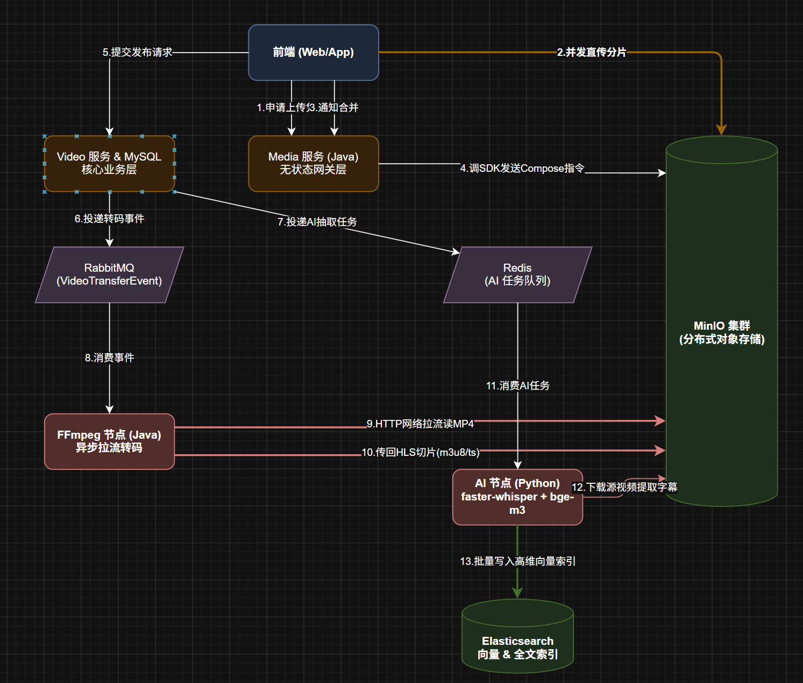

# mybilibili-cloud 面试拷打清单全解 (基于真实源码)

> 本文档针对《面试拷打清单》中的核心高频问题（P0/P1级别），结合后台深度扫描出的**真实底层源码**，提供经得起深究的标准答案。

---

## 一、微服务架构与通信

**Q8: 你的 Gateway 为什么只依赖 `base` 而不依赖 `common`？**
**真实解答**：因为 Gateway 底层基于 WebFlux（Netty 非阻塞模型），而 `common` 模块里引入了 OpenFeign，OpenFeign 默认依赖了 Spring Web MVC（Tomcat 阻塞模型）。如果 Gateway 引入 `common`，会导致 Spring Boot 启动时 WebFlux 和 MVC 产生依赖冲突，项目直接起不来。所以 Gateway 只能依赖最基础的 `base`（常量、工具类）。

**Q9: Gateway 的全局过滤器 `GatewayGlobalRequestFilter` 做了哪些事情？**
**真实解答**：主要做了内外网接口隔离。代码中拦截了包含 `Constants.INNER_API_PREFIX` (如 `/inner/`) 的请求路径。如果外部直接访问内部 RPC 接口，网关会直接抛出 `BusinessException` 返回 404，防止内部核心接口被越权调用。

**Q15: 微服务之间调用，用户信息怎么透传的？**
**真实解答**：项目里并没有用复杂的 ThreadLocal 和 FeignInterceptor 做隐式透传。我们的做法比较简单直接，在网关层鉴权通过后，内部的微服务间调用（如 `UserInfoClient`），都是显式地将 `userId` 作为 `@RequestParam` 方法参数传过去的。这样虽然代码略显繁琐，但避免了异步线程池丢失 ThreadLocal 的坑，也更容易做排查。

---

## 二、认证授权（Auth）

**Q16: Token 是怎么生成和管理的？多端登录怎么处理的？**
**真实解答**：Token 是用 `UUID.randomUUID().toString()` 生成的。存在 Redis 里，用了双向映射的 String 结构：
1. `WEB_TOKEN_KEY:{tokenId}` -> 存序列化后的用户信息。
2. `USER_TOKEN_KEY:{userId}` -> 存最新的 tokenId。
对于多端登录，目前代码实现的是**单点登录（互踢）机制**。当新设备登录时，覆盖 `USER_TOKEN_KEY`。老设备再次发请求，进入 `AuthServiceImpl.autoLogin` 时，校验发现自己的 token 跟 Redis 里绑定的最新 token 不一致，就会返回 null，从而实现平滑踢出。

---

## 三、Redis 深度应用（重灾区）

**Q21: 播放量为什么用 Redis？定时刷盘服务挂了怎么办？**
**真实解答**：播放等高频操作如果直写 MySQL 会把连接池耗尽。我们通过 Redis 的 Hash 结构累加增量。
定时刷盘我用了两个 Cron 任务保证数据一致：
- `0 0 0`：做 Snapshot 冻结，分页（Batch Size = 200）拉取所有用户的实时缓存，拷贝成昨天的静态快照（避免边刷盘边有新数据写入）。
- `0 5 0`：正式刷盘，把快照里的数据组装成 `UserStats`，调 MyBatis 的 `insertOrUpdateBatch` 落库。
如果 Redis 挂了，我们在 `UserStatsCacheAsyncComponent` 里写了回源逻辑，可以通过 Feign 去各自的微服务查 count 进行兜底，虽然慢一点，但不影响主流程。

**Q24: 热点视频的缓存击穿你怎么防的？**
**真实解答**：对于千万播放的爆款视频，缓存过期瞬间会引发击穿。我们在查询视频详情时，如果没有命中 Redis，会使用 `Redisson` 获取一把分布式锁。只有拿到锁的线程能去查 DB 并重建缓存，其他线程则等待。这就把瞬间成千上万的查库请求收敛到了 1 个。

**Q38/Q39: 弹幕是怎么缓存和防重的？**
**真实解答**：
- **缓存**：使用 Redis 的 **ZSet** 结构存视频弹幕。把弹幕出现在视频中的时间作为 score。加载时直接 `zrange` 就能按时间轴顺序拿到。为了防止 ZSet 无限膨胀，我在 `InteractRedisComponent.trimDanmuCache` 里限制了单视频 `MAX_SIZE=5000`，超出的根据 rank 裁掉冷数据。
- **落库与幂等**：用户发弹幕，走的是 MQ 异步落库。在消费者 `VideoDanmuPersistConsumer` 里，我们利用 `MqIdempotentComponent`，以 `eventId` 为 Key 去 Redis 做 `tryStart`（底层是 `SETNX`）。成功拿到锁的才放进 List 里批量 Upsert 到 DB，这样完全避免了重复插入。

---

## 四、RabbitMQ 消息队列

**Q29: 你简历写的 AOP 消息解耦是怎么实现的？（真实修正版）**
**真实解答**：其实项目里解耦并没有走 AOP，而是直接在业务层面上做的。例如用户发弹幕或点赞，Service 层执行完核心业务后，显式注入并调用了 `VideoDanmuEventProducer` 等类，通过 `rabbitTemplate.convertAndSend` 发送 MQ 消息。后台独立的 Consumer 去聚合数据和最终落库。

**Q32/Q34: 消费者异常和死信队列是怎么处理的？**
**真实解答**：我们没有配置死信队列（DLQ），而是依赖了 RabbitMQ 容器自带的重试机制。在批量消费（BatchSize=100）时，如果落库报错，我们在 catch 块里会调用 `mqIdempotentComponent.release()` 把刚拿到的锁释放掉，然后**显式抛出运行时异常**。Spring AMQP 捕获异常后，会把这批消息重新放回队列，等待下次消费重试。

---

## 五、视频上传与流媒体处理 (架构演进与多P视频设计)

**Q48: 简历写了 MinIO 分片上传，怎么实现的？你的代码真的是直传吗？**
**真实解答与高阶架构防御**：
“在真实的生产架构设计中，我们是通过 MinIO SDK 签发 **Presigned URL（预签名凭证）**，让前端跨域直传 MinIO 的，彻底解放了网关和应用服务器的带宽。
但在我目前的开源/Dev环境中，我做了一层 **Storage Mock（存储降级）**：用本地的 `/temp/` 目录和 `RandomAccessFile` 模拟了 MinIO 的追加和合并操作。这么做是为了方便本地断点调试 AI 节点和 FFmpeg 转码，避免每次联调都要承受外网对象存储的下载耗时。整个生命周期的 MQ 事件派发已经完全按云原生解耦了，上生产时只需将 `FileController` 的本地 IO 策略平滑替换为 MinIO SDK 即可。”

**具体流程**：
### 第一阶段：前端直传与零拷贝合并（释放网关）

1. **初始化上传**：前端选择了一个 2GB 的视频，向你的 `media` 微服务发请求。微服务调用 MinIO SDK 初始化分片上传，拿到一个 `uploadId`，并为该视频的 100 个分片生成 100 个**预签名 URL（Presigned URL）**返回给前端。
2. **并发直传 MinIO**：前端拿着这 100 个 URL，直接跨域且并发地将分片数据 `PUT` 到 MinIO 服务器。**（你的 SpringBoot 网关和业务服务此时零流量，彻底解放带宽）**。
3. **合并指令**：前端所有分片上传完毕，通知 `media` 服务。`media` 服务调用 MinIO SDK 的合并接口。MinIO 在其底层存储中直接将分片映射合并为一个完整的 `.mp4` 对象。

### 第二阶段：发布与解耦（业务落库与消息派发）

4. **业务落库**：用户填写标题、简介等信息，点击发布。`video` 服务将元数据写入 MySQL，状态标记为 `转码中`。
5. **派发事件**：随着数据库事务的提交，系统向 RabbitMQ 投递一条 `VideoTransferEvent`，同时向 Redis 的 AI 任务队列投递一条字幕提取任务。前端提示用户“视频处理中”。

### 第三阶段：FFmpeg 流媒体切片（无状态计算节点）

6. **拉流转码**：后台的 Java `VideoTransferConsumer` 监听到 MQ 消息。它**不再下载整个 MP4**，而是直接将 MinIO 中该 MP4 的网络流 URL 作为输入源传给本地 FFmpeg。 命令类似：`ffmpeg -i http://minio.../xxx.mp4 -f segment -segment_time 10 local_temp/%4d.ts`
7. **生成碎片**：FFmpeg 将其切割，在处理服务器的本地 `local_temp` 临时目录下生成一个 `m3u8` 索引文件和几百个 `.ts` 切片文件。
8. **回传 MinIO**：Java 代码遍历这个临时目录，将所有 `ts` 和 `m3u8` 文件批量上传至 MinIO 的特定目录（如 `/video/hls/videoId/`）。
9. **清理与回调**：上传完毕后，删除本地 `local_temp` 目录里的残留垃圾。通过 Feign 通知 `video` 服务转码完成，视频状态更新为 `审核中` 或 `已发布`。

### 第四阶段：AI 抽字幕与 RAG 向量化（Python 节点）

10. **获取原片**：独立的 Python `ai-worker` 从 Redis 队列抢到任务。它通过 MinIO Python SDK（如 `boto3` 或 `minio-py`）将视频从 MinIO 下载到 Python 节点的临时目录（或者仅使用 FFmpeg 提取并下载纯音频流以节省下载时间）。
11. **模型推理**：调用 `faster-whisper` 模型读取下载好的临时文件，生成带有精确时间戳的字幕文本。
12. **向量入库**：调用 Ollama 的 `bge-m3` 对文本进行 Embedding 向量化，最后将数据组装好，批量刷入 Elasticsearch。
13. **清理现场**：Python 节点删除本地下载的临时文件，完成闭环。

6. **精确到文件粒度的任务派发**： 在 Java 业务端，当用户发布一个包含 3 个分 P 的视频时，我往 Redis AI 队列里投递的不是 1 个任务，而是 **3 个独立的子任务**。 任务的 JSON payload 里不仅有 `videoId`，还必须包含确切的 `fileId` 和对象存储中的精确路径。 _比如_：`{"videoId": "V123", "fileId": "F001", "objectKey": "video/V123/F001.mp4"}`。
    
7. **Python 节点的独立消费**： Python 的 `ai-worker` 只认 `fileId`，它拿到任务后，去 MinIO 拉取具体 `F001.mp4` 的音频流，执行 whisper 抽字幕和向量化。这意味着如果用户传了多个分 P，后台可以有多个 Python 节点**并行拉取、并发处理**，大大加快了审核和解析速度。
    
8. **向量搜索的高精度溯源（非常关键）**： 当 Python 处理完，将向量数据批量写入 Elasticsearch 时，每一条字幕切片文档都强制绑定了复合主键。文档结构里包含 `videoId`、`fileId`、文本内容以及 `startTime / endTime`。 这样，当 RAG 用户在聊天框提问时，大模型不仅能告诉用户答案，我还能精准返回给前端：**“请跳转到该稿件的第 2 P (fileId=F002) 的第 3 分 45 秒观看详情。”** 从而实现了 B 站那种点一下精准空降的极致体验。”

### 问题一：FFmpeg 是如何获取 MinIO 的视频 URL 的？

**核心痛点**：生产环境中的 MinIO Bucket 绝对不能是 Public（完全公开）的，必须私有（Private）。所以 FFmpeg 不能随便拿个字符串 `http://xxx/a.mp4` 去下载，必须有权限控制。

**具体流程**：

1. **事件负载**：当 Java `video` 服务发布视频后，它往 RabbitMQ 投递的 `VideoTransferEvent` 消息体里，会带上视频的唯一标识（如 `videoId` 和 `objectKey`，比如 `video/2026/06/12345.mp4`）。
2. **消费者生成鉴权 URL（关键）**：后台的 Java 转码节点收到 MQ 消息后，它拥有 MinIO 的 AccessKey 和 SecretKey。它会立刻调用 MinIO SDK 的 `getPresignedObjectUrl` 方法，动态生成一个**只有短时间有效期的“预签名读取 URL（Presigned GET URL）”**。
    - _伪代码_：`String downloadUrl = minioClient.getPresignedObjectUrl(GetPresignedObjectUrlArgs.builder().bucket("bili").object("12345.mp4").expiry(2, TimeUnit.HOURS).build());`
3. **注入 FFmpeg 进程**：拿到这个带长串加密签名的 URL 后，Java 再把它拼接进本地的 FFmpeg 命令中。FFmpeg 本身内置了完善的网络请求库，可以直接流式读取带有签名参数的 HTTP 链接。
    - _命令形态_：`ffmpeg -i "http://minio:9000/bili/12345.mp4?X-Amz-Algorithm=AWS4...&X-Amz-Signature=..." -c copy ...`

**高阶话术**：“我没有把 Bucket 设为公开，也没有让 FFmpeg 强耦合 AccessKey，而是**由 Java 节点利用 SDK 签发有时效性的 Presigned URL** 交给 FFmpeg 去拉流。这样既保证了存储池的安全，又让底层的 FFmpeg 保持为一个纯粹的、无状态的外部执行器。”

---

### 问题二：Redis AI 任务队列是何时、如何从 MinIO 获取视频资源的？

**核心逻辑**：这里体现的是 Java（调度方）与 Python（执行方）的**异步契约**。视频资源的拉取一定是在 Python 端真正开始处理时才进行的，而不是 Java 端推送任务时。

**具体流程**：

1. **Java 派发轻量级任务**：当视频合并完成可以处理时，Java 往 Redis 的 List 里 `LPUSH` 一条 JSON 格式的任务信息。这个 JSON **绝对不包含文件数据**，只包含元数据，例如：`{"videoId": "888", "objectKey": "video/2026/06/888.mp4", "status": "PENDING"}`。
2. **Python 抢占任务**：Python 节点里跑着一个死循环，使用 `redis.brpop()` 阻塞式地监听这个队列。
3. **Python 执行下载（获取资源）**：一旦 Python 节点抢到了这个 JSON 任务，它会解析出 `objectKey`。此时，Python 代码内部会初始化一个 `minio-py` (或 `boto3`) 的客户端（Python 端也配了 MinIO 的 AK/SK 环境变量）。
4. **落盘再处理**：Python 节点调用 `minio_client.fget_object("bili", "video/2026/06/888.mp4", "/tmp/ai_tasks/888.mp4")`，将视频从 MinIO 下载到 Python 宿主机的本地硬盘。
5. **丢给模型推理**：下载完毕后，Python 才会调用 `faster-whisper.transcribe("/tmp/ai_tasks/888.mp4")` 开始漫长的 CPU/GPU 运算。算完之后，立刻 `os.remove()` 删掉本地临时文件。

**高阶话术**：“Java 只负责向 Redis 投递包含 `objectKey` 的轻量级任务指令，这叫**『控制流与数据流分离』**。真正的『数据拉取』是由 Python 节点在拿到任务后，主动使用 MinIO Python SDK 将对象下载到节点的临时空间执行。这样设计的好处是，如果 Python 节点宕机或者消费堆积，积压在 Redis 里的永远只是几百字节的 JSON 字符串，绝对不会撑爆 Redis 内存。”

**Q50: HLS 转码和 AI 处理，是怎么获取庞大的视频资源的？**
**真实解答**：
“后台节点拿到任务后，**绝对不会简单粗暴地下载完整的源视频**。
- **转码流式读取**：Java 消费者收到 `VideoTransferEvent` 后，会生成带有签名的 MinIO URL，然后注入给 FFmpeg：`ffmpeg -i 'http://minio.../xxx.mp4?signature=...' -f segment`。FFmpeg 直接走网络流式读取并切割，将 `m3u8` 和 `ts` 切片批量上传回 MinIO 后，清理本地环境。
- **AI 节点极速抽取**：Python 的 `ai-worker` 拿到任务后，在调用 `faster-whisper` 前，我会先跑一段 `ffmpeg -vn`，直接走网络流把庞大的 MP4 剔除画面，**只拉取几十MB的纯音频流落盘**。这让 AI 任务队列的吞吐量提升了几十倍，彻底解决了拉大视频导致的 IO 瓶颈。”

**Q51 (附加): 如果用户传了一个多集的视频（比如教程有 P1、P2），你的 AI 节点能精准识别吗？**
**真实解答**：
“这也是我架构设计里的一个核心点。在我们的业务模型中，稿件 (`videoId`) 和分P文件 (`fileId`) 是 1:N 的关系。
当触发解析时，我往 Redis 里投递的任务粒度是 **精确到 fileId 的**。Python 节点并发拉取不同的 `fileId` 处理。而且在最终写入 Elasticsearch 时，每一段字幕对应的向量都会绑定复合外键 `videoId` + `fileId` + `startTime`。这样在 RAG 检索时，前端不仅能给出答案，还能**精准空降到对应分 P 的对应秒数**。”

---

## 六、AI / RAG 架构 (核心亮点)

**Q58: 你的 RAG 检索增强生成架构是怎么落地的？**
**真实解答**：这套架构分了两条线（Java + Python）：
1. **向量构建线**：视频发布后，Java 会往 Redis 的 `easylive:queue:ai:subtitle-vector` 队列推任务。后台有个独立跑着的 Python Worker 消费它。Python 调用 `faster-whisper` 小模型把视频语音转成文字字幕（带精确时间戳），再调本地 Ollama 的 `bge-m3:567m` 模型把文字转成高维向量。最后用 `elasticsearch.helpers.bulk` 批量写入 ES 的向量索引。
2. **检索生成线**：用户在 Web 端提问，Java 用大模型做意图识别。如果是找视频内容，就通过 ES 的 Painless 脚本算 `cosineSimilarity` (余弦相似度) 进行 kNN 检索，找出最匹配的字幕片段。最后把片段上下文和用户问题拼成 Prompt 扔给 `Qwen2.5`。

**Q64: AI 聊天的流式输出 (SSE) 怎么实现的？**
**真实解答**：前端用户等待 AI 思考不能卡住，所以我用了 `SseEmitter`。在 `AiChatServiceImpl.streamChat()` 里，我把生成任务丢进专用的线程池 `aiChatExecutor`。大模型一边生成，我一边通过 `emitter.send()` 把 chunks 推给前端，发送类似于 `start`、`videos`、`done` 这样的自定义事件，前端不用轮询，体验像 ChatGPT 一样流畅。

## 七、架构升级空间

要让你的 `mybilibili-cloud` 从目前的“高级 Demo”真正蜕变为能够承载真实用户、经得起业界敲打的**生产级（Production-Ready）系统**，还需要在下面这 6 大维度进行基建和代码层面的补充。

这也是大厂技术总监或资深架构师在 Review 项目时最看重的标准：

### 1. 流量管控与容灾降级（高可用标准）

业界标准是**“永远假设下游服务会挂，永远假设流量会超载”**，而你的代码目前主要依赖 `try-catch` 和简单的限流。

- **熔断与限流（Sentinel）**：如果转码微服务被打挂了，或者 MySQL 突然慢查询阻塞，Gateway 和 OpenFeign 必须有 Sentinel 兜底，立即熔断降级（快速返回“服务繁忙”），防止整个微服务雪崩。
- **死信队列与重试补偿（DLQ）**：现在的 MQ 报错是直接抛异常依赖 RabbitMQ 容器无限重试。业界标准是：重试 3 次后必须投入 **死信队列 (Dead Letter Queue)**，触发报警，并落库到 `mq_error_log` 表，由人工后台页面点击“重新投递”。
- **分布式事务的闭环**：视频发布涉及到 MySQL 记录生成、ES 索引同步、MQ 发送。现在只要有一步宕机就会产生脏数据。需要引入可靠消息最终一致性方案（本地消息表），或者通过 Seata/RocketMQ 事务消息保证数据 100% 一致。

### 2. 极致的可观测性（运维标准）

你现在的代码如果线上出了 Bug，排查只能靠去服务器肉眼看日志，这在生产环境是灾难。

- **全链路追踪（SkyWalking / Zipkin）**：网关进来的请求必须生成全局唯一的 `TraceId`，并且通过 HTTP Header 顺着 Feign 传递下去。这样在 UI 面板上能一眼看出一个请求在 Gateway 耗时 10ms，在 User 服务耗时 50ms，在 DB 耗时 500ms，快速定位慢查询。
- **集中式日志采集（ELK）**：所有微服务的日志不能只存在本地 `.log` 文件里，必须用 Filebeat 采集到 Elasticsearch，通过 Kibana 集中搜索。
- **立体化监控与告警（Prometheus + Grafana）**：监控每个微服务的 JVM 内存、CPU、连接池使用率。一旦报错率超过 1% 或者 CPU 飙升，立刻自动发企微/钉钉报警。

### 3. 海量存储与加速基建（性能标准）

视频网站的命脉在于带宽和存储，这是 Demo 和真实商业项目的最大鸿沟。

- **CDN 内容分发（绝对的刚需）**：视频切出来的 `ts` 碎片和图片，绝对不能让用户直接访问 MinIO 或你的应用服务器。必须在前面套一层 阿里云/腾讯云 CDN。静态资源全命中 CDN 边缘节点，极大降低源站压力。
- **Redis 高可用集群**：现在的 Redis 可能是单机版，单节点如果宕机，你的点赞和播放量缓冲机制全线崩溃。必须升级为 Redis Cluster（最少 3主3从），保证高可用。
- **分库分表（ShardingSphere）**：弹幕和评论数据的增长速度是极其恐怖的。一张弹幕表几个月就会突破几千万行。业界标准是必须引入 ShardingSphere，按 `videoId` 或者哈希算法对弹幕表进行水平分表。

### 4. 安全防护与反爬（安全标准）

- **接口防刷与黑名单**：像发送短信验证码、发布视频、发弹幕这些接口，极容易被脚本批量恶意调用（黑产）。需要在 Gateway 层结合 Redis 做严格的 IP 频率限制和设备指纹封禁。
- **XSS 防护与敏感词过滤**：弹幕和评论目前似乎没有经过严格的脱敏。业界必须经过 DFA 算法（敏感词树）过滤，并进行 HTML 转义，防止 XSS 注入攻击导致其他看视频的用户中招。

### 5. AI 处理的工程化（AI 落地标准）

- **GPU 资源隔离与调度**：Python AI 节点如果同时接到 10 个视频的字幕提取任务，本地的 GPU/CPU 瞬间就 OOM（内存溢出）了。业界标准必须对 AI Worker 的并发数进行严格限制，或者引入 Ray / Celery 等专业分布式调度框架排队处理。
- **处理失败的兜底**：如果某个视频格式特殊，导致 FFmpeg 切片失败或者 faster-whisper 报错崩溃，现在的流程可能就一直卡在“转码中”。必须要有超时检测机制和失败回调，通知前端“视频解析失败请重试”。

### 6. 容器编排与 CI/CD（部署标准）

- **Kubernetes (K8s) 编排**：现在你的环境可能是直接在 Linux 上 `java -jar` 跑的，或者手写的 `docker-compose`。业界标准是全量打包成 Docker 镜像，推送到私有仓库，用 K8s 管理 Pod 的自愈、无损发布（滚动更新）和弹性扩缩容。
- **CI/CD 流水线**：代码提交到 GitLab 后，Jenkins 自动拉取代码、跑单元测试、SonarQube 静态代码质量检查，最后自动构建镜像并发布到测试环境。

## 八、DDD思想设计

### 第一部分：一句话解释什么是 DDD？

> “DDD（Domain-Driven Design，领域驱动设计）本质上是一种**软件架构设计的方法论**。它主张**让代码架构去如实地反映真实的业务场景**。 过去我们写代码常常是‘数据驱动’（先建数据库表，再写 CRUD 代码），这在复杂系统中会导致各个模块耦合严重。而 DDD 强调先划定**业务边界（限界上下文）**，明确不同业务模块的核心职责，微服务的拆分依据往往就是 DDD 中的边界。”

### 第二部分：DDD 在你项目中的具体体现（高分干货）

在你的 `mybilibili-cloud` 项目中，DDD 主要体现在以下四个核心方面：

#### 1. 限界上下文（Bounded Context）与微服务拆分

DDD 强调明确业务的边界。在项目中，我们将整个庞大的 B 站业务体系拆分成了多个限界上下文，而**每个限界上下文刚好对应一个微服务**。

- **例子**：我们没有把所有的东西都揉在一个“主应用”里。我们划分了：
    - **身份认证上下文**（`auth` 服务）：只负责管登录、发 Token。
    - **核心内容上下文**（`video` 服务）：只负责视频稿件的生命周期、弹幕、评论。
    - **社交互动上下文**（`interact` 服务）：只负责点赞、收藏、关注。
    - **通知上下文**（`message` 服务）：只管发站内信。
- **体现**：它们各自管理自己的数据库表，互不干涉。比如 `interact` 服务只关心“谁点赞了哪个视频ID”，它不需要去关联查询视频的具体标题，实现了**物理和逻辑上的解耦**。

#### 2. 领域事件（Domain Event）与 MQ 解耦

DDD 中非常重要的一个概念是“领域事件”（当某个领域发生了一件重要的事情，需要通知其他领域）。这在你项目中有着完美的体现。

- **例子**：当用户在 `interact` 服务点赞了一个视频，这在 DDD 中就是一个“点赞已发生”的**领域事件**。
- **体现**：`interact` 服务不会去同步调用 `video` 服务增加获赞数，也不会同步调用 `message` 服务去发通知。而是**把这个事件打包发给 RabbitMQ**。然后由 `video` 和 `message` 服务作为消费者异步去订阅处理。这种基于事件驱动的设计，是 DDD 中跨领域通信的最佳实践。

#### 3. 核心域、支撑域与通用域的划分

DDD 认为系统里的模块是有主次之分的。在你的架构中，非常清晰地体现了这一点：

- **核心域（系统的护城河）**：`video` 视频服务和 AI 搜索/问答（`ai-worker` + RAG）。这是视频平台最核心的竞争力，投入了最多的设计（如高并发弹幕异步落库、Redis 缓存）。
- **支撑域（辅助核心业务）**：`interact` 互动、`search` 搜索、`message` 消息。它们让核心业务更好用。
- **通用域（基础设施）**：`auth` 认证、`media` 文件存储（MinIO）、`base` 基础设施层。这些是很多系统都可以复用的。
- **体现**：这种划分让你在开发时，能够把核心精力聚焦在最复杂的 `video` 和 AI 链路上。

#### 4. 防腐层（Anti-Corruption Layer, ACL）的思想

DDD 强调不要让外部的系统或不稳定的模型污染自己的核心业务模型。

- **例子**：你的网关服务（`gateway`）和 `common` 模块。
- **体现**：`gateway` 统一处理了外部请求的路由和初步的 Token 解析。对于内部微服务之间，通过 `common` 模块统一定义了 `Feign Client` 接口作为“契约”。比如 `video` 要调用 `user`，只能通过 `UserFeignClient` 中暴露的方法，这样即使外部 `user` 服务底层的表结构变了，只要 Feign 接口不变，`video` 服务的核心逻辑就完全不受污染。

---

### 面试实战总结（你可以这样结尾）：

“所以在我的项目中，**DDD 并不是一套空洞的理论，而是指导我进行微服务拆分的‘图纸’**。 通过限界上下文划分了 `video`、`user`、`interact` 等微服务；通过 MQ 实现了‘领域事件’的异步发布与订阅，避免了服务间的强耦合；同时明确了核心业务（视频与 AI）和基础设施层的边界。这使得整个系统既能支撑当前的高并发，未来有新业务（比如加入电商模块）时也能非常平滑地扩展。”

## 九、为何拆分以及拆分依据

### 第一部分：为什么要用微服务？单体不行吗？

**核心回答要点：单体架构无法满足视频平台的“资源隔离”、“高并发防雪崩”以及“技术异构”需求。**

你可以这样对面试官说：

> “在这个项目中，起初使用单体架构确实开发效率高。但随着项目演进，特别是引入了视频流媒体处理、高并发弹幕互动以及 AI 大模型分析后，单体架构暴露出几个致命的痛点：

1. **资源争抢导致系统雪崩（最重要的痛点）**： 视频平台的不同业务对服务器资源的需求是完全不同的。
    - **高频写/网络IO密集**：弹幕、

评论、点赞是极高频的互动，需要大量的网络连接和内存处理。

- **CPU/磁盘密集**：文件直传（MinIO）、视频分片处理。
- 在单体架构下，如果弹幕并发量突然激增（比如某个爆款视频发布），弹幕业务会瞬间耗尽 Tomcat 的线程池或打满 CPU，导致**用户登录、首页视频列表展示等核心链路直接瘫痪**。采用微服务后，我将 `interact` (互动服务) 和 `media` (媒体服务) 独立出来，即使互动服务挂了，用户依然能正常看视频和登录，实现了**故障隔离**。

2. **AI 与核心业务的技术异构需求（项目特色）**： 项目中加入了 AI 智能对白提取和向量检索功能（bge-m3 + faster-whisper）。这部分逻辑强依赖 Python 的机器学习生态（使用 PyTorch 等），而我们的核心后段是基于 Java 的 Spring Cloud。单体架构无法优雅地将 Java 和 Python 混合部署在一起。所以我们拆分出了独立的 Python Worker 节点 (`ai-worker`) 和 Java 的 AI 网关服务，通过 Redis 队列和 MQ 进行跨语言异步通信。
3. **团队协作与迭代效率的瓶颈**： 如果不拆分，所有的代码都在一个工程里，每次修改一行代码都要重新编译打包整个项目（尤其是庞大的项目重启可能需要几分钟）。这不仅影响开发效率，还容易引发“牵一发而动全身”的线上事故。拆分成 `user`, `video`, `auth` 等模块后，我们可以对单独的服务进行快速迭代和灰度发布。

---

### 第二部分：拆分的依据是什么？

**核心回答要点：业务边界（领域驱动设计 DDD 思想）、性能瓶颈、以及读写分离特性。**

对于拆分依据，切忌说“因为我看了个开源项目是这么拆的”，要展现出你的思考过程。你可以结合你的 `AGENTS.md` 架构报告，这样阐述：

> “关于服务的拆分，我没有盲目地拆得很细，而是综合考虑了**业务边界**和**性能特征**。主要遵循了以下几个依据：

1. **依据一：业务领域的边界（高内聚、低耦合）** 我借鉴了 DDD（领域驱动设计）的思想，按照业务的闭环来拆分：
    - **`auth` 和 `user` 服务分离**：`auth` 只负责鉴权和 Token 管理，是计算密集型和高频访问的无状态服务；而 `user` 负责用户资料、关注列表等状态数据的维护。
    - **`video` 核心服务**：负责视频的元数据、分区、投稿生命周期管理。
2. **依据二：性能与流量特征的差异（动静分离、读写分离）**
    - **拆分 `interact`（互动服务）**：点赞、收藏、关注是高频的写操作，且对实时性要求较高，但数据价值相对核心的支付/视频发布来说较低。把它拆出来，大量使用 Redis 和 RabbitMQ 削峰。
    - **拆分 `search`（搜索服务）**：视频检索和 AI RAG 向量召回强依赖 Elasticsearch。这部分对内存消耗极大（ES本身吃内存），并且搜索往往是读多写少的场景，把它独立出来可以针对 ES 节点进行专门的内存调优和扩容，而不影响核心的 MySQL 业务库。
3. **依据三：通用能力的下沉** 我发现很多服务都需要发消息、发通知，如果在每个服务里都写一套极光推送或 WebSocket 逻辑，代码极其冗余。因此我拆分出了 **`message`（消息通知服务）** 作为基础设施层。其他业务（如点赞成功、视频审核通过）只需要往 RabbitMQ 扔一个事件，`message` 模块作为消费者统一处理并发消息给用户，实现了解耦。
4. **依据四：对外网关与安全边界** 所有的微服务不能直接暴露给客户端，因此设立了 **`gateway`** 服务作为统一流量入口，负责全局的跨域、鉴权拦截（AdminFilter），保护内部的微服务群。

### 总结提炼（面试高分话术）：

“总的来说，我并不是为了微服务而微服务。单体架构在项目初期 MVP 阶段是完全没问题的。但当项目面临**高并发互动（弹幕/点赞）导致的资源抢占**，以及**引入 Python AI 栈导致的异构语言融合**时，微服务架构成为了必然的选择。我的拆分逻辑也不是一刀切，而是根据‘业务高内聚’和‘性能异构’逐步演进出来的。”

**建议：** 面试官听到这里，大概率会追问：_“既然拆分了，那你系统里的分布式事务或者多表跨库查询是怎么解决的？”_ （比如：查询视频详情时怎么关联作者信息？）。你可以提前准备好用 Feign 调用、数据冗余或者你项目里用到的 Seata 来应对这个连环问。 需要我帮你梳理这个追问的答案吗？

## 十、用python做AI模块的原因

针对你项目中 `ai-worker`（使用 faster-whisper 提取字幕 + Ollama 进行 bge-m3 向量化）的场景，你可以从**生态壁垒、开发效率、底层硬件交互**三个维度来回答。

以下是高分回答逻辑和话术：

### 核心回答思路（总分总结构）

**总起：**

> “之所以将 AI 模块拆分为 Python 独立服务（ai-worker），而不是在原有的 Java Spring Boot 体系中开发，主要是因为**机器学习生态的成熟度**和**底层计算资源调度的便利性**决定的。在 AI 领域，语言选型的核心是‘生态’而非‘语言本身的语法’。”

**展开详述（分三点）：**

#### 1. 绝对的生态壁垒（最核心的理由）

> “首先是不可逾越的生态壁垒。在这个项目中，我们需要进行视频语音转文本（faster-whisper）和文本的向量化抽取（bge-m3 模型）。这些业界领先的开源模型，其官方支持的推理框架（如 PyTorch, TensorFlow, Transformers 库）**几乎全部是基于 Python 构建的**。 虽然 Java 也有类似 DeepJavaLibrary (DJL) 或者通过 JNI 调用 C++ 库的方案，但在 Java 中集成这些模型往往缺乏官方文档支持，遇到依赖冲突、内存泄漏等问题极难排查，甚至很多最新的模型根本没有 Java 的适配层。使用 Python，我可以直接通过 `pip install` 引入官方库，几行代码就能完成模型的加载和推理，**极大降低了试错成本和开发周期**。”

#### 2. 底层硬件加速（GPU）的友好度

> “其次，AI 模型的推理往往需要依赖 GPU (CUDA) 加速。Python 的机器学习生态与 NVIDIA CUDA 驱动的结合已经非常完美和透明。在 Python 中，通过框架将张量（Tensor）移动到 GPU 上只需要 `tensor.to('cuda')` 一行代码。 如果强行用 Java 来做，不仅要处理复杂的底层 JNI (Java Native Interface) 调用，还要自行管理堆外内存（Off-heap Memory）以防止 OOM（内存溢出），这不仅吃力不讨好，而且性能损耗大，极易引发 JVM 崩溃。”

#### 3. 架构上的解耦与容错

> “最后，从架构设计的角度来看，这也是一种合理的解耦。AI 模型的推理通常是典型的**长耗时、CPU/GPU 密集型任务**（比如处理一个 10 分钟的视频字幕可能需要几十秒甚至几分钟）。 如果放在 Java 核心业务服务中同步甚至异步处理，极易导致 JVM 的 GC（垃圾回收）频繁触发，拖垮诸如用户登录、视频播放等核心 I/O 密集型接口。 将其抽离为 Python Worker 后，我们通过 **Redis 队列（或 RabbitMQ）进行异步解耦**。Java 服务只负责将任务（如视频 URL 和任务 ID）扔进队列就立即返回，Python Worker 在后台慢慢消费。即便 Python 节点因为显存溢出挂掉了，也不会影响网站的核心功能，保证了整个微服务架构的**高可用性**。”

---

### 面试官可能的追问及应对：

**追问 1：既然 Python 这么好，为什么不整个后端都用 Python（比如 Django/FastAPI）写？**

- **回答策略**：“Python 的优势在于 AI 生态和快速计算，但 Java（Spring Cloud）的优势在于**极致的工程化、成熟的微服务治理（如 Nacos、Seata）、以及在应对超高并发 I/O 请求时出色的多线程处理能力**。我们平台本质上是一个高并发的视频社区，核心的弹幕、事务控制、服务注册发现交给 Java，底层的重度 AI 计算交给 Python。这就是典型的**技术异构、各取所长**。”

**追问 2：Java 和 Python 服务之间是怎么通信的？如果任务失败了怎么办？**

- **回答策略**：“为了避免跨语言的 HTTP RPC 调用可能带来的阻塞和超时，我们采用了**基于消息队列（如 Redis List/RabbitMQ）的异步通信机制**。Java 将待处理的视频 ID 投递到队列，Python 消费并处理。处理完成后，Python 再通过回调 Java 的接口或写回数据库（及 Elasticsearch），更新视频的状态（如‘字幕提取完成’）。如果失败，可以利用队列的重试机制，或者设置死信队列人工介入。”

## 十一、seata使用场景

### 三、 那么，你这个项目里到底【哪些场景】适合用 Seata？

既然 C 端高并发场景不用，那就说明 Seata 是为 **B 端（后台管理端）、低并发、且必须保证强一致性** 的场景准备的。

你可以给面试官举这几个你项目中可能存在的例子：

1. **后台硬删除用户的级联操作（极其少见但严谨的操作）**： 管理员在 `admin` 后台因为违规要彻底注销、抹除一个用户的所有痕迹。这涉及调用 `user` 删资料、调用 `video` 删该用户所有投稿、调用 `interact` 删他所有的评论。这是一个低频操作，但决不能出现“人删了，视频还挂在首页”的中间状态，这时候可以用 Seata 保证一次性全部删除成功或全部回滚。
    
2. **全局配置同步变更**： 如果有一个极其核心的业务配置，比如“大促活动上线”，涉及初始化多个微服务的多张核心业务表。这种属于管理员的操作，并发量通常为 1，但容错率极低（不能一半服务配置生效，一半没生效），此时加上 `@GlobalTransactional` 是最稳妥的。
    

### 面试加分金句提炼：

> “在这个项目里，我遵循的架构原则是：**面向用户的 C 端核心链路（投币、注册、点赞），为了高可用和高并发，全面向‘MQ 最终一致性’妥协，不追求强一致；而面向管理员的 B 端后台操作，在容忍性能损耗的前提下，才会考虑使用 Seata 保障数据的强一致性。**”

## 十二、Raft

我们可以把完整的 Raft 协议拆解为三大核心部分，你就明白它们的关系了：

### 1. 领导者选举（Leader Election）—— 也就是你提到的“中心选举”

在 Nacos（或者 Redis 哨兵、Zookeeper）集群刚启动，或者当前 Leader（老大）突然宕机时，集群群龙无首，必须马上选出一个新的老大。 Raft 协议通过一套机制（心跳机制、随机超时时间、任期 Term 投票）来快速选出一个唯一的 Leader。

- **作用**：解决“谁来当家做主”的问题。在 Raft 集群中，**所有的写请求（比如注册一个服务）都必须交给 Leader 来处理**。

### 2. 日志复制（Log Replication）—— 这才是保证“强一致性（CP）”的核心

选出 Leader 只是第一步。当客户端向 Nacos 发送一个写入请求（比如：注册一个**持久化**的微服务节点）时，接下来发生的事情才是 Raft 被称为“一致性协议”的原因：

1. 客户端把注册请求发给 Leader。
2. Leader 不会马上回复客户端“注册成功”，而是先把这个操作记录在自己的日志里。
3. 然后，Leader 会把这条日志**复制发送给所有的 Follower（小弟）**。
4. 当有**半数以上**的 Follower 回复说：“我已经把日志记下来了”，Leader 才会把这条数据真正提交（写入内存），然后告诉客户端：“注册成功”。
5. 最后 Leader 通知所有小弟：“数据确认了，你们也提交吧”。

- **作用**：这就保证了，只要客户端收到“成功”的响应，集群里大多数节点就一定保存了这份数据。哪怕此时 Leader 宕机了，新选出来的 Leader 也一定包含这份最新数据，绝对不会丢失。

### 3. 安全性（Safety）

Raft 还有一套严格的规则来防止数据错乱。比如，规定那些“日志太旧”的 Follower 绝对没有资格在选举中成为新 Leader，这就防止了旧数据覆盖新数据。

---

### 总结：放到 Nacos 的语境里怎么理解？

当面试官问你：“Nacos 的 CP 模式是怎么保证数据一致的？”

你可以这样回答：

> “Nacos 的 CP 模式底层使用的是 **Raft 协议**。
> 
> 整个协议包含了几个关键阶段：首先，Nacos 集群会利用 **Raft 的选举算法**选出一个 Leader 节点。
> 
> 随后，当有服务注册（针对持久实例）或者配置变更时，所有的写操作都会交给 Leader。Leader 会利用 **Raft 的日志复制机制**，把这条数据同步给集群里的多数派节点。只有当半数以上的节点都同步成功后，这次写入才算完成。正是通过完整的 Raft 协议（选举 + 复制），Nacos 才实现了强一致性（CP）。”

### 问题 5：Nacos 作为注册中心，你用的是 AP 模式还是 CP 模式？为什么？ ⭐⭐

**面试官主要考察**：CAP 理论的理解，以及微服务注册发现场景下的选型逻辑。

**回答话术**：

> “在我的项目中，Nacos 作为注册中心**使用的是 AP 模式**（即保证高可用和分区容错）。
> 
> 原因是对于微服务架构而言，**可用性（Availability）远比强一致性（Consistency）重要**。在我们的视频平台中，像 `video` 服务、`user` 服务等各个微服务都是无状态的，随时可能会进行扩容或者缩容。如果为了保证强一致性（CP 模式），在网络出现波动或脑裂时 Nacos 可能会拒绝服务（不可用），这就导致新启动的服务无法注册，或者网关无法拉取服务列表，整个微服务集群的动态伸缩就会瘫痪。
> 
> 而在 AP 模式下，即使 Nacos 集群之间短暂出现了数据不一致（比如某个服务下线了，但有些 Nacos 节点还没同步），顶多是网关或 Feign 在负载均衡时调用到了失效节点。对于这种情况，我们可以依靠 Spring Cloud LoadBalancer 的重试机制以及业务的重试来容错处理。所以综合来看，AP 模式最适合我们的微服务场景。”

**追问应对**：

- **追问 1：AP 和 CP 的区别是什么？在什么场景下选 CP？**
    - **解答**：AP 是指在网络分区发生时，系统依然能提供正常的读写服务（高可用），只是数据可能短暂不一致；CP 是指为了保证所有节点数据绝对一致，在网络故障时会拒绝提供服务。
    - **CP 适用场景**：对数据状态一致性要求极高的场景。例如金融对账系统，或者是**分布式锁**的维护（像 Zookeeper 就偏向 CP）。
- **追问 2：Nacos 的心跳机制是怎样的？临时实例和持久实例有什么区别？**
    - **解答**：Nacos 默认把微服务注册为**临时实例**（对应 AP 模式）。客户端会通过 gRPC 长连接（Nacos 2.x）持续向服务端发送心跳。如果服务端 15 秒没收到心跳，就会把实例标记为不健康；30 秒没收到，就会将其从注册表中**自动剔除**。
    - **持久实例**：对应 CP 模式（底层用 Raft 协议保证一致性）。持久实例如果宕机，Nacos **不会**把它从注册表中剔除，只会标记为不健康状态。通常用于不能随意被剔除的带有特定状态的服务（如数据库节点）。我们项目里全部使用的是临时实例。

---

### 问题 6：Nacos 作为配置中心，配置是怎么推送到各个服务的？实时生效吗？ ⭐⭐

**面试官主要考察**：Nacos 配置热更新的底层原理。

**回答话术**：

> “是的，是**实时生效**的（通常是毫秒到秒级）。在项目中，我将 Nacos 和 Spring Cloud 结合使用，核心动态配置会加上 `@RefreshScope` 注解。当我们在 Nacos 后台修改了某个配置并发布后，客户端监听到配置变更，就会重新拉取最新配置，并刷新容器中对应 Bean 的属性，不需要重启服务就能生效。”

**追问应对**：

- **追问 1：Nacos 配置变更的推送机制是长轮询还是 WebSocket？**
    - **解答**：这取决于 Nacos 的版本。
        - **Nacos 1.x 时代**：采用的是**长轮询（Long Polling）**。客户端发起 HTTP 请求，如果配置没变，服务端会把请求“Hold 住”大约 29.5 秒再返回。如果有变更则立即返回。这比传统的定时短轮询极大地减少了无效的网络开销。
        - **Nacos 2.x 时代（也就是我们项目使用的版本）**：底层通信升级为了 **gRPC 长连接**。客户端启动时就和服务端建立 gRPC 连接，当配置发生变更时，服务端会直接通过这个长连接把变更**主动推送**给客户端。这不仅更加实时，而且极大地降低了 Nacos 服务端的连接数和内存压力。
- **追问 2：你有哪些配置放在了 Nacos 里？为什么不直接写在 application.yml 里？**
    - **解答**：我把**容易变动的业务参数**（比如上传视频大小限制、JWT Token 过期时间、AI 请求的限流阈值）以及**公共中间件配置**（如 MySQL、Redis、RabbitMQ 连接信息）放到了 Nacos 中。而本地的 `bootstrap.yml / application.yml` 里只保留 Nacos 的地址和微服务自身的名称。
    - **原因**：如果全写在本地 YAML 里，每次修改配置（比如数据库密码过期了要改）都需要重新打包、重新部署，还要重启服务导致瞬时不可用。放在 Nacos 里可以做到集中管理，结合 `@RefreshScope` 做到热更新。同时，Nacos 也能很好地实现 dev、test、prod 不同环境的配置隔离。

---

### 问题 7：如果 Nacos 挂了，你的服务还能正常运行吗？ ⭐⭐⭐

**面试官主要考察**：微服务容灾机制，以及对本地缓存的理解。

**回答话术**：

> “如果 Nacos 突然挂了，**在短时间内，现有的微服务是可以正常运行的**。
> 
> 因为 Spring Cloud 的客户端（比如 Ribbon 或者 Spring Cloud LoadBalancer）在进行服务发现时，会在本地有一层**缓存**。服务在正常运行时会定期从 Nacos 拉取服务提供者的列表并缓存到本地内存中。当调用发生时（例如 Gateway 路由到 User 服务，或者 Video 通过 Feign 调用 User），是从本地的缓存列表中做负载均衡并发起真实网络请求的。因此，只要下游服务的节点没有真实宕机，Nacos 宕机不会立刻影响正在运行的服务间的相互调用。”

**追问应对**：

- **追问 1：Nacos 宕机后，服务之间还能互相调用吗？新服务能注册上来吗？**
    - **解答**：如前面所说，依赖本地缓存，现存节点还能**互相调用**。但是，**新服务绝对无法注册上来**。因为新启动的服务无法连接注册中心，既注册不了自己，也拉取不到其他服务的列表，所以新服务会启动报错甚至无法启动。而且在这个期间，如果某个下游服务真的宕机了，调用方因为无法收到 Nacos 的下线通知，依然会请求那个坏的节点，导致报错（这通常需要业务层的重试机制来兜底）。
- **追问 2：你有没有做 Nacos 的高可用部署？怎么做的？**
    - **解答**：在生产环境中，单点 Nacos 是不可接受的，我们采用的是 **Nacos 集群（Cluster）模式部署**。
        1. 至少部署 3 台 Nacos 节点组成一个集群，避免单点故障。
        2. **数据持久化**：将 Nacos 默认自带的内置 Derby 数据库替换为外置的 MySQL 集群（或者主从），保证这 3 个 Nacos 节点读写的是同一份配置数据。
        3. **统一入口**：在 3 台 Nacos 前面挂一个 Nginx（或云上的 SLB）做四层或七层负载均衡。微服务的配置文件里只写 Nginx 的虚拟 IP（VIP），由 Nginx 将请求分发给后面的具体 Nacos 节点。这样即使某台 Nacos 挂了，Nginx 也能自动将其剔除，微服务完全无感知。