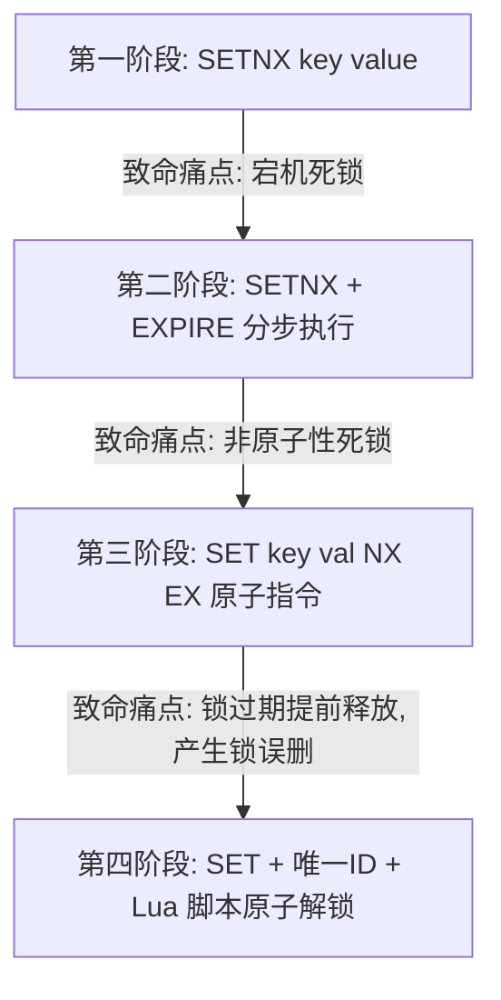

# 架构升维：分布式锁底层技术演进与 AP/CP 全面方案对比（面试黄金版）

在分布式与微服务架构中，**分布式锁**是解决跨进程并发冲突、保障订单/库存/秒杀等核心业务数据一致性的终极武器。面试官往往喜欢让你从零手写一个 Redis 分布式锁，以此考察你对“时序漏洞”和“原子性”的把控能力。本文为你构建一条闭环式的**分布式锁技术演进与全方案对比指南**。

> [!TIP]
> 关于企业级分布式锁的工业化实现（可重入锁、看门狗自动续期、阻塞等待等），请参阅本系列另一篇深度解析：[Redisson 分布式锁核心原理与看门狗自动续期深度解析](file:///d:/JavaNotes/java%E9%9D%A2%E8%AF%95/Redisson%E5%88%86%E5%B8%83%E5%BC%8F%E9%94%81%E7%9A%84%E6%B7%B1%E5%BA%A6%E8%A7%A3%E6%9E%90.md)。

---

## 🎯 面试官高频必杀问（核心考点）

### Q1：为什么单机 JVM 锁（如 `synchronized` 或 `ReentrantLock`）在分布式架构下会失效？
*   **黄金回答**：JVM 锁的原理是基于**单进程内多线程对共享内存数据（如对象头/AQS 状态）的修改与竞争**。
    在分布式微服务架构下，业务部署在多台独立的物理机/虚拟机/容器上，拥有**各自独立的 JVM 内存空间**。当一个请求到达 A 节点，另一个请求到达 B 节点，它们只能锁住各自进程内的线程，无法跨进程实现全局互斥，因此会导致并发下的超卖或重复处理。我们需要引入全局第三方的集中式组件（如 Redis 或 ZooKeeper）来实现**跨进程的全局排他锁**。

### Q2：手写 Redis 分布式锁是如何一步步演进的？每一代解决了什么致命痛点？
*   **黄金回答**：Redis 分布式锁经历了四个经典的发展阶段，每一步都是在不断堵住高并发环境下的“时序漏洞”：



---

## 📊 Redis 分布式锁实现方案 4 阶段演进表（面试高分核心）

| 阶段 | 核心实现命令 / 代码 | 核心设计逻辑 | 遗留的致命缺陷（时序漏洞） | 解决方案 |
| :--- | :--- | :--- | :--- | :--- |
| **第一阶段** | `SETNX lock_key 1` | 仅当 key 不存在时才设值成功，代表加锁。业务执行完后 `DEL lock_key` 释放锁。 | **锁永久残留（死锁）**：若客户端加锁成功后，突然宕机或被 `kill -9`，没有执行 `DEL`，锁将永久驻留 Redis，导致后续业务全部卡死。 | 为锁引入**自动过期时间**。 |
| **第二阶段** | `SETNX lock_key 1`<br/>`EXPIRE lock_key 30` | 先加锁，再通过单独的指令为锁设置过期时间。 | **非原子性导致的死锁**：加锁和设过期时间是两条命令。若在 `SETNX` 成功后、执行 `EXPIRE` 前，客户端网络中断或宕机，依然会发生死锁。 | 将加锁与设过期时间合并为**一条原子命令**。 |
| **第三阶段** | `SET lock_key 1 NX EX 30` | 利用 Redis 2.6.12+ 的 `SET` 复合参数，加锁与过期时间在 Redis 内部原子性执行。 | **锁被他人误删**：若线程 A 业务卡顿导致锁过期自动释放，线程 B 随后加锁成功；此时 A 业务回过来执行完毕，顺手调用 `DEL`，会把 **B 刚刚加的锁误删掉**，导致锁防线崩溃。 | 在加锁时存入**当前线程的唯一标识（如 UUID）**，解锁前校验身份。 |
| **第四阶段** | **加锁**：`SET lock_key uuid NX EX 30`<br>**解锁**：执行 **Lua 脚本** | 加锁存入专属 UUID。解锁时，先判断当前锁的值是否与自己的 UUID 匹配，匹配才允许删除。 | **校验与删除非原子性**：如果用 Java 代码先 `GET` 校验再 `DEL`，在“校验通过”与“执行删除”之间的极微小间隙，锁刚好过期被线程 B 抢走，A 依然会误删 B 的锁。 | 使用 **Lua 脚本**，在 Redis 内部以**单线程排他方式**原子执行“校验+删除”。 |

---

## 🔒 终极完美手写版：原子性加锁与 Lua 解锁实战

面试官往往会让你在黑板或白板上直接写出“第四阶段”的完美手写锁逻辑。

### 1. 原子加锁
```java
// 使用 Spring Boot RedisTemplate 实现
String uniqueId = UUID.randomUUID().toString(); // 保证锁的独占标识，防止误删
Boolean lockSuccess = redisTemplate.opsForValue()
    .setIfAbsent("lock_key", uniqueId, 30, TimeUnit.SECONDS); // NX EX 原子操作
```

### 2. 原子解锁（Lua 脚本）
必须保证“验证身份”和“释放锁”在 Redis 端原子执行。Lua 脚本如下：
```lua
-- KEYS[1]: 锁名 (lock_key)
-- ARGV[1]: 当前客户端的唯一标识 (uniqueId)
if redis.call("get", KEYS[1]) == ARGV[1] then
    -- 如果身份验证成功，则安全删除锁，返回 1
    return redis.call("del", KEYS[1])
else
    -- 身份不匹配（说明锁已过期被他人获取），不执行删除，返回 0
    return 0
end
```
*   **Java 解锁调用代码**：
    ```java
    String luaScript = 
          "if redis.call('get', KEYS[1]) == ARGV[1] then " +
          "    return redis.call('del', KEYS[1]) " +
          "else " +
          "    return 0 " +
          "end";
    redisTemplate.execute(
        new DefaultRedisScript<>(luaScript, Long.class), 
        Collections.singletonList("lock_key"), 
        uniqueId
    );
    ```

---

## 📊 分布式锁三大主流方案深度对比（架构选型考点）

大厂面试官非常喜欢问：“你的项目中分布式锁是怎么选型的？Redis、ZooKeeper 和数据库锁分别适用于什么场景？”

| 对比维度 | Redis 分布式锁 (AP 倾向) | ZooKeeper 分布式锁 (CP 倾向) | 关系型数据库 (MySQL) 锁 |
| :--- | :--- | :--- | :--- |
| **实现原理** | 基于内存读写，操作 `SETNX` / Hash 结构。 | 基于临时顺序节点（Ephemeral Sequential）与 Watch 监听机制。 | 基于数据库行锁 `FOR UPDATE` 或唯一索引冲突。 |
| **性能吞吐** | **极高**（内存操作，十万级 QPS）。 | **中等**（每次创建/删除节点需在集群间通过 Paxos/ZAB 协议同步）。 | **极低**（高并发下磁盘 I/O 成为灾难瓶颈）。 |
| **可靠性** | **中等**（主从异步复制，极端下存在主从切换导致的锁丢失）。 | **极高**（CP 模型，多数派写入才成功，强一致性保证）。 | **高**（依赖数据库本身的事务与高可用机制）。 |
| **死锁防范** | 依靠**过期时间（TTL）兜底**与客户端 Watchdog 定时续期。 | **天然防死锁**（一旦客户端宕机，Session 断开，临时节点自动删除）。 | 依靠数据库连接断开自动释放锁，或手动超时清理。 |
| **排队机制** | 需客户端自行轮询或通过 Pub/Sub 订阅挂起唤醒。 | **天然排队**（监听前一个顺序节点的删除事件，避免惊群效应）。 | 依赖数据库本身的行锁等待队列。 |

---

## 💡 终极抉择：Redis 锁（AP） vs ZooKeeper 锁（CP）

这是中高级程序员的核心选型能力体现，面试时应这样回答：
1.  **什么时候选择 Redis 分布式锁？（AP 模式，效率至上）**
    *   适用于**高并发、高吞吐、对微秒级响应有要求**，且**业务能够容忍极低概率锁失效**的场景。
    *   例如：商品秒杀、高频接口防重、社交平台点赞计数等。
2.  **什么时候选择 ZooKeeper 分布式锁？（CP 模式，安全至上）**
    *   适用于**对数据一致性要求 100% 绝对精确，无法容忍任何锁失效**的场景。
    *   例如：金融级资金划转、跨系统核心对账、敏感资源全局配置修改。
    *   *ZK 锁天然安全的底层原因*：ZK 满足 **CP 理论**，锁的创建必须经过半数以上节点同意（强一致性），且一旦持有锁的节点挂掉，ZK 与客户端的 Session 租约断开，其创建的**临时节点会被自动删除**，这从物理层面上既防止了死锁，又保证了锁绝不会在没释放前出现重复抢占。