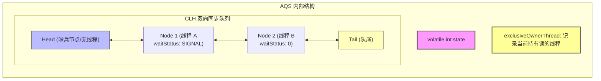

# Java并发基石：通过 ReentrantLock 彻底攻克 AQS 核心原理（面试黄金版）

在 Java 高级面试中，**AQS（AbstractQueuedSynchronizer）** 是并发编程领域出镜率最高、最能体现候选人内功的底层核心。面试官往往会从 `ReentrantLock` 谈起，然后层层递进直击 AQS 源码。本文为你梳理出一条完美的面试通关逻辑，配合硬核图解与源码剖析，助你碾压面试官。

---

## 🎨 AQS 核心视觉概念

为了更直观地理解多线程抢占锁的宏观场景，下图展示了多线程在 AQS 虚拟队列中排队，锁状态在 CPU 核心之间原子转移的科技感概念图：


---

## 🎯 面试官高频必杀问（快速通关）

### Q1：什么是 AQS？它的核心思想是什么？
*   **黄金回答**：AQS 是 `AbstractQueuedSynchronizer`（抽象队列同步器）的缩写，是整个 `java.util.concurrent`（JUC）包的基石。
    它的核心思想是：如果被请求的共享资源**空闲**，则将当前请求资源的线程设置为有效的工作线程，并将共享资源设置为**锁定状态**（通过 `volatile state` 修改）。如果被请求的共享资源**被占用**，那么就需要一套**线程阻塞等待以及被唤醒时锁分配的机制**，这套机制 AQS 是用一个 **CLH 队列变体的双向链表**来实现的，将暂时获取不到锁的线程构建成 Node 节点加入队列中排队。

### Q2：★ 核心高频追问：为什么 AQS 队列是双向链表，而不是单向链表？
这是区分普通程序员与资深开发的核心考点。双向链表在 AQS 中主要解决以下三个痛点：
1.  **节点取消排队（Cancellation）的开销极低**：
    在并发环境下，某些排队线程可能因为超时或被中断而取消排队。此时，该节点需要从队列中移除。如果是单向链表，移除一个节点必须从 `head` 开始往后遍历找到它的前驱节点，时间复杂度是 $O(N)$；而在双向链表中，每个节点都直接保存了 `prev` 前驱节点，可以 $O(1)$ 复杂度地将前驱节点的 `next` 指向自己的后继节点，高效完成移出。
2.  **新节点入队时对前驱节点状态的原子判定**：
    新节点加入队列尾部（Tail）后，在挂起前必须确保它的前驱节点是“在释放锁时会唤醒后继”的节点（即前驱节点的 `waitStatus` 必须是 `SIGNAL = -1`）。双向链表允许新节点轻松地通过 `prev` 指针向前查找并修改前驱节点的状态。
3.  **支持非公平锁的高并发唤醒与自旋优化**：
    当持有锁的线程释放锁时，如果发现后继节点被取消了（`waitStatus > 0`），AQS 需要跳过取消的节点，寻找最靠前的一个有效节点去唤醒。此时，AQS 会**从尾部（Tail）向前遍历**，利用 `prev` 指针能够稳定、安全地找到排在最前方的有效节点。

### Q3：`state` 变量为什么用 `volatile` 修饰？配合 CAS 起到什么作用？
*   **黄金回答**：
    *   `state` 是一个 `volatile int` 类型变量，用来表示同步状态。`volatile` 保证了多线程下的**可见性**和**有序性**，使得任何线程对锁状态的修改都能立刻被其他线程看到。
    *   配合 **CAS（Compare And Swap）** 保证了状态修改的**原子性**。在多线程并发抢锁时，多个线程同时尝试通过 `unsafe.compareAndSwapInt()` 将 `state` 从 0 修改为 1，只有一个线程能成功，失败的线程则会安全地进入队列排队，从而避免了传统加锁带来的 CPU 上下文切换开销。

---

## 🧠 AQS 内部数据结构与核心组件

AQS 内部主要依靠一个 **`state` 变量**、一个 **双向同步队列** 和一个 **`exclusiveOwnerThread` 变量**（来自父类 `AbstractOwnableSynchronizer`）来协同工作。



### 1. 核心状态值 `state` 的多重语义
在不同的 JUC 工具中，`state` 具有完全不同的并发业务语义：
*   **`ReentrantLock`**：表示**锁的持有状态与重入次数**。`state = 0` 表示锁空闲，`state > 0` 表示锁被占用，数值大小代表同一线程的重入次数。
*   **`Semaphore`**：表示**剩余的可用信号量许可数**（Permits）。
*   **`CountDownLatch`**：表示**还需要等待倒计时的任务数**。当 `state` 减到 0 时，唤醒所有在队列中阻塞的线程。

### 2. Node 节点的核心状态属性 `waitStatus`
在排队队列中，每个 Node 包含一个 `waitStatus` 变量，用来表示当前线程节点的等待状态：
*   **`0`**：新节点入队时的默认状态。
*   **`CANCELLED (1)`**：表示当前线程因为超时或中断，已经**取消了锁的竞争**，需要被移出队列，此节点永远不会再阻塞。
*   **`SIGNAL (-1)`**：表示**当前节点的后继节点处于阻塞（park）状态**，当前节点在释放锁或取消竞争时，**必须唤醒（unpark）其后继节点**。
*   **`CONDITION (-2)`**：表示当前节点在条件队列中，正在等待某个条件（`Condition.await()`）。
*   **`PROPAGATE (-3)`**：共享模式下使用，表示下一次共享式同步状态获取将会被无条件地传播下去。

---

## 📊 ReentrantLock 核心加锁/解锁源码时序级剖析

为了展现 AQS 的精髓，我们以 **非公平锁（NonfairSync）** 为例，深入剖析两个线程竞争锁的完整源码流程。

### 1. 整体抢锁流程图 


### 2. 公平锁 vs 非公平锁的源码级差异（面试高分必背）
这是面试官最喜欢抠的底层细节：
```java
// 非公平锁 NonfairSync 源码
final void lock() {
    if (compareAndSetState(0, 1)) // 1. 一上来管你有没有人排队，直接 CAS 抢锁（体现非公平）
        setExclusiveOwnerThread(Thread.currentThread());
    else
        acquire(1);
}

// 公平锁 FairSync 源码
final void lock() {
    acquire(1); // 1. 直接老老实实去调用 acquire
}
```
进入 `acquire(1)` 后，两者都会调用 `tryAcquire(acquires)` 方法：
```java
// 非公平锁 tryAcquire 最终调用 nonfairTryAcquire
final boolean nonfairTryAcquire(int acquires) {
    final Thread current = Thread.currentThread();
    int c = getState();
    if (c == 0) {
        if (compareAndSetState(0, acquires)) { // 2. 只要发现状态是 0，直接抢！
            setExclusiveOwnerThread(current);
            return true;
        }
    }
    // ... 忽略重入逻辑
}

// 公平锁 tryAcquire 源码
protected final boolean tryAcquire(int acquires) {
    final Thread current = Thread.currentThread();
    int c = getState();
    if (c == 0) {
        // 2. 关键：不仅要状态是 0，还要调用 hasQueuedPredecessors() 判断队列里有没有人在你前面排队！
        if (!hasQueuedPredecessors() && compareAndSetState(0, acquires)) {
            setExclusiveOwnerThread(current);
            return true;
        }
    }
    // ... 忽略重入逻辑
}
```
*   **总结**：
    1.  **非公平锁** 抢锁有两次“插队”机会：第一次是 `lock()` 方法刚进来时直接 CAS；第二次是 `tryAcquire()` 发现 `state == 0` 时直接 CAS，完全不管队列中是否有线程在等待。
    2.  **公平锁** 则非常绅士：无论何时，发现 `state == 0` 时，必须先调用 `hasQueuedPredecessors()` 检查排队队列中是否有前驱节点在等待。如果有，则主动进入队尾排队。

---

## ⚡ 终极深度考点：为什么非公平锁性能更强？

很多同学只能回答“因为非公平锁吞吐量高”，但说不清楚底层机制。
*   **核心原因**：**减少了线程挂起与唤醒的 CPU 上下文切换开销。**
*   **高并发场景模拟**：
    假设线程 A 刚刚执行完业务准备释放锁，此时队列中只有挂起的线程 B 在等待被唤醒（唤醒 B 需要耗费大约几个微秒的线程上下文切换开销）。
    恰好在这个时间间隙，新来的线程 C 进来了。
    *   如果是**公平锁**：线程 C 必须被挂起进入队列，同时等待线程 B 慢吞吞地被唤醒。这期间发生了**两次线程上下文切换**，且 CPU 处于空转等待状态。
    *   如果是**非公平锁**：新来的线程 C 还在 CPU 时间片内处于活跃状态，它直接 CAS 抢到了刚刚释放的锁并开始执行业务。而线程 B 被唤醒后发现锁又被抢了，继续挂起。由于线程 C 绝大多数情况下能直接在活跃状态下完成工作，极大地提高了 CPU 的利用率，从而将并发吞吐量提升了数倍。

---

## ⚠️ 避坑指南与最佳实战

1.  **必须要保证解锁操作在 `finally` 块中执行**：
    `ReentrantLock` 不像 `synchronized` 是 JVM 自动释放锁，如果发生异常且没有在 `finally` 中显式调用 `unlock()`，锁将永远得不到释放，AQS 队列中的线程将永久阻塞，导致死锁。
2.  **合理评估公平锁的使用场景**：
    除非你的业务逻辑中，**极度要求请求处理的严格顺序（FIFO）**，否则在绝大多数高并发场景下，应默认选择非公平锁，以获得极致的系统吞吐量。
3.  **不要滥用 `lockInterruptibly()`**：
    普通 `lock()` 方法对中断是不响应的（线程被唤醒后只记录中断状态，继续竞争锁）。如果使用 `lockInterruptibly()`，一旦线程在排队过程中被中断，会立刻抛出 `InterruptedException` 并退出排队。需根据业务对中断的敏感度谨慎抉择。